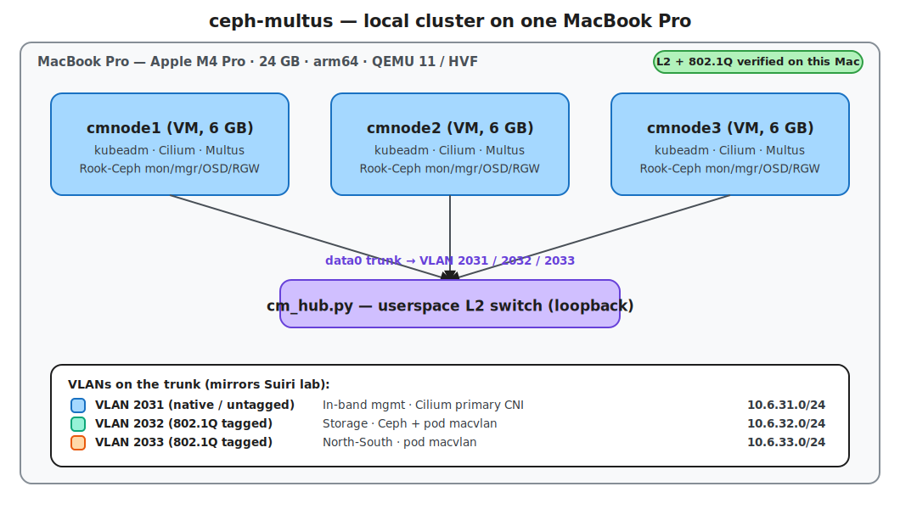

# ceph-multus

Local proof-of-concept (POC): a multi-VLAN Kubernetes (K8s) cluster on **one Apple-silicon Mac**,
with **Rook-Ceph** serving **block (RBD)** and **object (RGW/S3)** storage to pods over a dedicated
storage VLAN. It builds the storage half the Suiri lab left unbuilt, on a faithful copy of the
[host-net-config](../host-net-config/) network design (VLANs 2031/2032/2033).

- **3 Ubuntu 24.04 arm64 VMs** under QEMU/Hypervisor.framework (HVF), joined by a small userspace
  Layer-2 (L2) switch that carries an 802.1Q VLAN trunk: in-band mgmt (2031), north-south (2033),
  storage (2032).
- **Cilium** is the primary Container Network Interface (CNI) on the in-band VLAN; **Multus** adds
  two **macvlan** secondaries (north-south + storage), so every app pod has **3 interfaces**.
- **Rook-Ceph runs host-networked** with `public_network = 10.6.32.0/24`, so *all* Ceph traffic
  (clients, replication, heartbeat) rides the storage VLAN. Serves a block StorageClass and an S3
  object store.
- **Demo:** a pod mounts a block volume, downloads a small Hugging Face model onto it, then reads
  and writes objects in the S3 store over the storage VLAN.
- **Status:** the network substrate is **proven on the Mac** (M0 — 18/18 cross-VLAN mesh, 802.1Q
  tags captured on the wire). The K8s/Cilium/Multus/Rook layers (M1–M6) are designed and
  version-pinned, not yet built.

**Full plan:** [implementation-plan.md](implementation-plan.md) · **Proven harness:** [feasibility/](feasibility/)

## Open threads

- Build M1–M6: kubeadm → Cilium → Multus → Rook-Ceph (block + object) → seed ~1 GB → demo workload.
- Residual risk: Ceph memory under load on 24 GB; single-node fallback is ready.
- Optional advanced milestone: put the Ceph public network on the Multus storage VLAN (vs host
  networking) — heavier, fragile Container Storage Interface (CSI) host-routing path.
