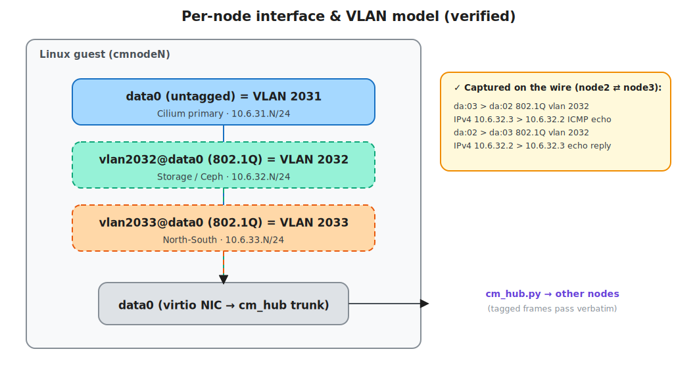
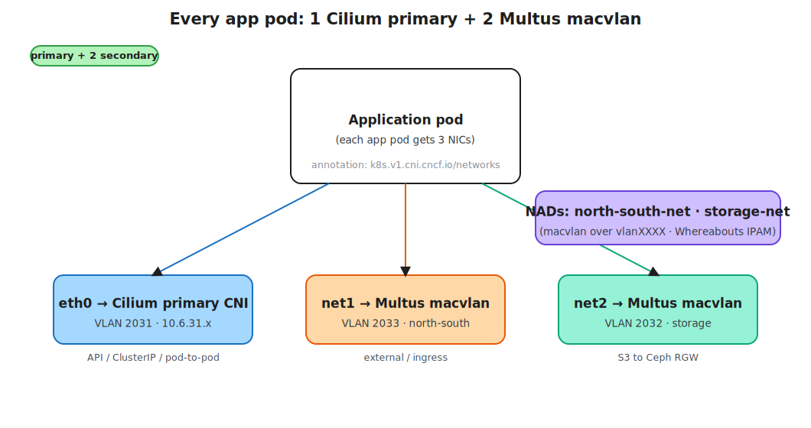
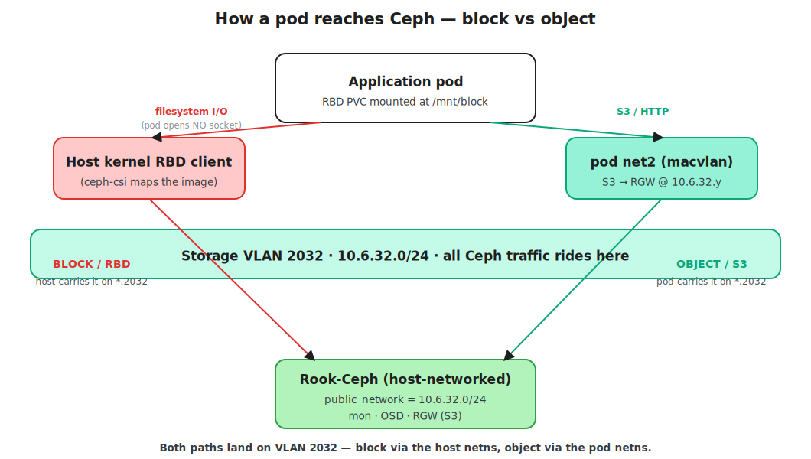
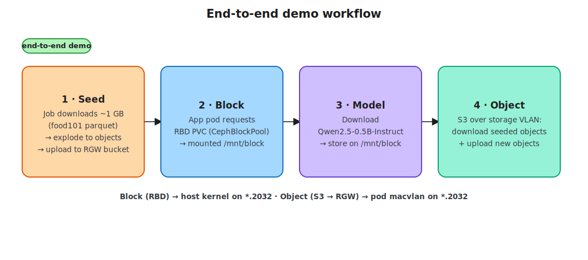

<!-- Throwaway POC. Functional testing only: no test suites, observability, or performance work. -->

# ceph-multus — implementation plan

Multi-VLAN Kubernetes with Rook-Ceph block + object storage, on one Apple-silicon Mac.

## Executive summary

Build the *storage half* the Suiri lab never finished — Rook-Ceph serving **block (RBD)** and
**object (RGW/S3)** storage to pods — on a faithful local copy of the
[host-net-config](../host-net-config/) multi-VLAN network, entirely on one Mac at zero cloud cost.
Three Ubuntu 24.04 arm64 VMs under QEMU/HVF are joined by a userspace L2 switch carrying an 802.1Q
VLAN trunk. **Cilium** is the primary CNI on the in-band VLAN; **Multus** gives every app pod two
**macvlan** secondaries (north-south + storage). **Rook-Ceph runs host-networked** with
`public_network = 10.6.32.0/24`, so all Ceph traffic rides the storage VLAN. The network substrate
is already **proven on this Mac** ([Feasibility results](#feasibility-results-proven-on-this-mac));
the K8s/Cilium/Multus/Rook layers are designed, version-pinned, and gated by the milestones below.

## Requirements

- **Local only**, no cloud cost; flag if any part is infeasible locally. (It is feasible.)
- A K8s cluster whose hosts carry multiple interfaces on different VLANs — in-band mgmt,
  north-south, storage — mirroring [host-net-config](../host-net-config/) / the Suiri design.
- **Cilium** primary CNI; **Multus** for two secondary interfaces (north-south, storage); every
  app pod has **3 interfaces**.
- **Rook-Ceph** providing **block (RBD)** and **object (RGW/S3)** storage to pods.
- All **workload-pod ↔ Ceph** traffic on the **storage VLAN**.
- **Seed** the object store with ~1 GB of public test data from the internet.
- A pod that **requests block storage, mounts it, downloads a small Hugging Face model** onto it,
  then **talks to the object store** to download and upload objects.
- **Functional testing only** — no performance validation.

## Assumptions made

- **No bond / Link Aggregation Control Protocol (LACP):** a single data NIC carries the VLAN trunk
  (confirmed acceptable for functional testing).
- **No jumbo frames:** default MTU 1500 (confirmed).
- **Stock kube-proxy** (`kubeProxyReplacement=false`) (confirmed).
- **GPU/InfiniBand RDMA tier (Suiri VLAN 2037) out of scope** — no GPU/IB hardware locally.
- **Ceph host-networked** with `public_network` = storage VLAN; Ceph-on-Multus is an optional
  advanced milestone, not the foundation.
- **`kubectl` runs in-guest** (no host↔VLAN bridge).
- **macvlan secondaries are per-workload** (pod annotation), not forced on system pods.
- **Demo picks:** model `Qwen/Qwen2.5-0.5B-Instruct` (~1 GB); seed dataset `ethz/food101` (~1 GB) —
  the brief delegated these ("pick anything").


## The network

| Network | VLAN | CIDR | Role | Realized as |
|---|---|---|---|---|
| In-band mgmt | 2031 (native/untagged) | 10.6.31.0/24 | **Cilium** primary CNI, API/etcd, pod-to-pod | `data0` untagged |
| North-South | 2033 (tagged) | 10.6.33.0/24 | external / ingress; pod default route | `vlan2033@data0` → Multus macvlan |
| Storage | 2032 (tagged) | 10.6.32.0/24 | **all Ceph traffic**; pod object I/O | `vlan2032@data0` → Multus macvlan + Ceph host-net |



## Local Mac setup

**Host:** Apple-silicon Mac (developed on **M4 Pro · 12 cores · 24 GB · 357 GB free**).
**Prereqs:** `brew install qemu xorriso` — QEMU 11 provides HVF acceleration and the arm64 Unified
Extensible Firmware Interface (UEFI) firmware; xorriso builds the cloud-init seed ISO.

**Topology.** A ~50-line userspace L2 switch ([`feasibility/cm_hub.py`](feasibility/cm_hub.py)) runs
on the Mac over loopback TCP and rebroadcasts raw Ethernet frames (VLAN tags included) between all
VMs — a multi-port hub. Each VM has two virtio NICs:

- **mgmt** — QEMU user-net, Secure Shell (SSH) forwarded to a host port (`2221/2222/2223`).
  `kubectl` runs in-guest; copy out the kubeconfig if you want it on the Mac.
- **data0** — connected to the hub. This is the **trunk** carrying VLANs 2031/2032/2033.

**Guest network** is configured by cloud-init (NoCloud seed), interfaces matched by Media Access
Control (MAC) address like the lab. A single `data0` NIC carries the untagged in-band VLAN plus two
802.1Q sub-interfaces (MTU 1500):

```yaml
# cloud-init network-config (node N)
ethernets:
  data0:                                   # VLAN 2031 (native / untagged)
    match: { macaddress: "52:54:00:00:da:0N" }
    set-name: data0
    addresses: [10.6.31.N/24]
vlans:
  vlan2032: { id: 2032, link: data0, addresses: [10.6.32.N/24] }   # storage  (tagged)
  vlan2033: { id: 2033, link: data0, addresses: [10.6.33.N/24] }   # north-south (tagged)
```

**Each VM is launched** with HVF acceleration, UEFI via pflash, and the data NIC wired to the hub
(exact invocation in [`feasibility/up.sh`](feasibility/up.sh)):

```
qemu-system-aarch64 -machine virt,accel=hvf -cpu host -smp 2 -m 6144 \
  -drive if=pflash,format=raw,readonly=on,file=edk2-aarch64-code.fd \
  -drive if=pflash,format=raw,file=vars.fd \
  -drive if=virtio,format=qcow2,file=disk.qcow2 \
  -netdev user,id=mgmt,hostfwd=tcp::222N-:22  -device virtio-net-pci,netdev=mgmt,mac=52:54:00:00:01:0N \
  -netdev socket,id=data,connect=127.0.0.1:10032 -device virtio-net-pci,netdev=data,mac=52:54:00:00:da:0N
```

**Bring up the substrate and verify VLAN connectivity:**

```bash
brew install qemu xorriso
python3 feasibility/cm_hub.py 10032 &     # start the L2 switch
bash    feasibility/up.sh 3               # boot 3 VMs onto the trunk
bash    feasibility/netcheck.sh           # ping across 2031/2032/2033 + capture a tagged frame
bash    feasibility/down.sh               # tear down
```

**Sizing:** 3 VMs × 6 GB on a 24 GB Mac (verified to run; macOS compresses idle pages, swap stays
flat). VM disk images live in `~/cm-feasibility/` (outside the repo).

## Feasibility results (proven on this Mac)

Guests: **Ubuntu 24.04 LTS arm64**, kernel `6.8.0-117`, **6 GB / 2 vCPU** each, **QEMU 11.0.1**.

| Check | Result |
|---|---|
| QEMU + HVF boots Ubuntu 24.04 arm64, unattended (cloud-init) | ✅ 3 VMs, ~30 s each |
| netplan reproduces the VLAN scheme (2031 untagged + 2032/2033 tagged on one NIC) | ✅ matched by MAC |
| **802.1Q-tagged frames cross between VMs** | ✅ captured on the wire (below) |
| Full **3-node mesh** reachability across all three VLANs | ✅ **18/18** ping checks |
| 3 VMs at the planned 6 GB sizing run without thrashing | ✅ swap flat at 160 MB |

Wire proof — tagged VLAN 2032 ICMP flowing directly between node2 and node3, via `tcpdump -e` on node2:

```
da:03 > da:02  ethertype 802.1Q (0x8100): vlan 2032 ... IPv4 10.6.32.3 > 10.6.32.2: ICMP echo request
da:02 > da:03  ethertype 802.1Q (0x8100): vlan 2032 ... IPv4 10.6.32.2 > 10.6.32.3: ICMP echo reply
```

**Still to build** (standard on arm64, version-checked, not yet stood up here): the
kubeadm/Cilium/Multus/Rook layers. The one residual risk is **Ceph memory under load** on 24 GB,
addressed in [Risks](#risks--mitigations) with a single-node fallback. The milestones below turn the
rest from "verified" into "proven".

## Every app pod gets 3 interfaces



App pods request the two secondary interfaces with the annotation
`k8s.v1.cni.cncf.io/networks: north-south-net, storage-net` (per-workload, not on system pods). The
storage NetworkAttachmentDefinition (NAD) is macvlan over the tagged sub-interface, Whereabouts IP
Address Management (IPAM), **no default route** (that belongs to north-south):

```yaml
apiVersion: k8s.cni.cncf.io/v1
kind: NetworkAttachmentDefinition
metadata: { name: storage-net }
spec:
  config: |
    { "cniVersion": "0.3.1", "type": "macvlan", "master": "vlan2032", "mode": "bridge",
      "ipam": { "type": "whereabouts", "range": "10.6.32.0/24" } }
```

## How a pod reaches Ceph (block vs object)



- **Block (RBD):** the pod opens **no** socket to Ceph. ceph-csi maps the RBD image with the
  **host kernel** client and bind-mounts the block device into the pod. RADOS traffic originates in
  the **host** network namespace (netns) and rides the host's storage sub-interface → VLAN 2032.
- **Object (RGW/S3):** this **is** pod-originated. The pod's `net2` macvlan interface (10.6.32.x)
  talks to RGW's storage-VLAN address (10.6.32.y) → VLAN 2032. Point the S3 client at the RGW
  storage-VLAN endpoint, **not** the ClusterIP Service (which routes via Cilium).

Both land on VLAN 2032 — block via the host netns, object via the pod netns. Running Ceph
host-networked with `public_network = 10.6.32.0/24` keeps every Ceph flow on the storage VLAN and
lets host-network CSI reach host-network Ceph natively.

## Components (pinned)

| Component | Version / method | Note |
|---|---|---|
| QEMU | 11.0.1 | HVF accel; `-netdev socket,connect` → `cm_hub.py` |
| Guest OS | Ubuntu 24.04 LTS arm64 | cloud-init NoCloud |
| Kubernetes | upstream **kubeadm**, stock kube-proxy | `kubeProxyReplacement=false` |
| Cilium | **1.19.4** (`oci://quay.io/cilium/charts/cilium`) | `cni.exclusive=false` (required for Multus), `routingMode=native`, `ipv4NativeRoutingCIDR=10.6.31.0/24` |
| CNI ref plugins | `containernetworking-plugins` → `/opt/cni/bin` | Cilium does not ship `macvlan` |
| Multus | **thick DaemonSet v4.3.0** | meta-CNI for the two secondaries |
| Whereabouts | pinned release, arm64 | cluster-wide IPAM for secondaries |
| Rook | **v1.20.0** | `network.provider: host` |
| Ceph | **quay.io/ceph/ceph:v19.2.4** (Squid) | |
| Demo image | `python:3.12-slim` arm64 + `huggingface_hub`, `boto3`, `s5cmd` | |

## Build milestones (each green before the next)

| # | Milestone | Verification gate | Status |
|---|---|---|---|
| **M0** | QEMU multi-VLAN substrate (3 VMs, userspace hub, tagged VLANs) | tagged VM↔VM ping + tcpdump | ✅ **done** |
| M1 | kubeadm cluster + Cilium primary over VLAN 2031 | pod-to-pod + DNS; `00-multus.conf` not clobbered | ☐ |
| M2 | Multus + Whereabouts + macvlan NADs; 3-interface test pod | pod shows `eth0`+`net1`+`net2` with right IPs | ☐ |
| M3 | Rook-Ceph single-node (host-net, storage VLAN): block + object | RBD PVC mounts; S3 PUT/GET works | ☐ |
| M4 | Scale Ceph to 3 nodes hyperconverged (`size:2`, 1 OSD/node) | `HEALTH_OK`; replication across nodes | ☐ |
| M5 | Seed object store (~1 GB) | objects listed in the seed bucket | ☐ |
| M6 | Demo workload (block PVC + model + S3 round-trip) | model on `/mnt/block`; objects downloaded + uploaded | ☐ |

## Demo workflow (M5–M6)



- **Model (block):** `Qwen/Qwen2.5-0.5B-Instruct` (~1 GB; CPU/arm64-friendly, no token) via
  `huggingface_hub.snapshot_download` with `allow_patterns`.
- **Seed (~1 GB object):** `ethz/food101` parquet shards from the Hugging Face Content Delivery
  Network (no auth), exploded into ~20k `.jpg` objects, uploaded with **s5cmd** (path-style against
  Ceph RGW).
- **S3 wiring:** an `ObjectBucketClaim` mints a ConfigMap (`BUCKET_HOST/PORT/NAME`) + Secret
  (S3 keys); the pod consumes them via `envFrom` and targets the RGW storage-VLAN endpoint.

## Risks & mitigations

| Risk | Mitigation |
|---|---|
| **Ceph RAM on 24 GB** | `osd_memory_target ≈ 1.5 GiB` (POC-only), `size:2`, `mon.count:1`; prototype single-node first; fall back to 1–2 nodes |
| Cilium silently disables Multus | set `cni.exclusive=false`; verify `00-multus.conf` not renamed `.cilium_bak` on-node |
| `macvlan` plugin missing | bake `containernetworking-plugins` into the VM image; check `/opt/cni/bin/macvlan` |
| Storage NAD hijacks pod default route | no `0.0.0.0/0` on `storage-net` (only on `north-south-net`) |

## Repo layout

```
ceph-multus/
├── README.md                 # area executive summary
├── implementation-plan.md    # this plan
├── feasibility/              # proven substrate harness (up/netcheck/down + cm_hub.py)
└── diagrams/                 # gen.py → *.svg (embedded) + *.excalidraw (editable)
```

Regenerate diagrams: `python3 diagrams/gen.py`. The build will add `vm/` (cloud-init + per-node
configs) and `k8s/` (Cilium values, Multus, NADs, Rook, demo) as milestones land.
