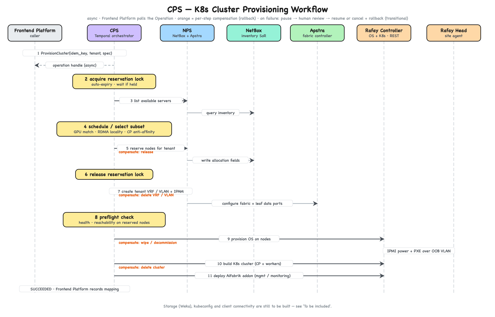

# CPS — GPUaaS Cluster Provisioning

The **Compute Provisioning Service (CPS)** delivers **GPU-as-a-Service (GPUaaS)**: a
tenant requests a number of GPUs and receives a dedicated Kubernetes (K8s) cluster —
control plane included and transparent — provisioned on site hardware.

CPS exposes a GKE-style resource API over gRPC with Protocol Buffers (Proto).
Storage (Weka), kubeconfig delivery, and client connectivity are still to be built —
see [To be included](#to-be-included).

## Executive summary

The tenant's unit is **GPUs**, not nodes: they request a `gpu_count` of a `gpu_type`
and receive a dedicated K8s cluster with that capacity. The control plane is
provisioned automatically and never surfaced.

- **API** — a GKE-shaped resource service (`CreateCluster`, `GetCluster`,
  `ListClusters`, `UpdateCluster`, `DeleteCluster`, `GetOperation`) over a `Cluster`
  resource. Mutating calls return an `Operation`; `Get`/`List` read current state.
- **Mechanics** — each mutating call is realized by **one bounded Temporal workflow**
  scoped to that operation (not a long-lived entity workflow). While the platform
  matures, a failure pauses the workflow for human review.
- **State** — CPS is **stateful** and uses **Rafay as its state store** (for now).
  **NetBox** is the System of Record (SoR) for inventory and allocation; the
  **Frontend Platform** — backed by PostgreSQL (PGSQL) — owns the mapping
  tenant→cluster→assets for billing.

## Resource model

GKE conventions (resource + status + `Operation`), but the spec is **GPU-centric** —
node pools and the control plane are internal and never appear in the customer
surface.

```proto
message Cluster {
  string name        = 1;   // tenants/{tenant}/clusters/{cluster}   (single site)
  string gpu_type    = 2;   // e.g. B300
  int32  gpu_count   = 3;   // the tenant's unit; reconciled to this target
  string k8s_version = 4;   // optional; CPS manages a default
  Status status      = 5;   // observed: PROVISIONING | RUNNING | RECONCILING | DELETING | AWAITING_REVIEW | ERROR
  // endpoint / kubeconfig -> see To be included
  // control plane is provisioned automatically and is not represented here
}
```

- **`gpu_count` is allocated in whole-server increments.** Nodes are dedicated per
  tenant and a GPU server packs a fixed number of GPUs (e.g., 8 on a B300 box), so
  CPS validates/rounds the request to whole servers.
- **spec vs status.** The tenant sets desired state (`gpu_type`, `gpu_count`,
  `k8s_version`); `status` is observed. An error needing human attention surfaces as
  `AWAITING_REVIEW` on the `Operation`/`Cluster` status (see Failure handling).

## API methods

GKE's `ClusterManager` shape, trimmed to the GPU-centric surface:

```proto
service ClusterProvisioning {            // CPS — mirrors google.container.v1.ClusterManager
  rpc CreateCluster (CreateClusterRequest) returns (Operation);  // provision
  rpc GetCluster    (GetClusterRequest)    returns (Cluster);    // read-through
  rpc ListClusters  (ListClustersRequest)  returns (ListClustersResponse);
  rpc UpdateCluster (UpdateClusterRequest) returns (Operation);  // change gpu_count / version -> expand or shrink
  rpc DeleteCluster (DeleteClusterRequest) returns (Operation);  // deprovision
  rpc GetOperation  (GetOperationRequest)  returns (Operation);  // poll
}
```

- **Declarative, reconcile-to-target.** `UpdateCluster` sets the desired `gpu_count`;
  CPS diffs against actual and runs an expand *or* shrink workflow — GKE's
  `SetNodePoolSize` idea, expressed in GPUs.
- **Idempotent.** Create takes a client-set cluster id (or `request_id`), so a retry
  does not double-provision; `Update`/`Delete` are naturally idempotent.
- **Async.** Every mutating call returns an `Operation`; the Frontend Platform polls
  `GetOperation`.

## Actors & systems

All cloud components run in the Management Plane (GCP).

| Component | Where | Role |
|-----------|-------|------|
| **Frontend Platform** | Management Plane (GCP) | Calls CPS to provision clusters; owns tenant→cluster→assets mapping in PGSQL (billing). |
| **CPS** (Compute Provisioning Service) | Management Plane (GCP) | GKE-style resource API (gRPC/Proto). **Stateful** — uses Rafay as its state store (for now). Realizes each mutation with a bounded Temporal workflow. Owns scheduling/selection + the reservation lock. |
| **NPS** (Network Provisioning Service) | Management Plane (GCP) | gRPC/Proto wrapper over NetBox (inventory reads + allocation writes); drives Apstra for VRF/VLAN + IP addressing (IPAM). |
| **NetBox** | Management Plane (GCP) | Inventory **SoR**. Two writers, non-overlapping fields: Aravolta (physical) + CPS/NPS (allocation). |
| **Aravolta** | Management Plane (GCP) | Physical data-center infra management; feeds host/switch/router facts into NetBox. |
| **Juniper Apstra** | Management Plane (GCP) | Underlay fabric controller; configures site switches over the VPN. |
| **Rafay Controller** | Management Plane (GCP, separate GKE cluster) | Bare-metal OS + K8s lifecycle + addons; also CPS's cluster state store. CPS↔Rafay is REST. |
| **Rafay Head Node** | Site | Last-mile agent: IPMI discovery, PXE boot, host config. |
| **Site servers** | Site | CPU servers (control plane) + GPU servers (workers). |

## State & systems of record

- CPS is **stateful**; for now it uses **Rafay as the cluster state store** — Rafay
  already holds cluster and (internal) node-pool definitions plus their status.
  `Get`/`List` read through to Rafay.
- **NetBox is the SoR for inventory and allocation.** It has two writers on
  non-overlapping fields: Aravolta writes physical facts; CPS/NPS write allocation
  facts. After a CPS restart, NetBox still reflects which assets belong to which
  tenant.
- **The Frontend Platform (PGSQL) owns the tenant→cluster→assets mapping** (consumed
  by billing).
- NetBox→Rafay node inventory is kept current by a **separate periodic CPS workflow**
  (every few hours), not by the provisioning path.

## Scheduling & reservation

- **Node selection lives in CPS.** From the requested `gpu_type`/`gpu_count` it:
  - picks GPU servers to satisfy the GPU count (whole-server granularity);
  - keeps GPU workers rail/leaf-local for backend Remote Direct Memory Access (RDMA);
  - **provisions the control plane automatically** on CPU servers, spread for high
    availability (HA) — transparent to the tenant.
- **Reservation is serialized by a CPS-held lock**: acquire before reserving, release
  after; the lock auto-expires, and callers wait to acquire it. (Single site, low
  volume — a concurrency-safe reserve is [future work](#future-work).)
- **Reserved nodes pass a preflight** health/reachability check before being
  committed to the tenant.

## Networking

- Per-tenant isolation is a **tenant VRF/VLAN with IP addressing (IPAM)**, created
  through NPS→Apstra before OS install.
- **PXE/IPMI provisioning rides a separate out-of-band (OOB) VLAN**, distinct from
  the tenant data network, so attaching nodes to the tenant VRF never strands the
  boot.

## Interfaces & security

- **Frontend Platform↔CPS↔NPS** speak gRPC with Proto; NPS presents NetBox and Apstra
  behind that same gRPC surface.
- **CPS↔Rafay is REST** (Rafay is a vendor product in a separate GKE cluster). Rafay
  credentials come from a secrets manager, never hardcoded.
- All our services run in the Management Plane — one trust domain. The only VPN
  crossings are vendor-internal: Apstra→switches and Rafay Controller↔Rafay Head Node
  (the head node dials out). Rafay's project/RBAC model maps 1:1 to tenants to bound
  blast radius.
- The AiFabrik management/monitoring workload deploys as a **Rafay addon/blueprint**
  (declarative, re-applied).

## CPS Workflows

Each API mutation is realized by **one bounded Temporal workflow** scoped to that
operation — not a long-lived entity workflow. Activities are idempotent so Temporal
can safely retry them.

### Provisioning workflow — realizes `CreateCluster`



> Diagram source: [`gen/build_provision_flow.py`](gen/build_provision_flow.py) →
> `diagrams/cps_provision_flow.{excalidraw,svg,png}`. Regenerate with
> `python3 gen/build_provision_flow.py`.

**Failure handling (transitional human review).** While the platform matures, an
unrecoverable activity failure **pauses the workflow** in `AWAITING_REVIEW` (surfaced
on the `Operation`/`Cluster` status) and it awaits a human signal:

- **resume** — the operator fixes the underlying problem; the workflow re-attempts
  from the failed step and continues to completion;
- **cancel** — compensations run in reverse (release the NetBox reservation, tear
  down the tenant VRF, …) and the workflow ends rolled back.

The pause is a **bounded gate inside a single-purpose workflow** — not a long-lived
entity workflow; the workflow still terminates, on resume-to-completion or
cancel-with-rollback. The same gate applies to the reconcile and teardown workflows.
**Once the platform matures, the human gate is removed** and the failure path becomes
automated (retry/backoff, then rollback or hold per policy).

### Reconcile & teardown — realize `UpdateCluster` / `DeleteCluster`

- **`UpdateCluster` → expand or shrink.** CPS diffs the new `gpu_count` against
  actual; a bounded workflow reserves + attaches new GPU servers, or drains +
  releases them, then ends.
- **`DeleteCluster` → deprovision.** A bounded workflow deletes the cluster, tears
  down the tenant VRF/VLAN, and releases the NetBox reservation, then ends.

These follow the provisioning pattern; detailed designs come with their own passes.

## To be included

These pieces complete the capability; each gets its own design pass.

- **Storage (Weka).** Per-tenant filesystem plus the K8s Container Storage Interface
  (CSI) integration.
- **Kubeconfig & client connectivity.** Tenants get a **direct API-server
  kubeconfig** (no Rafay zero-trust kubectl access, "ZTKA"). Two problems: a network
  path from the Management Plane or tenant to the API server inside the tenant VRF at
  the site, and credential lifecycle (issue/rotate/revoke).

## Future Work

- **Concurrency-safe reservation.** Replace the single CPS lock with an atomic
  compare-and-set reserve in NPS once request volume outgrows serialized access.
