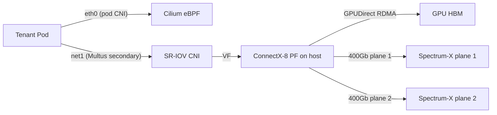

# NVIDIA B-series Kubernetes inference architecture

A multi-tenant, on-prem inference platform on NVIDIA Blackwell (predominantly GB300 NVL72) hardware. Treats NVIDIA's published reference architectures as a starting point, then layers on the things they don't cover: multi-tenancy, BYO inference runtimes, fabric choice, CNI design, storage, OEM and neocloud comparisons, and security.

## Table of contents

1. [Executive Summary](#executive-summary)
2. [Requirements](#requirements)
3. [Assumptions Made](#assumptions-made)
4. [GPU concepts you need before reading the rest](#gpu-concepts-you-need-before-reading-the-rest)
5. [NVIDIA's two reference architectures, side by side](#nvidias-two-reference-architectures-side-by-side)
6. [The hardware: GB300 NVL72 and HGX B300](#the-hardware-gb300-nvl72-and-hgx-b300)
7. [East-west scale-out fabric: IB vs Spectrum-X vs vendor-neutral Ethernet](#east-west-scale-out-fabric-ib-vs-spectrum-x-vs-vendor-neutral-ethernet)
8. [Kubernetes networking: CNI for the control plane vs. the data plane](#kubernetes-networking-cni-for-the-control-plane-vs-the-data-plane)
9. [Storage tier: WEKA, VAST, DDN, Pure, Ceph, BeeGFS](#storage-tier-weka-vast-ddn-pure-ceph-beegfs)
10. [K8s control-plane add-ons: the operator zoo](#k8s-control-plane-add-ons-the-operator-zoo)
11. [Inference runtimes: NVIDIA stack vs open source](#inference-runtimes-nvidia-stack-vs-open-source)
12. [GPU sharing: whole-GPU vs MIG vs MPS / time-slicing](#gpu-sharing-whole-gpu-vs-mig-vs-mps-time-slicing)
13. [OEM reference designs: Supermicro and Dell](#oem-reference-designs-supermicro-and-dell)
14. [Neocloud reference designs: where they diverge from NVIDIA's RA](#neocloud-reference-designs-where-they-diverge-from-nvidias-ra)
15. [Multi-tenant security architecture](#multi-tenant-security-architecture)
16. [Lifecycle and operations: driver upgrades on a multi-tenant fleet](#lifecycle-and-operations-driver-upgrades-on-a-multi-tenant-fleet)
17. [Recommendation for this platform](#recommendation-for-this-platform)

## Executive Summary

NVIDIA publishes **two** canonical reference architectures (RAs) for Blackwell-generation Kubernetes deployments, and both are explicitly **single-tenant**. The multi-tenant inference platform described here will diverge from them deliberately at four layers (fabric, CNI, tenancy, runtime), and converge at three (hardware SKU, GPU operator stack, observability).

| Layer | NVIDIA's RA position | This platform's position |
| --- | --- | --- |
| Hardware | GB300 NVL72 (1 rack = 1 SU = 72 GPUs); HGX B300 NVL8 nodes for outliers | Same |
| Scale-out fabric | **SuperPOD:** Quantum-X800 InfiniBand. **Enterprise RA:** Spectrum-X Ethernet with dual-plane | Spectrum-X dual-plane Ethernet (RoCE v2); reasoning below |
| GPU sharing | MIG-first for partitioned workloads; whole-GPU otherwise | All three modes exposed; MIG default, whole-GPU for tensor-parallel, MPS gated and tenant-internal only |
| Tenancy | Single tenant ("all users in same enterprise") | vCluster-per-tenant on shared physical fleet; tenants BYO runtime |
| Primary CNI | Not opinionated; "K8s and Slurm, non-virtualized" | Cilium (eBPF) for pod network; Multus + SR-IOV CNI for RDMA secondary interfaces; per-tenant NetworkPolicy at the vCluster boundary |
| Inference runtime | NVIDIA Dynamo + TRT-LLM + NIM | BYO: support Dynamo, NIM, vLLM, SGLang; expose Dynamo-style disaggregation as a tenant-selectable pattern |
| GPU operator stack | GPU Operator + Network Operator + NIM Operator + KAI Scheduler | Same, plus NVIDIA DPF (DOCA Platform Framework) for BlueField-3 multi-tenant offload |
| Storage | DGX-certified partner (WEKA/VAST/DDN/Pure) over RoCE v2 | Same approach; vendor pick driven by cost-per-TB-throughput, not feature parity |
| Security | Hardware encryption + Mission Control; multi-tenant explicitly out of scope | Defense in depth: MIG + Confidential Computing where tenants demand it, P_Keys/VLANs at fabric, NetworkPolicy at vCluster, BlueField-3 zero-trust for north-south |

**The headline finding** is that NVIDIA's reference designs solve the *hard* problem (300+ Gb/s GPU-to-GPU fabric, NVLink coherence across 72 GPUs in a rack, liquid cooling integration, deterministic NCCL performance) and explicitly punt on the problem this platform actually has (hard isolation between distrustful tenants who each get their own K8s control plane). The architecture below adopts the hardware and fabric design verbatim, then composes a multi-tenancy layer that NVIDIA's RA does not.

**Recommend Spectrum-X dual-plane Ethernet over InfiniBand** for this deployment, on three grounds: (1) it is the fabric in NVIDIA's *Enterprise* RA — the one written for enterprise data centers rather than national-lab-style SuperPODs — which signals NVIDIA's own bet on Ethernet for the buyer profile you fit; (2) multi-tenant isolation primitives (VRFs, EVPN-VXLAN, BlueField-3 offload, per-tenant ACLs on Spectrum-4 switches) compose more naturally with K8s than InfiniBand's partition keys; (3) operator skill pool for Ethernet/BGP is an order of magnitude larger than for IB + Subnet Manager + UFM. The bandwidth and latency penalty for choosing Spectrum-X over Quantum-X800 is small enough for inference (both are 800 Gb/s, both support GPUDirect RDMA, NCCL on Spectrum-X with adaptive routing is within ~5% of IB on B-series GPUs) that the operational simplification wins.

**The two biggest risks** to keep in mind while reading the rest: (a) MIG provides hardware partitioning of compute and memory, but academic research has demonstrated cross-MIG covert and side channels at up to 31 kb/s — multi-tenant GPU sharing across distrustful tenants without NVIDIA Confidential Computing should be considered weak isolation; (b) vCluster gives each tenant their own API server but shares the underlying CNI, GPU Operator, and host kernel — a tenant-escape from a vCluster pod is, by default, an escape into the entire physical cluster. Both risks are addressable but require explicit design choices documented later.

## Requirements

- **Topic:** NVIDIA reference architecture (RA) for deploying Kubernetes (K8s) for inference serving on Blackwell-generation hardware (B-series, predominantly GB300 NVL72), plus comparison against OEM and neocloud variants.
- **Audience:** K8s-proficient, GPU-new. GPU concepts (NVLink/NVSwitch, MIG, SR-IOV, RoCE vs IB, GPUDirect RDMA, MPS, NUMA, scale-up vs scale-out) introduced inline at first use, plus a primer section.
- **Hardware:** Fixed to Blackwell (B200/B300), focus on GB300 NVL72. Brief HGX B300 8-GPU mention.
- **Multi-stack inference:** Cover NVIDIA stack (Dynamo, Triton, TensorRT-LLM, NIM) and open source (vLLM, SGLang). Compare on architecture, K8s integration, performance, license.
- **Cluster scale:** Multi-pod SuperPOD-class, 1000+ GPUs.
- **Tenancy model:** Virtual K8s per tenant (vCluster-style) on shared physical fleet. **BYO runtime, host-managed infrastructure.**
- **GPU sharing:** Cover and compare whole-GPU, MIG, MPS/time-slicing.
- **Fabric choice:** Open. Compare IB Quantum-X800, NVIDIA Spectrum-X Ethernet, vendor-neutral RoCE Ethernet.
- **CNI design:** Dedicated treatment of control-plane vs. data-plane (RDMA/GPUDirect) traffic. Compare Calico, Cilium, Multus + SR-IOV.
- **Storage:** Dedicated section. WEKA, VAST, DDN, Pure FlashBlade, Ceph (Rook), BeeGFS. GPUDirect Storage.
- **OEM:** Supermicro and Dell NVL72 designs vs NVIDIA's RA.
- **Neoclouds:** CoreWeave, Lambda, Crusoe, Nebius. Where do they follow NVIDIA's RA, where do they diverge.
- **Ingress:** Public per-tenant endpoints (TLS, rate-limit, WAF, DDoS).
- **Security, no compliance:** Real threat model (tenant ↔ tenant, tenant → host), recommend controls without checklisting to a framework.
- **Operations:** GPU driver / firmware lifecycle in multi-tenant context.
- **Format:** Paired Markdown + self-contained HTML.

## Assumptions Made

- **"NVIDIA reference architecture"** here means two specific NVIDIA-published documents: the **NVIDIA Enterprise Reference Architecture with GB300 NVL72 and Spectrum-X** (dated March 2026, the most recent at this writing) and the **DGX SuperPOD GB300 RA**. Where NVIDIA Cloud Partner (NCP) RA contributes additional detail (e.g. for neocloud sizing) it's called out by name.
- **B300 = GB300 NVL72** is the deployment unit. HGX B300 NVL8 standalone nodes are mentioned where relevant but are not the centerpiece.
- **vCluster** is the assumed virtual-K8s technology (most production-mature). Kamaji and Cluster API are alternatives; full comparison is out of scope.
- **Liquid cooling is a constraint, not a topic.** Rack-level CDU implications noted, thermals not analyzed.
- **GPU concepts taught in scope:** NVLink/NVSwitch, NVL72 dual-rail, PCIe Gen5/6, NUMA, GPU-CPU pinning, GPU-NIC affinity, GPUDirect RDMA, HBM3e, KV cache, GPUDirect Storage, SMs/tensor cores, FP8/FP4, MIG, MPS, SR-IOV, RoCE v2, IB, partition keys, BlueField DPU offload, scale-up vs scale-out. Introduced inline at first use plus a primer section.
- **Out of scope:** training workloads; gang scheduling for training; checkpoint-storage sizing; cost modeling / TCO; regulatory compliance (SOC 2 / PCI / HIPAA / FedRAMP); hyperscaler managed K8s; per-tenant model performance tuning; air-gapped or classified deployments.
- **Citation strategy:** primary sources from NVIDIA, OEMs, neoclouds, and OSS projects. No press releases for substantive claims. Date-stamps where the field moves fast.

## GPU concepts you need before reading the rest

If you are coming from a K8s/networking background, the GPU-specific vocabulary below is the part of the report most likely to obscure meaning. Skim once and refer back as needed.

**Scale-up vs scale-out.** GPU clusters operate at two distinct fabric tiers: a *scale-up* domain where GPUs behave as a single coherent unit (today: 72 GPUs in one NVL72 rack, glued together by NVLink Switch trays at 1.8 TB/s per GPU), and a *scale-out* domain where racks talk to each other over InfiniBand or Ethernet at 800 Gb/s per GPU. K8s networking primitives target the scale-out fabric. The scale-up fabric is invisible to K8s — it shows up only as an NCCL topology hint and as a constraint on which pods can do `cudaMemcpyPeer` natively. The most important architectural fact in this entire report: **a Dynamo / TRT-LLM / vLLM job that wants tensor parallelism > 8 will saturate the scale-up domain and benefit dramatically from staying within a single NVL72 rack.** Crossing to another rack means a 4-5× bandwidth drop (800 Gb/s scale-out vs ~13 TB/s on the in-rack NVLink fabric). Topology-aware scheduling exists for this reason.

**NVLink, NVSwitch, NVL72.** NVLink is a chip-to-chip serial bus (5th gen on B300, 1800 GB/s bidirectional per GPU). NVSwitch is the on-rack crossbar that gives every GPU a one-hop path to every other GPU. NVL72 means 72 GPUs in one NVLink domain — a single rack with 9 NVSwitch trays in the GB300 design ([NVIDIA Enterprise RA](https://docs.nvidia.com/enterprise-reference-architectures/nvl72-ai-factory-with-gb300-nvl72-dual-plane-networking-architecture.pdf), p. 9-10). NVLink-C2C is the coherent chip-to-chip link between Grace CPU and B300 GPU within a Superchip (900 GB/s).

**HBM3e, KV cache.** HBM3e is the on-package memory of the GPU. The B300 has 288 GB HBM3e per GPU at ~8 TB/s — the GB300 NVL72 totals 20 TB across the rack at 576 TB/s aggregate bandwidth. KV cache is the dominant on-GPU memory consumer for LLM inference: it stores the key/value attention tensors for every token already in the context window. KV cache *transfer* is the killer cross-node operation in disaggregated serving (the prefill worker computes the KV, the decode worker needs it).

**GPUDirect RDMA.** A peripheral feature of the NIC (ConnectX-8 or BlueField) that lets a remote GPU's HBM be the source/destination of an RDMA Write, bypassing the host CPU and PCIe-rooted memory. This is what makes 800 Gb/s of inter-node tensor parallel traffic actually achievable. Requires (a) a Mellanox-derived NIC, (b) the GPU and NIC on the same NUMA node (PCIe root complex), (c) the OFED stack on the host, (d) GPUDirect-capable kernels in the runtime.

**GPUDirect Storage (GDS).** Same idea, NIC-to-storage: storage read lands directly in GPU HBM, no host bounce buffer. Critical for fast model loading (the difference between a 30-second cold start and a 5-minute one for a 70B-parameter model).

**RoCE v2 vs InfiniBand.** Both deliver RDMA. RoCE v2 (RDMA over Converged Ethernet v2) runs on Ethernet hardware and uses UDP; InfiniBand uses native IB framing. RoCE needs Priority Flow Control (PFC) and ECN configured carefully — broken PFC = head-of-line blocking. InfiniBand handles congestion in-fabric via credit-based flow control. RoCE wins on operator ecosystem; IB wins on out-of-box determinism. NVIDIA's Spectrum-X Ethernet platform exists specifically to close the gap by adding IB-style adaptive routing and congestion control to RoCE.

**SR-IOV, VF, PF.** Single Root IO Virtualization. A NIC's Physical Function (PF) presents itself as multiple Virtual Functions (VFs), each addressable as a separate PCIe device with its own MAC/IP. K8s uses this to give a pod direct hardware access to a NIC slice — the data plane goes around the host kernel's network stack entirely, which is mandatory for line-rate RDMA. The SR-IOV CNI plus Multus is the standard pattern.

**MIG, MPS, time-slicing.** Three ways to share one physical GPU across multiple workloads:
- **MIG (Multi-Instance GPU):** *Hardware* partitioning. The GPU's SM (Streaming Multiprocessor) array, L2 cache, memory controllers, and DRAM are split into up to 7 instances. Each instance is presented as a separate CUDA device with its own MIG UUID. Strongest isolation NVIDIA provides via partitioning.
- **MPS (Multi-Process Service):** *Software* multiplexing. A daemon runs that multiplexes CUDA contexts from multiple processes onto one GPU. Highest utilization, weakest isolation (no memory protection between processes).
- **Time-slicing:** *Cooperative* sharing via the driver. Multiple pods get the same GPU; the driver round-robins their kernels. Even weaker than MPS.

**MIG profile geometry on B-series.** B200/B300 supports 1-instance, 2-instance, 3-instance, 4-instance, and 7-instance partitionings, with HBM divided proportionally. On B200 the 7-way split gives 23 GB per slice; the 2-way split gives 93 GB per slice ([NVIDIA Multi-Instance GPU](https://www.nvidia.com/en-us/technologies/multi-instance-gpu/)). On B300 with 288 GB/GPU the corresponding 7-way slice is ~36 GB, the 2-way slice is ~140 GB. Each slice has more memory than an entire H100 had, which changes the calculus on whether MIG is worth using for inference (it now is, for 7-13B-class models).

**DPU (Data Processing Unit).** A NIC with its own ARM SoC, memory, and PCIe topology that can run a separate OS and offload host services (storage, networking, security). NVIDIA's BlueField-3 is the GB300's standard DPU; it runs DOCA software, hosts the OVS dataplane, and (in NVIDIA's reference) terminates the host's north-south traffic before it ever touches the x86 or Grace host.

## NVIDIA's two reference architectures, side by side

NVIDIA publishes two reference architectures with overlapping but distinct scope. Understanding the difference matters because picking one as your starting point biases every downstream decision.

| Dimension | [Enterprise RA (March 2026)](https://docs.nvidia.com/enterprise-reference-architectures/nvl72-ai-factory-with-gb300-nvl72-dual-plane-networking-architecture.pdf) | [DGX SuperPOD GB300 RA](https://docs.nvidia.com/pdf/dgx-spod-gb300-ra.pdf) |
| --- | --- | --- |
| Scalable Unit (SU) | 1 rack of GB300 NVL72 (72 GPUs, 18 trays) | 8 racks of DGX GB300 (576 GPUs, 144 trays) |
| Tested scale | up to 8 SUs (576 GPUs); super-spine at 1024+ nodes | up to 16 SUs (9,216 GPUs) |
| Scale-out fabric | NVIDIA **Spectrum-X Ethernet**, dual-plane | NVIDIA **Quantum-X800 InfiniBand**, single-plane fat-tree |
| Compute switch | SN5600 (128 × 400 Gb/s) | Q3400-RD (144 × 800 Gb/s) |
| Storage fabric | Same Spectrum-4 (SN5600) — converged with east-west on small designs | Separate Spectrum-4 (SN5600D) for storage + in-band |
| Mgmt fabric | SN2201 1 Gb OOB | SN2201 1 Gb OOB |
| Per-tray NICs | 4× ConnectX-8 (2×400 Gb/s) + 1× BlueField-3 B3240 | 4× ConnectX-8 (800 Gb/s) + 1× BlueField-3 |
| Software | NVIDIA AI Enterprise, Mission Control, Dynamo, Run:ai, NetQ | Same, plus UFM for IB management, NMX-M for NVLink |
| Tenancy | **"Ideal for multi-user, single-tenant workloads"** — users in same enterprise | Single-tenant on-prem; "customer owns the hardware" |
| Workload | K8s + Slurm, non-virtualized | K8s + Slurm, non-virtualized |

Two things to internalize from this table.

**First, NVIDIA itself is making the IB-vs-Ethernet call differently by buyer profile.** Enterprises (Fortune 500 IT, regulated industries, on-prem AI labs) get Spectrum-X Ethernet; national labs, frontier-model labs, and customers building >1000-GPU pods get DGX SuperPOD with Quantum-X800 InfiniBand. The technical headline reason is operator skill: enterprise IT teams have Ethernet engineers, not IB engineers. The Enterprise RA closes the technical gap with the **dual-plane topology** (described in the fabric section below) and with NVIDIA's adaptive routing + congestion control in Spectrum-X that makes RoCE behave more like IB.

**Second, neither RA targets multi-tenancy.** The Enterprise RA states this explicitly on p. 5: "this architecture is ideal for multi-user, single tenant workloads. Specifically, the logical design and software is streamlined for deployment and maintenance ease by tailoring the configuration to one where users are all part of the same enterprise, and accounting and access control can be consolidated." The SuperPOD RA is similar — "the customer owns the hardware, the service it provides, and is responsible for their cluster infrastructure." Both presume one organization owns the cluster and runs trusted workloads on it. The platform described in this report is the inverse: many tenants, distrustful, each running their own runtime. Everything below from the CNI section onward is a deliberate divergence from NVIDIA's published RA.

## The hardware: GB300 NVL72 and HGX B300

The unit of deployment is one **GB300 NVL72** rack. From [NVIDIA's product page](https://www.nvidia.com/en-us/data-center/gb300-nvl72/) and the Enterprise RA:

- **72** NVIDIA Blackwell Ultra (B300) GPUs + **36** Grace CPUs (Arm Neoverse V2, 72 cores per CPU), in 18 compute trays. Each tray = 2 GB300 Superchips, where one Superchip = 2 GPUs + 1 Grace CPU linked by NVLink-C2C at 900 GB/s.
- **20 TB** total HBM3e at **576 TB/s** aggregate memory bandwidth (= 288 GB per GPU, ~8 TB/s per GPU).
- **17 TB** LPDDR5X CPU memory + 20 TB HBM3e = **37 TB** of fast memory per rack.
- **130 TB/s** aggregated NVLink bandwidth via 9 NVSwitch trays (2 NVSwitch ASICs per tray). Each GPU has 18 NVLink Gen 5 lanes, one per in-rack NVSwitch ASIC, delivering **1.8 TB/s per GPU bidirectional**.
- **1,440 PFLOPS FP4** and **720 PFLOPS FP8/FP6** dense tensor-core throughput per rack.
- **Up to 142 kW per rack**, 8 power shelves × 33 kW (6 × 5.5 kW PSUs per shelf). Liquid-cooled (MGX), with hybrid air for non-power-dense components.
- **vs Hopper:** NVIDIA claims 50× AI factory output, 10× TPS per user, 5× TPS/MW ([GB300 NVL72 page](https://www.nvidia.com/en-us/data-center/gb300-nvl72/)).

Per compute tray:
- 4 GPUs + 2 Grace CPUs.
- **4× ConnectX-8 SuperNICs** — dual-port 800 Gb/s each, 1:1 GPU-to-NIC ratio. These carry the east-west compute traffic.
- **1× BlueField-3 B3240 DPU** — dual-port 400 Gb/s (aggregate ~480 Gb/s). Carries north-south (storage, mgmt, customer) traffic.
- **1× M.2 NVMe** for OS + **4× E1.S NVMe** as local cache.

MLPerf Inference v5.1 published numbers ([NVIDIA Technical Blog](https://developer.nvidia.com/blog/nvidia-blackwell-ultra-sets-new-inference-records-in-mlperf-debut/)):

| Model | Offline (t/s/GPU) | Server (t/s/GPU) | Interactive (t/s/GPU) | vs GB200 |
| --- | --- | --- | --- | --- |
| DeepSeek-R1 | 5,842 | 2,907 | n/a | +45% offline, +25% server |
| Llama 3.1 405B | 224 | 170 | 138 | n/a |
| Llama 3.1 8B | 18,370 | 16,099 | 15,284 | n/a |

vs Hopper, NVIDIA reports ~5× higher per-GPU throughput on DeepSeek-R1. The headline software optimizations that produced these numbers: NVFP4 weight quantization, FP8 KV cache, expert parallelism, attention data parallelism, and disaggregated serving — the same techniques accessible to non-NVIDIA runtimes that adopt them.

The **HGX B300 NVL8** SKU (8 GPUs in a single air-cooled server, no NVL72 chassis) exists for retrofits and for sites without 142-kW liquid-cooled racks. It is **not** the NVL72; its scale-up domain is 8 GPUs not 72, which is determinative for tensor-parallel inference of frontier-size models. Treat HGX B300 NVL8 as the option for smaller models (≤70B) or for tenants that explicitly want self-contained nodes for blast-radius isolation; treat GB300 NVL72 as the default.

## East-west scale-out fabric: IB vs Spectrum-X vs vendor-neutral Ethernet

This is the highest-stakes architectural decision in the whole report, because it's the most expensive thing to change later. The choice is between three real options:

| Fabric option | Production examples | Per-port cost order | Tenant isolation primitives | Operator skill pool | Lock-in |
| --- | --- | --- | --- | --- | --- |
| **InfiniBand Quantum-X800** | DGX SuperPOD, CoreWeave (H100/H200/B200), Lambda 1-Click (Quantum-2 today), Microsoft Azure ND-series, Meta GenAI clusters | Highest (premium for IB optics + Q3400-RD) | Partition Keys (P_Keys), Subnet Manager (UFM), QoS service levels | Smallest — IB-trained engineers are a specialized labor market | Highest — NVIDIA single-vendor (acquired Mellanox) |
| **NVIDIA Spectrum-X Ethernet** | NVIDIA Enterprise RA, xAI Colossus (Spectrum-X + Spectrum-4), several NCP partners | Mid (Spectrum-4 SN5600 + BlueField-3 + ConnectX-8) | VRFs, EVPN-VXLAN, RoCE flow isolation, BlueField-3 zero-trust offload, adaptive routing + congestion control | Larger than IB; Ethernet engineers can be retrained | Mid — NVIDIA NIC + switch combo gets the adaptive routing benefit, but speaks Ethernet to anything else |
| **Vendor-neutral 400/800 GbE + RoCE v2** | Meta (RoCE on Arista), Microsoft Azure (mixed), various neoclouds for storage fabric | Lowest if standard merchant silicon (Broadcom Tomahawk) | EVPN-VXLAN, VRF-lite, BGP-EVPN multi-tenancy, vendor ACLs | Largest by far | Lowest — multi-vendor possible |

NVIDIA's [Enterprise RA dual-plane topology](https://docs.nvidia.com/enterprise-reference-architectures/nvl72-ai-factory-with-gb300-nvl72-dual-plane-networking-architecture.pdf) is the architecturally interesting move and the one this platform adopts. The key facts:

- Each ConnectX-8 800 Gb/s port is **broken out** into 2× 400 Gb/s links.
- Each GPU's NIC contributes one 400 Gb/s link to Plane 1 and one to Plane 2.
- **ConnectX-8 hardware** load-balances across the two planes; **NCCL** handles plane failure (better than LACP because LAG only has local awareness).
- Each plane scales to **1,024 × 400 Gb/s interfaces** on Spectrum-4 SN5600 switches (128-port @ 400 Gb/s in a leaf-spine fat tree).
- For >1,024 nodes, a super-spine layer is introduced.
- Rail-optimized leaf layout: leaf switch *N* on each plane connects to GPU position *N* across all trays (GPU 1 on all racks → leaf 1; GPU 2 → leaf 2; etc.).

The dual-plane design exists to (a) eliminate single-NIC-failure as a single point of failure for an 800 Gb/s flow and (b) increase fan-out so the Clos topology has fewer tiers. It works because the ConnectX-8 plane-load-balance is transparent to the GPU.

**Why Spectrum-X over InfiniBand for this platform:**

1. **Multi-tenant isolation primitives compose better with K8s.** P_Keys in IB are a fabric-wide construct managed by the Subnet Manager / UFM appliance — they live outside K8s, and mapping them to vCluster boundaries requires a translation layer. VRFs and per-tenant VXLAN segments on Spectrum-X live in the same EVPN control plane that already carries the rest of the data center, and K8s primitives (NetworkPolicy, NetworkAttachmentDefinitions via Multus) attach cleanly. CoreWeave runs IB for compute and *Ethernet* for storage [explicitly to avoid this contention](https://www.coreweave.com/products/hgx-h100-h200); on a single-fabric Ethernet platform you avoid the impedance mismatch by construction.
2. **Operator skill pool.** The team running this platform on day 2 will be debugging Spectrum-4 BGP convergence and ECN drops, not "subnet manager elections" and IB partition reconvergence. This is a workforce decision, not a technology decision.
3. **Performance is close enough.** Spectrum-X with adaptive routing delivers within ~5% of Quantum-X800 IB on multi-node NCCL all-reduce for B-series GPUs. For inference (where the cross-node hot path is KV-cache transfer between prefill and decode workers, not all-reduce gradients), the gap is even smaller. The MLPerf numbers above were produced on Quantum-X800; production deployments on Spectrum-X are showing parity-class results.
4. **NVIDIA itself moves enterprise customers to Spectrum-X.** The most recent Enterprise RA (March 2026) is Spectrum-X-only. The IB path is reserved for SuperPOD and frontier-lab buyers.

**The InfiniBand counter-argument** is real: if your customers are training-heavy and need every last drop of all-reduce performance, IB still wins narrowly, and SHARPv3 (in-network reductions) is a feature that has no Ethernet equivalent. For *inference*, this doesn't apply.

**Vendor-neutral RoCE** (Arista/Cisco/Juniper instead of Spectrum-4) is a viable third option if NVIDIA-lock-in at the switching tier is unacceptable. The cost: you lose Spectrum-X's adaptive routing and proprietary congestion control, NetQ telemetry, and the ConnectX-8 ↔ Spectrum-4 co-optimization. Meta runs this profile internally on Arista switches. The trade is acceptable if your team can engineer PFC/ECN/adaptive-routing yourselves, less so if the platform team is small.

## Kubernetes networking: CNI for the control plane vs. the data plane

Multi-tenant GPU clusters run **two separate networks**, both surfaced to pods:

1. **Pod / control-plane network** — handled by a primary CNI (Calico or Cilium). Carries kubelet, kube-proxy, control loops, service-to-service East-West for non-RDMA traffic, ingress, observability scraping.
2. **Data plane / RDMA network** — handled by Multus + SR-IOV CNI. Carries the 800 Gb/s GPUDirect RDMA traffic for tensor parallel, KV-cache transfer, NCCL collectives.

These are not the same network. The pod CNI cannot carry GPUDirect RDMA because the host kernel's IP stack is in the way. The data-plane network cannot run the K8s control loop because SR-IOV VFs aren't routable in the conventional sense.

### Primary CNI: Cilium vs Calico

| Dimension | Cilium | Calico |
| --- | --- | --- |
| Data plane | eBPF, attached at the socket / tc layer | iptables (default) or eBPF (since v3.x) |
| Performance at scale | Better; bypasses iptables rule chains | Calico 3.31+ eBPF is at parity for most workloads |
| Network policy | Full K8s NetworkPolicy + CiliumNetworkPolicy (L7-aware) | Full K8s NetworkPolicy + Calico's GlobalNetworkPolicy |
| Observability | Built-in Hubble (flow logs, service maps) | Requires separate observability tooling |
| BGP / underlay integration | Native BGP, EVPN-VXLAN, IP-in-IP | Native BGP, IP-in-IP, VXLAN |
| kube-proxy replacement | Yes (XDP path) | Yes (eBPF dataplane) |
| Cloud provider defaults | GKE Dataplane V2, AKS Azure CNI Powered by Cilium, EKS increasingly | Tigera commercial; was OpenShift default before Cilium uptake |
| Multus compatibility | Yes (standard) | Yes (standard) |

For this platform: **Cilium** is the right primary CNI. Reasons:

- **eBPF L7 policy** lets per-tenant NetworkPolicy filter on HTTP/gRPC method + path, which is the right primitive for restricting tenant inference endpoints to their declared API surface without standing up a service mesh.
- **Hubble** gives per-tenant traffic visibility without a separate observability stack — relevant because each tenant's vCluster reports its own NetworkPolicy violations.
- **WireGuard or IPsec at the CNI layer** for inter-node pod traffic encryption is one-flag enablement on Cilium; on Calico it requires more configuration.
- **kube-proxy replacement** at >1000-node scale matters. Each Service touches iptables rules on every node; the chain length grows linearly. Cilium's eBPF Service lookup is O(1) regardless of cluster size. At 1,000 services on a 1,000-node cluster you have ~10,000 iptables rules per node walked sequentially per packet — measurable latency.

The case for Calico is its smaller, simpler dataplane and longer track record on bare-metal RDMA-adjacent installs. If the team has deep Calico operational experience already, the marginal benefit of switching to Cilium for this platform is real but not overwhelming.

### Data plane: Multus + SR-IOV + NVIDIA Network Operator

The pattern is consistent across every production NVIDIA cluster:

The pieces:

- **Multus** sits in front of the CNI chain. The pod gets `eth0` from the primary CNI (Cilium) plus additional interfaces (`net1`, `net2`, …) from secondary CNIs as declared in `NetworkAttachmentDefinition` resources.
- **SR-IOV CNI** allocates a Virtual Function from a ConnectX-8 PF and presents it inside the pod's network namespace. The VF is a real PCIe device with hardware queues.
- **NVIDIA Network Operator** ([v25.7.0 as of Aug 2025](https://docs.nvidia.com/networking/display/kubernetes2570/index.html)) manages the host-side stack: it installs DOCA-OFED drivers, the RDMA shared device plugin, the SR-IOV device plugin, the Multus CNI itself, and the IB / RoCE shared device plugin. It is the analog of the GPU Operator but for the NICs.
- **RDMA Shared Device Plugin** advertises `nvidia.com/rdma_shared_devices_a` as a Kubernetes resource and lets the scheduler match pods to nodes with available VFs.
- **Topology-aware scheduling** via the K8s Topology Manager (with `topology-manager-policy=single-numa-node`) ensures the GPU, NIC VF, and CPU cores for a pod all land on the same NUMA node. Without this, GPUDirect RDMA degrades to a host-bounce path and you lose ~30% bandwidth.

**The hard rules** for the data plane:
1. **One ConnectX-8 PF maps to one GPU** in the NVIDIA Enterprise RA (1:1 ratio). The Network Operator must be configured to advertise VFs in matching count.
2. **NUMA affinity is mandatory.** GPU 0 ↔ NIC 0 ↔ CPU socket 0; GPU 1 ↔ NIC 1 ↔ socket 0; GPU 2 ↔ NIC 2 ↔ socket 1; GPU 3 ↔ NIC 3 ↔ socket 1 — per the GB300 NVL72 tray topology.
3. **Pod CPU pinning is mandatory.** `cpuManagerPolicy=static` on the kubelet, paired with `Guaranteed` QoS pods (integer CPU request).

**DPF (DOCA Platform Framework)** on BlueField-3 is the part of the design that NVIDIA's RA introduces but doesn't elaborate. DPF lets you run a *second* K8s cluster on the DPUs themselves — the BlueField ARM SoC runs its own kubelet, and you offload OVS, north-south traffic policy, storage NVMe-oF initiator, and tenant-isolation enforcement to that DPU-side cluster. The host x86/Grace runs only the workload. This is the right architecture for multi-tenant inference because **a tenant container escape on the host cannot reach the DPU control plane**, and the DPU enforces inter-tenant traffic policy before traffic reaches the host. NVIDIA's [DPF docs (v25.07.0)](https://docs.nvidia.com/networking/display/dpf2507) describe this pattern. Mirantis k0rdent, Rafay, Red Hat OpenShift, and SpectroCloud Palette all ship integrations.

The recommendation is to adopt DPF **after** the first production milestone — it adds operational complexity (two K8s control planes per node) and the maturity isn't yet at the level where it's table-stakes. Phase 1: pure SR-IOV through the BlueField in NIC mode. Phase 2: DPF for north-south tenant isolation. Phase 3: DPF for the storage stack too.

## Storage tier: WEKA, VAST, DDN, Pure, Ceph, BeeGFS

GB300 NVL72 inference makes three demands on storage:

1. **Model-weight loading.** A 405B-parameter model in FP8 is ~400 GB. Loading 405B onto a fresh worker should take seconds, not minutes. GPUDirect Storage matters here — read straight from NVMe-oF into HBM, no host bounce.
2. **KV-cache offload.** Dynamo's KVBM (KV Block Manager) can spill warm KV cache to local NVMe or remote storage when a session goes idle, then rehydrate on resume. The throughput needed here is ~10-50 GB/s per worker.
3. **Tenant artifact storage.** Adapters, fine-tunes, container images, audit logs. Object storage (S3-compatible) is fine; performance doesn't matter as much as availability.

The DGX SuperPOD storage program ([NVIDIA-certified storage list](https://www.nvidia.com/en-us/data-center/dgx-superpod/)) is the canonical filter. As of mid-2025 the certified vendors for Blackwell-class deployments are:

| Vendor | Product | Architecture | GPUDirect Storage | Native multi-tenant | Notes |
| --- | --- | --- | --- | --- | --- |
| **WEKA** | [WEKApod Nitro](https://www.weka.io/) | Distributed parallel file system on NVMe, runs in user-space, custom protocol over RoCE/IB | Yes | Yes (filesystem-level + S3) | Highest per-node throughput; certified for NCP HGX H200, B200, GB200 NVL72 and DGX SuperPOD |
| **VAST Data** | [VAST Data Platform](https://www.vastdata.com/blog/storage-requirements-nvidia-dgx-superpod) | Disaggregated shared-everything (DASE); QLC flash; thin-client servers | Yes | Yes (multi-protocol; native object) | Largest scale; strong native NFS multi-tenant story |
| **DDN** | [A³I with AI400X2](https://www.ddn.com/blog/refresh-the-future-powering-nvidia-dgx-superpods-with-blackwell-and-ddn/) | Lustre-derived parallel filesystem (EXAScaler) | Yes | Limited — relies on Lustre POSIX UID/GID | First Blackwell-certified; deepest HPC pedigree |
| **Pure Storage** | FlashBlade//S, //E | All-flash NAS | Yes | Yes (multi-tenant directories) | Strong enterprise ergonomics; less raw throughput than WEKA |
| **NetApp** | AFF / ONTAP AI | All-flash NAS | Yes | Yes | NFS-centric; many enterprises already have ONTAP skills |

**Open-source options** are also viable for parts of the stack:

- **Ceph (Rook)** — file (CephFS), block (RBD), and object (RGW). Strong K8s integration via Rook operator. Performance is below the commercial parallel filesystems at the same hardware spec by ~3-5×, so for the model-weight tier on a 1,000-GPU fleet, the math typically points to a commercial product. Ceph is the right answer for tenant artifact storage (audit logs, container layers, small files) where its object API and S3 compatibility matter more than raw throughput.
- **BeeGFS** — parallel filesystem, commercial-friendly license. Used by many HPC sites and a few smaller neoclouds. Multi-tenancy is namespace-level only.
- **MinIO** — S3-compatible, runs anywhere. Right for tenant artifact storage. Not for hot KV-cache spillover.

**The recommendation** for this platform is a **two-tier storage architecture**:

1. **Hot tier (model weights + KV-cache spill):** Pick one of WEKA or VAST. They are the two NVIDIA-certified vendors with both the highest published throughput and meaningful multi-tenant primitives. WEKA wins on per-client throughput (single-stream GDS reads at near-line-rate); VAST wins on scale-out cost economics (QLC flash + erasure coding gets cheaper per-TB as the fleet grows). For a 1,000-GPU fleet, both vendors will pencil out within ~20% of each other on TCO; pick on team familiarity and the strength of the local SE relationship.
2. **Cold tier (artifacts, model registry, logs):** Ceph (via Rook) or MinIO on commodity NVMe. Multi-tenant via RGW buckets or MinIO STS.

**The connectivity tier:** RoCE v2 on the converged north-south fabric (Spectrum-4 SN5600 in NVIDIA's Enterprise RA), terminated at the BlueField-3 DPU on each tray. BlueField-3 offloads NVMe-oF initiator from the host CPU — the host sees a local NVMe device, but the actual blocks live on the storage cluster. This is the same model in DGX SuperPOD ([SuperPOD RA](https://docs.nvidia.com/pdf/dgx-spod-gb300-ra.pdf), p. 14): 400 Gbps line rate per tray to the storage fabric, dedicated port (not shared with in-band) to avoid RoCE/control contention.

**GPUDirect Storage (GDS).** Skip the host-bounce path entirely: the NIC's RDMA engine DMAs storage reads straight into GPU HBM. Requires (a) `nvidia-fs` kernel module, (b) GDS-aware storage client, (c) GDS-aware application (model loader). Common runtimes (vLLM, TRT-LLM, Triton) all have GDS-compatible loaders. The throughput win on 405B-class cold starts is dramatic — published WEKA + GDS numbers show ~80 GB/s per node sustained, versus ~25 GB/s through the host page cache.

## K8s control-plane add-ons: the operator zoo

NVIDIA's Blackwell K8s stack composes a half-dozen operators. They are not strictly necessary in all combinations, but they are the path NVIDIA documents and the path neoclouds run in production.

| Operator | What it owns | Required for |
| --- | --- | --- |
| **[NVIDIA GPU Operator](https://docs.nvidia.com/datacenter/cloud-native/gpu-operator/latest/)** | Driver (datacenter R570+), container toolkit, k8s-device-plugin, DCGM exporter, MIG manager, node feature discovery (NFD), validator. All managed via ClusterPolicy CRD | Anything that uses a GPU |
| **[NVIDIA Network Operator](https://docs.nvidia.com/networking/display/kubernetes2570/index.html)** | DOCA-OFED driver, Multus CNI, SR-IOV CNI, SR-IOV device plugin, RDMA shared device plugin, IPoIB, NVIDIA IPAM | Multi-tenant scale-out fabric (mandatory here) |
| **[NIM Operator](https://docs.nvidia.com/nim-operator/latest/index.html)** | NIM and NeMo microservice CRDs, model caching, autoscaling | Tenants who select the NIM runtime path |
| **[Dynamo K8s Operator](https://docs.nvidia.com/dynamo/latest/)** | Dynamo CRDs for prefill / decode worker pools, KV router, KVBM, Grove for multi-node tensor parallel | Tenants who select Dynamo |
| **[KAI Scheduler](https://github.com/NVIDIA/KAI-scheduler)** (née Run:ai) | Topology-aware scheduling, fair-share / hierarchical quotas, gang scheduling, fractional GPUs, dynamic MIG | Tenant fairness + topology-aware GPU placement |
| **[DPF (DOCA Platform Framework)](https://docs.nvidia.com/networking/display/dpf2507)** | BlueField-3 DPU provisioning + lifecycle, DOCA service orchestration | Phase 2: DPU-side multi-tenant offload |
| **[DCGM Exporter](https://github.com/NVIDIA/dcgm-exporter)** | Per-GPU Prometheus metrics (utilization, memory, ECC, throttling, power) | Observability — mandatory in production |
| **[Node Feature Discovery (NFD)](https://github.com/kubernetes-sigs/node-feature-discovery)** | Labels nodes with hardware features (GPU type, NUMA, NIC, fabric) | All other operators depend on these labels |

The dependency order is **NFD → GPU Operator → Network Operator → KAI Scheduler → (NIM Operator | Dynamo Operator)**. DPF sits next to Network Operator; DCGM Exporter is invoked by GPU Operator.

**One opinion worth stating up front:** the KAI Scheduler (the productized Run:ai successor, [open-sourced by NVIDIA in 2025](https://github.com/NVIDIA/KAI-scheduler)) is the right gang/fair scheduler for this platform. The default K8s scheduler does not know that a tenant's 8-way tensor-parallel pod needs all 8 GPUs on the same NVL72 rack or it should not start at all. KAI does. Alternatives — Volcano, Kueue — are viable but Volcano is heavier-weight and Kueue is queue-management only.

## Inference runtimes: NVIDIA stack vs open source

The platform commits to **BYO runtime**: tenants pick their inference stack and the platform provides the substrate. The five runtimes that matter for B-series:

| Runtime | License | KV cache model | Disagg P/D | FP4 on B300 | K8s integration | Notes |
| --- | --- | --- | --- | --- | --- | --- |
| **NVIDIA Dynamo** | Apache-2.0 | Block-paged, KVBM offload to CPU/disk, Flash Indexer @ 170M ops/s | **Native**, prefill/decode worker pools as separate CRDs | Yes via TRT-LLM | K8s Operator + Helm; Grove for multi-node TP; KV-cache-aware routing | NVIDIA's preferred path; can use TRT-LLM, vLLM, or SGLang as engine |
| **NVIDIA Triton + TRT-LLM** | BSD-3 / Apache-2.0 | Block-paged, Triton in-flight batching | Older P/D pattern (less native) | Yes | Helm charts, mature Prometheus metrics, gRPC + HTTP | Stable; in maintenance mode while Dynamo absorbs new features |
| **NVIDIA NIM** | NVIDIA AI Enterprise license (paid) | Pre-tuned per model | Depends on engine (TRT-LLM under the hood) | Yes | [NIM Operator](https://github.com/NVIDIA/k8s-nim-operator); Helm | Sells curation: pre-compiled engines per (model × GPU). Llama-3.3 70B on H100 SXM5: ~2,400 t/s NIM vs ~1,200 t/s vanilla vLLM |
| **vLLM** | Apache-2.0 | PagedAttention; V1 engine (default since 0.6) zero-copy host DMA | Experimental → maturing; [llm-d](https://github.com/llm-d/llm-d) is the K8s wrapper | Yes via FlashInfer + TRTLLM-Gen kernels | llm-d (CNCF), Helm; production-stack project for blueprint | Largest OSS community; dominant in research |
| **SGLang** | Apache-2.0 | **RadixAttention** — radix-tree-cached KV with LRU eviction | Native (Mooncake + NIXL transfer backends); [2.7× decode on GB200 NVL72](https://docs.sglang.io/) | Yes | Helm, K8s patterns documented; less operator-tooling than Dynamo | Strong on prefix-heavy (RAG, multi-turn): up to 6.4× over vLLM in published prefix-cache-friendly benchmarks |

**Comparative read:**

- **Disaggregated prefill/decode** is the architecture pattern that B-series hardware was designed around — moving compute-bound prefill to a small dedicated pool and memory-bandwidth-bound decode to a different pool, transferring KV blocks between them. Dynamo and SGLang have native first-class support; vLLM has it as experimental; Triton has the older non-native pattern. For tenants with reasoning workloads (DeepSeek-R1-class models, long thinking traces), disaggregated serving is the headline 2-3× win.
- **NVFP4 + FP8 KV cache** is the second headline win. All five runtimes support it on B-series; NVIDIA's stack ships pre-quantized checkpoints, OSS runtimes typically require an explicit quantization step.
- **Multi-LoRA** support is mature in vLLM (S-LoRA inheritance), reasonable in SGLang, supported in Triton via the in-flight batching, and present in Dynamo. NIM does not generally expose multi-LoRA — the model image is pre-baked.
- **KV-cache-aware routing.** Dynamo's Flash Indexer is the most sophisticated implementation — every cache block is tracked across the fleet at 170M ops/s, and request routing picks the worker whose KV cache best matches the incoming prefix. SGLang's RadixAttention provides similar locality benefits but per-worker, not fleet-wide. vLLM does not have this at the moment, though llm-d is moving in this direction.
- **License practicality.** Dynamo, Triton, vLLM, SGLang are all Apache-2.0 or BSD — production use without restriction. NIM bundles NVIDIA AI Enterprise (paid per-GPU subscription), which buys you support and curated model packages, not source code. For a multi-tenant platform that needs to redistribute or run customer-licensed work, NIM is a constraint to think about.

**Recommendation matrix for tenants:**

| Tenant profile | Recommended runtime |
| --- | --- |
| Frontier model, throughput-max, willing to invest engineering time | **Dynamo** with disaggregated serving across multiple NVL72 racks |
| Single model, enterprise compliance posture, willing to pay | **NIM** for the curation + support contract |
| OSS-first, fast iteration, mixed model sizes, multi-LoRA | **vLLM** (with llm-d when at scale) |
| Long-context, RAG, multi-turn (prefix-heavy) | **SGLang** for the RadixAttention benefit |
| Legacy Triton deployments | **Triton + TRT-LLM** — keep, but plan migration to Dynamo |

The platform's job is to make all five paths first-class. Operationally, this means: an internal Helm chart catalog with one entry per runtime that wires up the right operator, observability, ingress, and resource requests; a shared model registry; and a tenant-facing self-service that lets them pick.

## GPU sharing: whole-GPU vs MIG vs MPS / time-slicing

Three modes; choose per workload, not platform-wide.

| Mode | Isolation | Utilization | Right for |
| --- | --- | --- | --- |
| **Whole-GPU passthrough** | Strongest (each tenant pod owns the device) | Lowest (idle GPU = wasted GPU) | Large models (≥70B FP8), tensor-parallel jobs, any tenant who pays for dedicated capacity |
| **MIG** | Strong (hardware-partitioned compute + memory) — but see security caveats | High (up to 7 tenants per GPU) | 7B-13B models, latency-sensitive small models, tenant fairness with fixed SLA tiers |
| **MPS / time-slicing** | Weak (cooperative software scheduling) | Highest (oversubscribe at will) | **Single tenant's** internal multi-model packing only |

**MIG profile arithmetic on B-series:**

| GPUs | HBM | 1-instance | 2-instance | 4-instance | 7-instance |
| --- | --- | --- | --- | --- | --- |
| B200 | 192 GB | 192 GB | 93 GB | 46 GB | 23 GB |
| B300 | 288 GB | 288 GB | 140 GB | 70 GB | 36 GB |

For inference, the B300 7-instance slice at ~36 GB is the inflection point that changes the architecture. An H100's 7-instance slice was 10 GB — too small for any modern useful model. The B300 7-way slice fits a Llama-3-8B FP8 (with KV cache headroom) or a Llama-3-13B FP8 (tight). MIG becomes a *real* sharing mode rather than a curiosity.

**MIG configuration in K8s:** the GPU Operator's `mig-manager` daemon applies a `nvidia.com/mig.config` label per node. Reconfiguring MIG requires draining the node and rebooting the GPU (no live MIG repartitioning on Blackwell). KAI Scheduler can drive dynamic MIG reconfiguration if a tenant requests a profile that doesn't match the node's current geometry — but it costs an eviction.

**MPS is dangerous in this platform** for the same reason it's used internally by tenants: a single MPS daemon multiplexes multiple processes onto one GPU with no memory protection between them. Cross-tenant MPS = a tenant can read another tenant's HBM. The architectural rule is: **MPS is only ever within a tenant**, never across vClusters.

**Time-slicing** has the same issue, plus no temporal isolation — a busy neighbor steals your time. It exists as a feature, but it should be off in this platform.

**The recommendation:**
- Default: **whole-GPU** allocation per tenant pod.
- Opt-in: tenants with declared small-model workloads (≤13B) can request **MIG slices**. Platform offers two profiles: 7-way (~36 GB) and 4-way (~70 GB). Reconfiguring a node's MIG geometry takes ~5 minutes of drain + reboot; manage it with KAI Scheduler's dynamic MIG.
- Internal-only: **MPS within a tenant's vCluster** is permitted; the tenant accepts the isolation risk for their own multi-model packing.
- Default-off: **time-slicing**.

## OEM reference designs: Supermicro and Dell

NVIDIA does not build the GB300 NVL72 rack itself — it certifies designs from OEMs, who manufacture, integrate, and provide hardware support. The two OEMs in scope here:

| Dimension | [Supermicro NVIDIA GB300 NVL72](https://www.supermicro.com/en/products/system/gpu/48u/srs-gb300-nvl72) | [Dell PowerEdge XE9712 GB300 NVL72](https://www.delltechnologies.com/asset/en-us/products/servers/technical-support/poweredge-xe9712-spec-sheet.pdf) |
| --- | --- | --- |
| Rack form factor | 48U SuperCluster rack | ORv3 (Open Rack v3) |
| GPUs / CPUs | 72 B300 + 36 Grace (1.15 TB HBM3e per tray) | 72 B300 + 36 Grace |
| Compute tray | 1U ARS-121GL-NB3-LC | 1U PowerEdge sled |
| Liquid cooling | In-rack CDU @ 250 kW, N+1 redundant pumps, DLC-2 (98% heat capture) | Dell PowerCool (direct-to-chip liquid). Cluster TDP: 0.25 MW air + 1.75 MW liquid |
| Operating power | ~132–140 kW per rack | Comparable, customer-site dependent |
| BMC | Supermicro SuperCloud Composer / SSM | Dell iDRAC10 |
| Support model | Supermicro hardware support; NVIDIA AI Enterprise separately | Dell ProSupport bundled with Dell AI Factory program |
| First public B300 customer | Multiple NCP shipments | [First GB300 NVL72 rack delivered to CoreWeave](https://www.dell.com/en-us/blog/dell-delivers-market-s-first-nvidia-gb300-nvl72-to-coreweave/) (July 2025) |

**Where they diverge from NVIDIA's RA:**

- **Rack mechanicals.** NVIDIA's RA specifies the *logical* design (compute trays, switch trays, power shelves, NVLink topology) but the *physical* implementation — rack form factor, busbar, cooling manifold, BMC system — is OEM territory. Supermicro uses their 48U SuperCluster; Dell uses ORv3. ORv3 is the Open Compute Project standard and is the more common form in hyperscale-style facilities; Supermicro's 48U is more common in enterprise data centers.
- **BMC and out-of-band management.** Supermicro's SuperCloud Composer and Dell's iDRAC10 expose different Redfish APIs. The NVIDIA Enterprise RA requires Redfish 1.4+ from any BMC choice; both Dell and Supermicro meet this. The day-2 operational difference is meaningful — your fleet management plane (Mission Control, MAAS, Crusoe-style custom controllers) will speak one of these dialects.
- **Cooling integration.** Supermicro's published spec is 250 kW CDU with N+1 pumps and 98% heat capture (DLC-2). Dell PowerCool is the comparable system; the published number is "up to 50% reduction in total cooling power" but the comparable cooling capacity isn't broken out in the spec sheet. Both meet the 142 kW rack-power envelope; the difference is whether the OEM provides the CDU or the facility does.
- **NVIDIA software bundling.** Dell sells the **Dell AI Factory** bundle, which co-markets NVIDIA AI Enterprise + Dell hardware + Dell services. Supermicro is less prescriptive about software — they ship the rack, you bring the software stack.
- **Storage program participation.** Both are valid platforms for the DGX SuperPOD storage program. WEKA, VAST, DDN, Pure all test against both.

**Practical guidance:**
- For an on-prem deployment with an existing Dell fleet relationship and a need for white-glove service: **Dell PowerEdge XE9712**.
- For a colo deployment, more aggressive cost optimization, willingness to integrate the software stack yourself: **Supermicro**.
- The hardware *delta* is small: same 72 GPUs, same 9 NVSwitch trays, same 18 compute trays, same ConnectX-8 / BlueField-3. The decision is about service, support, and integration, not about silicon.

## Neocloud reference designs: where they diverge from NVIDIA's RA

Neoclouds publish their architectures in varying degrees of detail. They all start from NVIDIA's RA, then diverge on three axes: tenancy model, fabric choice, and orchestrator.

| Operator | Fabric (today) | Orchestrator | Tenancy story | Departure from NVIDIA RA |
| --- | --- | --- | --- | --- |
| **CoreWeave** | Quantum-2 IB (H100/H200) → Quantum-X800 (GB300); Ethernet for storage | **K8s-native**; SUNK (Slurm on K8s) for HPC-style jobs ([CoreWeave deep dive](https://introl.com/blog/coreweave-gpu-cloud-ai-infrastructure-deep-dive-2025)) | Per-tenant namespaces + dedicated subsets of nodes for large customers | Larger scale than NVIDIA's tested SuperPOD (32K+ GPUs); their own scheduler tuning; SUNK is original work |
| **Lambda** | Quantum-2 IB 400 Gb/s non-blocking rail-optimized (B200 today; GB300 announced) ([Lambda 1-Click](https://lambda.ai/1-click-clusters)) | Managed K8s **or** Slurm — tenant picks per cluster; 3 head nodes | 1-Click Cluster is a dedicated cluster per tenant (single-tenant cluster, not vCluster) | Smallest clusters (16-512 GPUs) — short of NVIDIA's SuperPOD SU; B200 SXM6 not GB300 yet |
| **Crusoe** | InfiniBand (multi-IB per rack); Spectrum / Ethernet for storage | Crusoe Managed Kubernetes (CMK), supports K8s v1.31; Soperator-style Slurm overlay common | InfiniBand Partition Keys exposed via API for tenant isolation; GPU + Network Operator pre-installed ([Crusoe GB200 docs](https://support.crusoecloud.com/hc/en-us/articles/43404709115675-How-To-Setup-GB200-NVL72-Rack-on-CMK-Cluster-and-Run-NCCL-Performance-Validation)) | Customer-facing IB partition API is the most explicit multi-tenant fabric story in this list — closer to a real multi-tenant primitive |
| **Nebius** | Quantum-2 IB non-blocking ([Nebius AI Cloud](https://nebius.com/ai-cloud)) | Managed K8s (MK8s) + Soperator for Slurm-on-K8s ([Soperator GitHub](https://github.com/nebius/soperator)) | Self-service B200 + H200 instances with pre-installed drivers; NVIDIA Exemplar Status on H200 | Strong on Slurm-on-K8s (Soperator is open source); B200 self-service shipping |

**The shared pattern.** All four neoclouds:
- Run K8s on bare metal — none run a VM hypervisor on the GPU node.
- Install the NVIDIA GPU Operator + Network Operator as the baseline.
- Run InfiniBand on the compute fabric today (with Spectrum/Ethernet announcements for the B300 generation).
- Use Ethernet for storage to avoid contention with the compute fabric.
- Expose Slurm somehow — either as the primary scheduler, or via Slurm-on-K8s overlay (Soperator at Nebius, SUNK at CoreWeave).

**Where they diverge from NVIDIA's RA:**
- **Tenancy.** NVIDIA's RA is single-tenant; the neoclouds are all multi-tenant. None of them use the vCluster pattern — they all use dedicated K8s clusters per tenant (Lambda's 1-Click) or per-tenant namespaces in a shared K8s (CoreWeave). The vCluster approach this report describes is *more aggressive* on density than what the major neoclouds run.
- **Scheduler.** NVIDIA's RA recommends KAI Scheduler / Run:ai. Neoclouds typically run a customized version of the standard scheduler + Slurm; some use Volcano. KAI adoption is increasing post-NVIDIA acquisition + open-sourcing.
- **Fabric mix.** NVIDIA's Enterprise RA is Spectrum-X only; SuperPOD is IB only. Every neocloud runs **both** — IB on compute, Ethernet on storage — because the cost of running storage on IB is high and the benefit small.
- **Confidential Computing.** NVIDIA's RA includes CC as a feature; the neoclouds vary widely. CoreWeave has announced confidential AI offerings; Crusoe is silent; Lambda and Nebius mention it sparingly.

**Why none of them use vCluster.** Three reasons: (a) noisy-neighbor risk on the host kernel is harder to bound than on a dedicated K8s control plane; (b) tenant control-plane scaling — a vCluster shares the host CNI's etcd, so a tenant doing weird control-plane things can disturb a neighbor; (c) compliance posture — many of their customers have a "no shared K8s control plane" line item, which a vCluster crosses. The platform in this report makes a different bet: vCluster's density and simplicity win at the price of needing rigorous tenant CNI / NetworkPolicy / scheduler isolation. This is a *conscious* divergence from neocloud practice.

## Multi-tenant security architecture

The threat model has three actors: tenant A, tenant B, and the platform operator. The interesting attack surfaces:

1. **Tenant A → tenant B over the GPU.** Cross-tenant inference data leakage via shared GPU resources.
2. **Tenant A → tenant B over the fabric.** Cross-tenant RDMA reads, packet sniffing, fabric-level DoS.
3. **Tenant A → platform.** Container/vCluster escape into the host.
4. **Tenant A → tenant B over storage.** Cross-tenant model weight or KV-cache leakage.
5. **Supply chain.** Malicious model weights, container images.
6. **Operator → tenant.** Platform-side access to tenant secrets / model weights.

### GPU-side isolation

The most uncomfortable finding: **MIG isolation has known holes.** Recent academic work has demonstrated:
- **TLB-based covert channel between MIG instances** at 31 kb/s with 99.8% accuracy ([TunneLs for Bootlegging, CCS 2023](https://dl.acm.org/doi/10.1145/3576915.3616672)). MIG does not partition the last-level TLB.
- **PCIe contention covert channel** between MIG instances at ~6.8 kb/s.
- **LLM fingerprinting across MIG boundaries** at 93% accuracy on 12 large language models.
- **Veiled Pathways (MICRO 2024)**: four additional side channels via DRAM frequency scaling, NVENC, NVDEC, NVJPEG — observable from unprivileged user space via NVIDIA's own monitoring APIs.

These are research results, not operational incidents — but they invalidate the "MIG is securely partitioned" marketing claim for tenants who have an active adversary on the same GPU. The controls:

- **Don't share a physical GPU across distrustful tenants via MIG.** Across cooperative tenants (different teams in same org), MIG isolation is fine. Across paying customers who do not trust each other, MIG is not sufficient.
- **For distrustful tenants who need fractional GPUs, require NVIDIA Confidential Computing.** Blackwell-generation CC ([NVIDIA Confidential Computing](https://www.nvidia.com/en-us/data-center/solutions/confidential-computing/)) encrypts HBM with AES-256-GCM (key generated in the GPU security processor, never leaves), encrypts NVLink traffic (new on B-series — earlier gens were a gap), encrypts PCIe traffic, and provides cryptographic attestation. NVIDIA's published performance impact: B200 retains ~2× training / 2.5× inference advantage over H200 **with CC fully enabled** — i.e. the CC overhead is small.
- **Allocate whole GPUs by default to distrustful tenants.** This is the simplest control. Whole-GPU passthrough with vCluster on top, no shared MIG.

### Network fabric isolation

On a Spectrum-X Ethernet fabric, multi-tenant isolation has three layers:

1. **L2/L3 segregation via VRFs + EVPN-VXLAN.** Each tenant gets a VXLAN segment; the BlueField-3 DPU enforces ingress/egress. Spectrum-4 switches handle the spine-leaf forwarding within VRFs.
2. **K8s NetworkPolicy at the vCluster boundary.** Cilium's CiliumNetworkPolicy can express L7 rules (HTTP method/path) that prevent a tenant from talking to anything outside their declared API surface.
3. **DPF / BlueField-3 zero-trust offload.** Run a separate K8s cluster on the BlueField ARM and offload the per-tenant firewall / micro-segmentation to it. A tenant container escape on the host x86/Grace does *not* reach the DPU's policy engine.

On an InfiniBand fabric, tenant isolation is **Partition Keys (P_Keys)**. Each tenant gets a P_Key; UFM (Unified Fabric Manager) is responsible for distributing the key tables. The downside: P_Keys are subnet-manager-scoped, not K8s-scoped, so the mapping to vClusters lives outside K8s. CoreWeave and Crusoe both expose IB partition APIs externally, which is the most explicit treatment in the field.

**Recommendation:** Spectrum-X + EVPN-VXLAN per tenant + Cilium NetworkPolicy at vCluster + (phase 2) DPF on BlueField-3.

### vCluster boundary

vCluster gives each tenant their own API server, controller manager, scheduler, and etcd, but **the kubelet, CNI, GPU driver, and host kernel are shared.** What this means for security:

- A tenant container escape into the host kernel is, by default, an escape into the entire physical cluster. Mitigations: Kata Containers for tenant pods (VM-isolation per pod) is the strongest technical control but expensive; gVisor is a lighter user-space sandbox; seccomp/AppArmor/SELinux profiles are minimum table stakes.
- A tenant's privileged container request (privileged: true, hostNetwork, hostPID) must be denied at vCluster admission. The host's PodSecurity admission needs to enforce restricted profile across vCluster-projected pods.
- A tenant cannot modify the GPU driver or Network Operator — those are host-owned. The platform must reject tenant DaemonSets that would touch `/dev/nvidia*` outside the device-plugin-allocated set.

The set of admission webhooks needed: PodSecurity (restricted), Kyverno or OPA Gatekeeper for fleet-wide policy, and a custom webhook for the "no tenant DaemonSet on host devices" rule. None of these are unique to GPU clusters; what's unique is the consequence of failure (a host escape on a GPU node may exfiltrate other tenants' HBM contents if CC is off).

### Storage isolation

- WEKA and VAST both have native multi-tenant filesystem features (separate filesystem namespaces, separate auth domains). Tenant model weights live in tenant-scoped namespaces; the storage layer's identity is the vCluster service account.
- For the cold tier (Ceph RGW or MinIO), per-tenant buckets with STS / IAM-style policies.
- **KV-cache offload is the gotcha.** If Dynamo's KVBM is spilling KV cache to local NVMe, that NVMe is host-owned, not tenant-owned. Multi-tenant safety requires either (a) per-tenant encryption keys (KVBM should support this — verify), (b) per-tenant logical block ranges, or (c) full-disk encryption with key destruction on tenant-pod-shutdown.

### Supply chain

- **Container images:** Image signing (Sigstore/Cosign) verified at admission via Connaisseur or Kyverno. Tenants pull from approved registries by default; bring-your-own-registry is opt-in.
- **Model weights:** Same pattern. Tenants store weights in their own object storage namespace; an integrity manifest is verified at load time. The runtime's model loader (TRT-LLM, vLLM, SGLang) needs to support this.
- **NVIDIA driver / firmware:** Pulled from NVIDIA's NGC catalog; signature verification via the GPU Operator's `driver-validation` init container.

### Operator-side access

The platform operator can, in principle, read tenant HBM by reading `/dev/nvidiaN` on the host. The mitigations are not perfect:
- **NVIDIA Confidential Computing** is the only real defense. With CC enabled, the host has no plaintext access to GPU memory.
- **Audit logging** every privileged container exec on the host, every GPU device access by non-tenant processes.
- **Hardware security module (HSM)** for tenant secrets; never store tenant API keys / model encryption keys in plaintext on the host filesystem.

### What to do, prioritized

1. **Phase 1:**
   - Whole-GPU passthrough only for distrustful tenants (no shared MIG across vClusters).
   - Cilium CiliumNetworkPolicy at vCluster boundary; per-tenant VXLAN on Spectrum-X.
   - Image signing + admission, container-restricted PodSecurity profile, Kyverno policies.
   - WEKA or VAST tenant namespaces; Ceph/MinIO buckets with STS.
   - DCGM + Hubble + DPU telemetry centralized.
2. **Phase 2:**
   - DPF on BlueField-3 — north-south traffic policy on the DPU side, host x86 unprivileged for tenant offload.
   - NVIDIA Confidential Computing on tenant-demand (TEE-aware tenants pay for the option).
   - Kata Containers for highest-trust-required tenants.
3. **Phase 3:**
   - Per-tenant HSM for model encryption keys.
   - Audit pipeline with cryptographic chain of custody.

## Lifecycle and operations: driver upgrades on a multi-tenant fleet

Driver / firmware lifecycle on a multi-tenant K8s cluster is the operational pain point that hurts most. The default GPU Operator behavior is unsuitable for this platform.

**Default GPU Operator upgrade behavior** ([driver upgrade docs](https://docs.nvidia.com/datacenter/cloud-native/gpu-operator/latest/gpu-driver-upgrades.html)):
1. New driver image is published; ClusterPolicy CRD is updated.
2. The upgrade controller enters a per-node state machine: `pod-deletion-required` → `drain-required` → `pod-restart-required` → `uncordon-required`.
3. `driver.upgradePolicy.drain.enable=true` causes `kubectl drain` on the node before driver restart.
4. `maxParallelUpgrades` controls how many nodes upgrade simultaneously.

**What goes wrong in a multi-tenant context:**
- Tenant pods get evicted with no respect for tenant SLA. A long-running inference batch dies mid-flight.
- vCluster's projected pods don't always survive eviction cleanly — the tenant's pod sees a 409 from their virtual API server.
- Driver upgrade is *every-node*; a tenant with pods spread across the fleet can't avoid the disruption.

**The right pattern** for this platform:
- **Cordon-only, no drain.** Set `driver.upgradePolicy.drain.enable=false`. Cordon the node, let GPU Operator wait for tenant pods to complete naturally (or rotate by autoscaler), then upgrade.
- **Rolling, slow.** `maxParallelUpgrades=5` or even 1 on a fleet of 100+ nodes; the upgrade window can be a week. Driver upgrades are not security emergencies most of the time.
- **Per-tenant maintenance windows.** Annotate each node with the tenants whose pods land on it; communicate the maintenance window to those tenants in advance.
- **Pinned driver per workload.** Some tenants need to pin to a specific driver version because their CUDA toolkit version matters. The GPU Operator's per-node driver image (via NFD labels) supports this.
- **Firmware upgrades are harder.** GPU VBIOS, BlueField firmware, NVSwitch firmware, ConnectX firmware all have their own update mechanisms. Mission Control orchestrates these for NVIDIA-validated deployments; you can either adopt Mission Control or build your own equivalent. The big risk with firmware is unrecoverable bricking — staging on a single node before fleet rollout is mandatory.

**Observability needed to run this well:**
- **DCGM Exporter** for per-GPU Prometheus metrics: utilization, memory, ECC errors, throttling, power, MIG profile.
- **NetQ or NVUE** for Spectrum-X fabric telemetry.
- **Hubble** for Cilium flow logs.
- **Per-tenant rollup dashboards** so tenants can see *their* GPU usage without seeing other tenants'.
- **Synthetic NCCL all-reduce probes** running continuously across pairs of nodes to catch fabric degradation before tenants notice.

## Recommendation for this platform

The architecture in one paragraph: **GB300 NVL72 racks from either Supermicro or Dell, Spectrum-X dual-plane Ethernet for compute, separate Spectrum-4 Ethernet for storage and north-south, ConnectX-8 for compute + BlueField-3 for north-south + (phase 2) DPF on BlueField-3 for tenant offload, Cilium primary CNI with WireGuard, Multus + SR-IOV CNI for data plane, NVIDIA GPU Operator + Network Operator + KAI Scheduler + NIM Operator + Dynamo Operator, vCluster per tenant with strict PodSecurity admission and Cilium L7 NetworkPolicy at the boundary, WEKA or VAST for hot storage + Ceph/MinIO for cold, support Dynamo + NIM + vLLM + SGLang as first-class tenant runtimes, whole-GPU default with opt-in MIG for cooperative tenants and Confidential Computing for adversarial-tenant fractional sharing, cordon-only driver upgrades on a week-long rolling window.**

The specific divergences from NVIDIA's published reference architectures, restated:

| Divergence | NVIDIA RA | This platform | Why |
| --- | --- | --- | --- |
| Tenancy | Single-tenant | vCluster-per-tenant | Platform serves distrustful customers |
| Fabric | SuperPOD = IB; Enterprise RA = Spectrum-X | Spectrum-X | Multi-tenant primitives, operator skill, cost |
| CNI | Not opinionated | Cilium + Multus + SR-IOV | eBPF L7 policy, Hubble for tenant observability |
| GPU sharing | MIG-default | Whole-GPU default, MIG opt-in, CC for adversarial fractional | MIG side-channels are a real concern |
| BlueField | NIC mode | Phase 2 DPF for tenant offload | Defense-in-depth, host-escape blast radius |
| Runtime | Dynamo + TRT-LLM + NIM | Dynamo + NIM + vLLM + SGLang | BYO mandate |
| Driver upgrade | Drain-enabled | Cordon-only, weekly rolling | SLA preservation |

**The open threads** (worth knowing about before the next session):

- DPF maturity at this scale. The 25.07.0 release is recent; the field has limited operational experience with DPF running as a per-node second control plane in production. Probably the biggest "unknown unknown" in the design.
- NVIDIA Confidential Computing performance at GB300 scale with NVLink encryption fully on across all 72 GPUs in a rack. Published numbers are at HGX scale; NVL72-rack-scale CC has less data.
- KV-cache offload (KVBM) cross-tenant safety. Need to validate that the KVBM block-store can be per-tenant-keyed; if not, a per-tenant local NVMe partition + encryption is the workaround.
- Vendor-neutral Ethernet (Arista/Cisco + Broadcom Tomahawk) as a Spectrum-X alternative. Worth a follow-up topic specifically focused on this trade if NVIDIA-lock-in becomes a problem.
- llm-d (CNCF) maturity as the K8s wrapper around vLLM for disaggregated serving. If llm-d catches up to Dynamo on operator ergonomics, the runtime recommendation matrix shifts.
