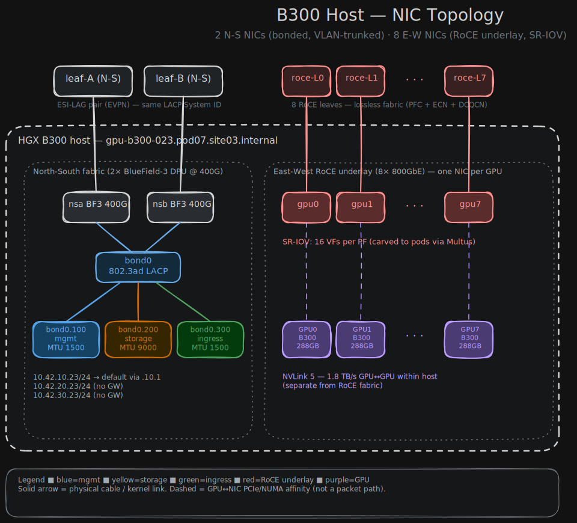
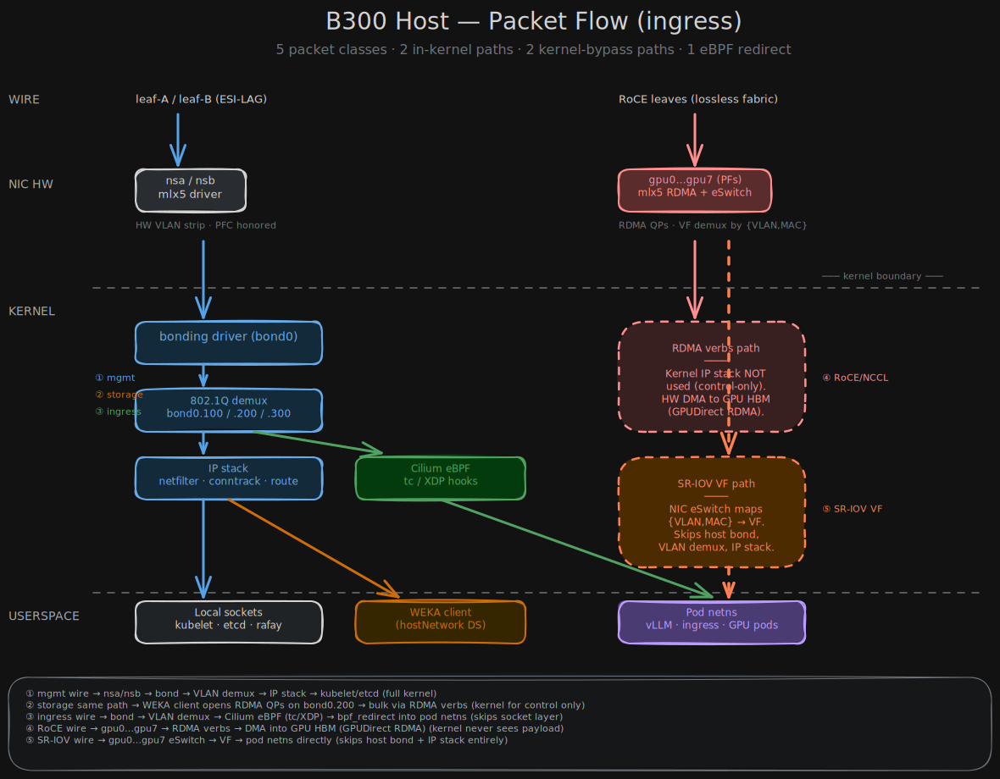

# Baremetal network configuration — interface layout and packet flows

## Executive Summary

A B300 GPU server is provisioned with two distinct network subsystems. **Two 200 GbE NICs are bonded under LACP and carry three VLAN-tagged sub-interfaces** — management, storage, ingress — for north-south traffic. **Eight 800 Gb/s ConnectX-8 SuperNICs, one per GPU,** expose host-addressed RoCE underlay IPs and SR-IOV virtual functions for east-west collectives. Inbound packets fall into five classes: two traverse the full kernel IP stack, two bypass the kernel entirely (RDMA verbs and SR-IOV virtual functions), and one is intercepted by Cilium eBPF before reaching userspace. Non-GPU hosts (K8s control plane, jumphosts) use the same north-south pattern with the east-west zone omitted.

## Requirements

- A single host configuration pattern serving GPU compute hosts (10 NICs) and non-GPU hosts (2 NICs) without forking the schema by role.
- North-south traffic separated into three VLANs on a single LACP bond — `mgmt`, `storage`, `ingress`.
- East-west traffic on dedicated NICs, one per GPU, with RoCE underlay addressing and SR-IOV VF provisioning.
- Lossless RoCE fabric for GPU collectives: PFC priority 3 with ECN and DCQCN.
- Storage VLAN at MTU 9000; management and ingress VLANs at MTU 1500.
- Exactly one default route per host, on the management VLAN.
- All host-side configuration declared in Netbox, rendered to Netplan plus ancillary systemd units, delivered via cloud-init NoCloud at first boot.

## Assumptions

- Ubuntu 24.04 with Netplan compiling to systemd-networkd. Alternative OS-level backends (nmstate, raw systemd-networkd) remain open decisions.
- VLAN IDs 100 / 200 / 300 for management / storage / ingress, fabric-wide.
- North-south leaves are an ESI-LAG pair coordinated via EVPN; the host sees a plain `mode=802.3ad` LACP bond and is unaware of EVPN.
- Switch fabric configuration (Apstra) and pod-side networking (Cilium, Multus, SR-IOV CNI) are out of scope for this overview.

## 1. NIC topology

The host has **10 physical NICs** divided into two logical zones.

### North-south zone (2 × 200 GbE)

`nsa` and `nsb` connect to `leaf-A` and `leaf-B`, which form an ESI-LAG pair on the fabric side. Because the two leaves advertise a common LACP System ID, the host sees a single LACP partner and runs an ordinary `mode=802.3ad` bond named `bond0`. The bond is configured with `lacp-rate: fast` (1 s LACPDU interval, ~3 s failover) and `transmit-hash-policy: layer3+4` so flows distribute across both physical links instead of pinning by MAC.

Three VLAN sub-interfaces sit on the bond:

| Sub-interface | Role | MTU | Default gateway |
|---|---|---|---|
| `bond0.100` | management — K8s API, etcd, DNS, Rafay agent | 1500 | yes (the host's only default route) |
| `bond0.200` | storage — WEKA client traffic | 9000 | no (link-local to storage fabric) |
| `bond0.300` | ingress — customer traffic from Cloudflare → edge POP | 1500 | no |

The bond itself carries no IP. Untagged frames have no destination on this host and are silently dropped — a useful defensive property against switch-port misconfiguration.

### East-west zone (8 × ConnectX-8 SuperNIC @ 800 Gb/s)

One ConnectX-8 SuperNIC per GPU at 800 Gb/s per direction (~1.6 Tb/s full-duplex), pinned to the same PCIe Gen6 root complex as its paired GPU. Each NIC carries:
- A host-side underlay IP (e.g., `10.42.100.23/24` … `10.42.107.23/24`) used during RDMA queue-pair setup.
- 16 SR-IOV virtual functions, which Multus assigns to customer pods.

The dashed lines in the diagram denote **PCIe / NUMA affinity** between each NIC and its paired GPU. The hardware is laid out so the NIC and GPU share a PCIe root complex, keeping GPUDirect RDMA paths short. NVLink 5 connects the eight GPUs within the host at 1.8 TB/s; it is independent of the RoCE fabric and carries on-host collective traffic that never reaches a NIC.

The eight RoCE leaves form the lossless east-west fabric, configured with PFC priority 3, ECN, and DCQCN.

### Non-GPU hosts

K8s control-plane nodes, jumphosts, and bootstrap appliances use only the north-south zone — `nsa`, `nsb`, `bond0`, and the three VLAN children. The east-west zone is absent. The same intent schema and renderer produce both shapes; the GPU-specific blocks are simply unpopulated for non-GPU roles.

## 2. Packet flows

Five distinct packet classes arrive at this host with very different kernel involvement.

**① Management.** A frame arrives on `nsa` or `nsb` with VLAN tag 100. The mlx5 driver strips the tag in hardware and presents the frame to the bonding driver. The 802.1Q demux delivers it to `bond0.100`. The Linux IP stack runs the full netfilter / conntrack / routing pipeline, then the packet reaches a socket in kubelet, etcd, or the Rafay site agent. **Full kernel path.** Any host-level firewall enforcement happens here.

**② Storage.** Wire path is identical to management but with VLAN tag 200. The IP stack handles the WEKA client's brief TCP control channel; bulk reads and writes then move via **RDMA verbs over the same physical bond**. The WEKA client opens RDMA queue pairs and the payload bypasses the IP stack from that point on. PFC and ECN are enforced in NIC hardware regardless of which path the packet takes. The cold-load concern documented as D45 is structural here — a 70B model burst saturates the bond and competes with ingress on the same two NICs.

**③ Ingress.** Customer HTTPS traffic from Cloudflare lands on `bond0.300`. **Cilium's eBPF program runs at the `tc`/`XDP` hook before the packet reaches the socket layer.** Cilium performs service-IP DNAT and `bpf_redirect`s the `skb` into the target pod's network namespace via the veth pair. For most TaaS requests the packet never visits the host's main IP stack — it goes from wire to pod netns with eBPF in between.

**④ RoCE / NCCL.** NCCL collectives between GPUs across hosts arrive on `gpu0`…`gpu7`. The mlx5 driver hands them directly to the RDMA verbs path, which **DMAs straight into GPU HBM via GPUDirect RDMA.** The kernel IP stack never sees the payload. Only the initial out-of-band queue-pair setup touches the IP stack; once a QP is established the host kernel is invisible.

**⑤ SR-IOV virtual functions.** When a pod claims an SR-IOV interface via Multus, the NIC's embedded switch ("eSwitch") demuxes incoming frames by `{VLAN, MAC}` and routes them to the matching VF's RX queue. The pod sees a raw `ethX` in its netns. **The host's bond, VLAN demux, and IP stack are bypassed entirely** — the path that lets customer GPU pods reach the east-west fabric at line rate without per-packet host overhead.

## Implications for the configuration pipeline

Two facts from these flows shape what the renderer must produce:

- **Interfaces have roles, not just names.** The intent schema encodes interface *role* — bond-member, VLAN-child, RoCE-underlay, SR-IOV-parent — because each role generates a structurally different output. Bond members need ethtool baselining; VLAN children need IP, gateway, and MTU; RoCE underlays need PFC tuning that Netplan cannot express and falls to a separate systemd template unit; SR-IOV parents need `virtual-function-count` plus per-VF udev rules.
- **The kernel is not always in the path.** For ④ and ⑤, Netplan declares the *substrate* — the underlay IP, the VF count, the MTU — but actual packet movement does not touch the kernel IP stack. Boot-time validation must probe the substrate (VFs present, RDMA verbs functional, PFC negotiated) rather than rely on `ping`-style reachability through it.

These shape the rest of the work: the Pydantic intent model needs role-aware interface types, and the renderer's output extends beyond Netplan into systemd `.link` files, instantiated `roce-tuning@.service` units, and `sysctl.d` drop-ins.
