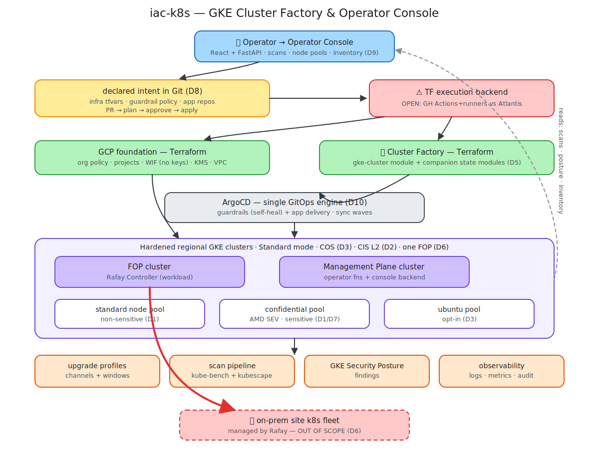
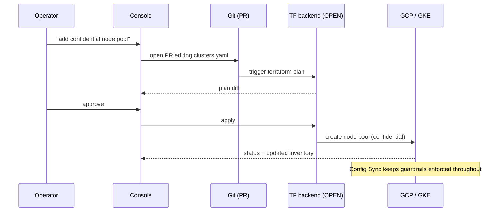

# iac-k8s — High-Level Architecture

A one-page picture of the GKE cluster factory + operator console for team brainstorming. Detail lives in [01 provisioning](01-provisioning-and-iac.md), [02 security](02-security-standard.md), [03 Day 2](03-day2-operations.md), [04 do-list](04-do-list.md), [05 console](05-operator-console.md). Design decisions **D1–D9** are tagged inline; one item (TF execution backend) is still open.

## The whole picture

> Editable source: [`diagrams/architecture.excalidraw`](diagrams/architecture.excalidraw) — open it on [excalidraw.com](https://excalidraw.com) (File → Open) to rework the diagram during the brainstorm, then re-export the SVG over `diagrams/architecture.svg`.

## How to read it (the four moves)

1. **Bootstrap once.** ~12 manual day-0 steps (org, billing, seed project, WIF) hand off to Terraform, which builds the GCP foundation and the factory. No downloadable keys — Workload Identity Federation.
2. **Build clusters from the factory.** The parameterized `gke-cluster` Terraform module stamps out hardened, regional (3-AZ) clusters from a values entry. Security is baked in (D2 CIS L2, D7 all GKE-native controls mandatory). Mixed node pools (D1): standard + confidential (per data class) + optional Ubuntu.
3. **Deliver config & apps via GitOps.** Config Sync continuously reconciles the guardrail policy package (reused from `k8s-hardening`) and self-heals drift; ArgoCD deploys the workloads — Rafay Controller on the FOP, operator functions on the Management Plane.
4. **Operate through the console.** Everything the operator does is **intent, not direct mutation** (D8): a console action edits declared config → opens a PR → plan → approve → apply. Scans, posture, inventory, and upgrade status flow back as reads.

## Trust & scope boundaries

- **One FOP** for the foreseeable future; it hosts **Rafay as a workload**, and **Rafay** — not this factory — manages the **multi-site on-prem k8s fleet** (D6). That fleet is out of `iac-k8s` scope; the red arrow to it marks the boundary.
- **No unsigned images** ever cross the admission boundary (D4) — the signing pipeline is a tier-0 dependency.
- **Control plane is a shared trust boundary** within a cluster; mixed node pools give data-in-use isolation, not blast-radius separation (D1). Hard regulatory tenancy → revisit two clusters.

## The intent loop (mutating actions)

## Open item for the brainstorm

- **Terraform execution backend** (the red ⚠ box): **GitHub Actions + self-hosted runners** (lean — reuses CI + WIF, clean API, creds stay in-env) vs **Atlantis** (purpose-built PR server, directory locking, more to operate). HCP Terraform / TFE ≈ eliminated (external SaaS / cost / sovereignty). Decision pending — see [05](05-operator-console.md#open-thread).
