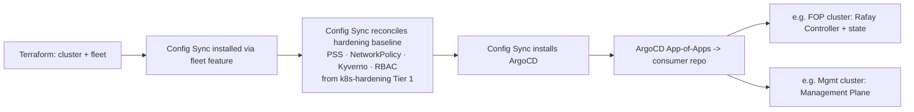

# Hardened HA GKE via IaC: Reusable Provisioning & App Delivery

This is the anchor report for the `iac-k8s` area. It carries the canonical **Requirements** and **Assumptions** for all four topics ([security standard](02-security-standard.md), [Day 2 operations](03-day2-operations.md), [do-list](04-do-list.md)); the others reference them.

## Table of contents
- [Executive Summary](#executive-summary)
- [Requirements](#requirements)
- [Assumptions Made](#assumptions-made)
- [Day-0: the irreducible manual bootstrap](#day-0-the-irreducible-manual-bootstrap)
- [IaC toolchain comparison](#iac-toolchain-comparison)
- [The cluster factory](#the-cluster-factory)
- [HA configuration](#ha-configuration)
- [App-delivery: from empty cluster to running workloads](#app-delivery-from-empty-cluster-to-running-workloads)

## Executive Summary

The deliverable is a **reusable cluster factory** — valued for repeatable, standardized, idempotent rebuilds, not for spinning up many clusters (see [D6](#decision-one-fop-rafay-owns-the-site-fleet-d6): one FOP for the foreseeable future). It is a parameterized **Terraform** blueprint (built on the maintained [`safer-cluster`](https://github.com/terraform-google-modules/terraform-google-kubernetes-engine/blob/main/modules/safer-cluster/README.md) submodule, which pins to the GKE Hardening Guide + CIS) that stands up **any hardened, regional GKE cluster** from a small config input, paired with a **Config Sync** policy package (guardrails) and an **ArgoCD** app template (workloads). A new cluster — FOP, Management Plane, or future site/tenant cluster — is one declarative instantiation in Git. Roughly **a dozen day-0 steps are unavoidably manual** (org, billing, seed project + state bucket, Workload Identity Federation); everything after is reproducible from the factory.

**Toolchain recommendation — prefer Terraform + Config Sync (+ ArgoCD for apps) over Terraform + ArgoCD-only or Terraform + Config Connector because:**
1. **Config Sync is free with GKE and drift-enforcing** — the hardening policy package is authored once and continuously reconciled on the FOP and Mgmt clusters; an off-standard change self-heals. *(Note: per [D6](#decision-one-fop-rafay-owns-the-site-fleet-d6), GKE-level fleet fan-out is not a driver — Rafay owns the multi-site fleet. At this 2-cluster scale, consolidating on ArgoCD-only is a defensible simplification; the split below is preferred for the drift-heal guarantee, not for scale.)*
2. **Clean split of concerns** — Config Sync owns *platform guardrails* (hardening baseline, Kyverno policy, namespaces); ArgoCD owns *apps* (Rafay Controller, Mgmt Plane) with the rollback/sync-wave UX app teams expect.
3. **Terraform stays the substrate tool** — Config Connector (managing GCP via in-cluster CRDs) creates a bootstrap chicken-and-egg and per-cluster coupling that fights the "one reusable module" goal.

> **Anti-pattern flagged:** the brief mentions "download API key." Do **not** download long-lived service-account JSON keys for CI. Use **Workload Identity Federation** (GitHub Actions OIDC → GCP) — keyless, no secret to leak or rotate. Part of the [security standard](02-security-standard.md).

## Requirements

*(Canonical for the area. Confirmed with the user before write-up.)*

- **R1 — Manual bootstrap (day-0).** Enumerate everything that must be done by hand once, before the factory can run, with a clear manual→automated handoff line.
- **R2 — Reusable IaC cluster factory.** A parameterized, idempotent, declarative blueprint that builds (and tears down) the GCP substrate (org policy, project, VPC, NAT, IAM, KMS) and a hardened GKE cluster from Git config — repeatable for *any* cluster, not hand-built per cluster. Includes an IaC-toolchain comparison with a recommendation.
- **R3 — HA configuration.** Every cluster the factory produces is regional and able to sustain one AZ failure (C3.2); sizing is an input parameter, not a fork.
- **R4 — Security posture.** A reusable GKE security standard baked into the factory, aligned to the [`AI-Fabrik/k8s-hardening`](https://github.com/AI-Fabrik/k8s-hardening) work. *(Full treatment in [02](02-security-standard.md).)*
- **R5 — App-delivery layer.** A reusable GitOps bootstrap so any new cluster gets its guardrails and its workloads (e.g. Rafay Controller, Management Plane) from declared intent.
- **R6 — Day 2: GKE version lifecycle.** Reusable upgrade policy — mandatory security upgrades vs optional feature upgrades — applied uniformly across factory-built clusters. *(Full treatment in [03](03-day2-operations.md).)*
- **R7 — Day 2: host OS management.** Node image OS and any GCE instances, managed by policy. *(Full treatment in [03](03-day2-operations.md).)*
- **R8 — Do-list output.** Concrete tasks tagged reuse-existing vs net-new across manual / IaC / GitOps / Day-2. *(Delivered in [04](04-do-list.md).)*

## Assumptions Made

- **A1** — GKE on GCP is settled (C1.2; confirmed by `mgmt-plane-setup`). No cloud comparison.
- **A2** — Scope is **hyperscaler GKE** clusters. Bare-metal *site* control-plane build (via Rafay) is a separate domain; the factory builds the clusters that *host* tooling such as the Rafay Controller and Management Plane.
- **A3** — One region, multiple AZs (C3.2). Multi-region DR is out of scope (covered in `mgmt-plane-setup`).
- **A4** — **The goal is the reusable tooling, not a specific cluster count.** The factory is cluster-agnostic and parameterized; FOP and Management Plane are the **first reference consumers**, each a separate instantiation.
- **A5** — **Standard vs Autopilot is compared** *(user-confirmed)*; the factory should support both as a mode parameter where practical. Recommendation in [03](03-day2-operations.md).
- **A6** — Security standard aligns to `AI-Fabrik/k8s-hardening`; CIS GKE Benchmark is the floor.
- **A7** — A GCP Organization (Cloud Identity / Workspace domain) either exists or its creation is part of R1's manual list; Workspace/domain setup is not researched beyond that.

## Day-0: the irreducible manual bootstrap

Steps that cannot be IaC because they create the identity, billing, or state the factory depends on. After step 8, everything is Terraform.

| # | Step | Why manual | One-time? |
|---|------|-----------|-----------|
| 1 | Create/claim **GCP Organization** (bound to a Cloud Identity or Workspace domain) | Root of the resource hierarchy; needs domain verification | Yes |
| 2 | Create a **Billing Account** + attach payment method | Console + payment instrument | Yes |
| 3 | Create **admin/IdP groups** in Cloud Identity (e.g. `gcp-org-admins`, `aifabrik-sre`) | Human identity source for RBAC | Yes |
| 4 | Create a **seed/bootstrap project** + link billing | Hosts Terraform state & the CI identity; can't bootstrap itself | Yes |
| 5 | Grant a human bootstrap admin org-level roles (`resourcemanager.organizationAdmin`, `billing.admin`) | First privileged identity | Yes |
| 6 | Create the **Terraform state GCS bucket** (versioning + CMEK) in the seed project | State must exist before `terraform init` — local-state-then-migrate, or `gcloud` one-liner | Yes |
| 7 | Configure **Workload Identity Federation** pool + provider for GitHub Actions OIDC, and a CI service account it can impersonate | Keyless CI auth; replaces downloaded keys | Yes |
| 8 | Enable bootstrap APIs on the seed project (`cloudresourcemanager`, `iam`, `serviceusage`, `storage`, `cloudkms`) | Needed before Terraform can enable the rest | Yes |
| — | **Handoff line** — from here the factory owns org policy, folders, projects, networks, KMS, GKE, and per-cluster API enablement | | |

Use the [`terraform-google-modules/bootstrap`](https://github.com/terraform-google-modules/terraform-google-bootstrap) module for steps 4–8 (it scripts the seed project, state bucket, and CI identity), shrinking the truly-manual set to steps 1–3 + 5. This bootstrap runs **once per organization**, not once per cluster.

## IaC toolchain comparison

| Dimension | **Terraform + Config Sync** *(rec.)* | Terraform + ArgoCD only | Terraform + Config Connector |
|---|---|---|---|
| GCP substrate provisioning | Terraform | Terraform | Terraform (bootstrap) then KCC CRDs |
| In-cluster config / policy | Config Sync (fleet feature) | ArgoCD | KCC + whatever |
| GCP resources as code | HCL | HCL | k8s CRDs in-cluster |
| Cost | Free with GKE | Self-hosted (free OSS) | Free |
| Consistent baseline across the few clusters | **Native (one policy pkg, drift-heal)** | Per-cluster HA control plane | Per-cluster operator |
| Bootstrap coupling | Low | Low | **High** (cluster manages its own cloud deps) |
| App-delivery UX (rollbacks, waves, UI) | Basic | **Rich** | n/a |
| Drift enforcement | Yes (continuous reconcile) | Yes | Yes |
| Skill match (k8s-hardening uses kubectl/Kyverno YAML) | **High** | High | Medium (KCC mental model) |

**Verdict:** Terraform for the substrate; **Config Sync** for the hardening/guardrail layer (it syncs the [`k8s-hardening` Tier-1 manifests + Kyverno policies](https://github.com/AI-Fabrik/k8s-hardening/tree/main/tier1-manifests) verbatim to every factory cluster); **ArgoCD** for per-consumer application stacks. Enable Config Sync via Terraform's `google_gke_hub_feature` ([worked example](https://cloud.google.com/blog/topics/anthos/using-terraform-to-enable-config-sync-on-a-gke-cluster)).

## The cluster factory

A single **reusable, parameterized** Terraform composition. Foundation layers run once per org/project; the cluster layer is invoked once per cluster with a small input (name, project, region, machine type, mode, size, channel).

| Layer | Scope | Reusable? |
|---|---|---|
| `00-org` | org policies (disable SA keys, require Shielded VM, restrict public IP), folders | once / org |
| `10-projects` | project per consumer + API enablement | per project |
| `20-network` | VPC, regional subnets w/ Pod/Service secondary ranges, **regional Cloud NAT**, firewall | per project |
| `30-kms` | key rings/keys (secrets, state) | per project |
| **`gke-cluster` (the core module)** | **the parameterized hardened cluster blueprint** — private nodes + endpoint, Workload Identity, Dataplane V2, Shielded nodes, Binary Authorization, KMS secrets encryption, authorized networks | **per cluster, any count** |
| `fleet` | register cluster to fleet; attach Config Sync + Policy Controller | per cluster |
| `app-bootstrap` | install ArgoCD, point at the consumer's app repo | per cluster |

The core module exposes a **values contract** (e.g. a `clusters.yaml` or per-env tfvars). Standing up the FOP cluster, the Mgmt Plane cluster, or the Nth cluster is adding an entry — no new code. Idempotent build/teardown (the recurring acceptance criterion in the objectives doc) is inherent to Terraform remote state; `prevent_destroy` guards stateful resources.

### Decision: one FOP, Rafay owns the site fleet (D6)

**Decided** — there is **one FOP for the foreseeable future**, hosting the **Rafay Controller as a workload**. Rafay manages the multi-site fleet — the k8s clusters at each on-prem site. That fleet lifecycle is the **Rafay/site domain, outside `iac-k8s` scope** (A2).

- **Implication:** `iac-k8s` targets a **small, stable set of hyperscaler GKE clusters** — the FOP cluster + the Management Plane cluster — not a growing GKE fleet.
- **Reusability still matters** for repeatability, the enforced security standard, and clean teardown/rebuild — *not* for fan-out.
- **No GKE-level fleet/multi-site machinery** (cross-site failover, multi-FOP federation, fleet-wide dashboards) is built here; each site is its own failure domain (C3.1) and Rafay owns the cross-site story.
- **Toolchain consequence:** Config Sync's fleet-scale advantage is moot at this size; it stays for drift enforcement and the guardrail/app split, not scale (see Toolchain recommendation).

### Decision: stateful add-ons as separate companion modules (D5)

**Decided** — persistent state a consumer needs outside the cluster (e.g. the Rafay Controller's durable DB/object store, which must survive controller reinstall) is **not** baked into the `gke-cluster` module. Instead, ship **separate optional companion modules** (`stateful-cloudsql`, `stateful-gcs` — Cloud SQL HA / GCS with CMEK + backups baked in) that a consumer composes *alongside* the cluster in its own Terraform.

- **Cluster module stays single-purpose** — "produce a hardened, HA cluster," nothing else.
- **Independent lifecycle** — data infra lives in the consumer's own state, so the FOP's Rafay state **outlives a cluster rebuild**; `terraform destroy` of a cluster never touches it.
- **Reuse without coupling** — the companion modules give every consumer the same hardened Cloud SQL/GCS pattern (no hand-rolling), but the cluster module carries no DB knowledge.

## HA configuration

Baked into the module so **every** cluster inherits it:

- **Regional cluster** — control plane replicated across 3 zones; survives one AZ loss (C3.2).
- **Node pools** across ≥3 zones; per-pool autoscaler. Count/type are inputs.
- **Surge upgrades** + **PodDisruptionBudgets** so node upgrades preserve quorum-sensitive workloads.
- **Regional** disks / Cloud SQL HA for any stateful add-ons (a per-consumer option, e.g. Rafay state).
- Not in scope: cross-**region** DR (single region per C3.2).

## App-delivery: from empty cluster to running workloads

The factory's GitOps bootstrap is identical for every cluster; only the consumer's app repo differs.

- **Guardrails land before any app** — when workloads deploy, PSS + Kyverno are already enforcing, so anything off-standard is rejected at admission.
- **Consumers plug in** by pointing ArgoCD at their own app repo. The Rafay Controller (isolated tenant, durable Cloud SQL/GCS state) and the Management Plane are the first two; later clusters reuse the same path.

Sources: [GKE release channels](https://docs.cloud.google.com/kubernetes-engine/docs/concepts/release-channels), [safer-cluster module](https://registry.terraform.io/modules/terraform-google-modules/kubernetes-engine/google/latest/submodules/safer-cluster), [Config Sync via Terraform](https://cloud.google.com/blog/topics/anthos/using-terraform-to-enable-config-sync-on-a-gke-cluster), [AI-Fabrik/k8s-hardening](https://github.com/AI-Fabrik/k8s-hardening).
