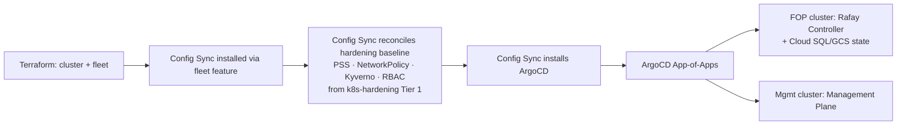

# GCP → Hardened HA GKE via IaC: Provisioning & App Delivery

This is the anchor report for the `iac-k8s` area. It carries the canonical **Requirements** and **Assumptions** for all four topics ([security standard](02-security-standard.md), [Day 2 operations](03-day2-operations.md), [do-list](04-do-list.md)); the others reference them.

## Table of contents
- [Executive Summary](#executive-summary)
- [Requirements](#requirements)
- [Assumptions Made](#assumptions-made)
- [Day-0: the irreducible manual bootstrap](#day-0-the-irreducible-manual-bootstrap)
- [IaC toolchain comparison](#iac-toolchain-comparison)
- [Provisioning the GCP substrate + GKE](#provisioning-the-gcp-substrate--gke)
- [HA configuration](#ha-configuration)
- [App-delivery: from empty cluster to Rafay + Mgmt Plane](#app-delivery-from-empty-cluster-to-rafay--mgmt-plane)

## Executive Summary

Two **regional** GKE clusters — one for the Fleet Operations Plane (FOP, hosting the Rafay Controller), one for the Management Plane — provisioned from Git with **Terraform** (the maintained [`safer-cluster`](https://github.com/terraform-google-modules/terraform-google-kubernetes-engine/blob/main/modules/safer-cluster/README.md) submodule, which pins to the GKE Hardening Guide + CIS), and reconciled in-cluster by **Config Sync** (Google's fleet-native GitOps), with **ArgoCD** layered on for application delivery. Roughly **a dozen day-0 steps are unavoidably manual** (org, billing, seed project + state bucket, Workload Identity Federation); everything after that is declared intent in Git.

**Toolchain recommendation — prefer Terraform + Config Sync (+ ArgoCD for apps) over Terraform + ArgoCD-only or Terraform + Config Connector because:**
1. **Config Sync is free with GKE and fleet-native** — it scales cleanly to the multi-site North Star (C2.2) where ArgoCD-only would need a separate HA control plane per region.
2. **Clean split of concerns** — Config Sync owns *platform guardrails* (hardening baseline, Kyverno policy, namespaces); ArgoCD owns *apps* (Rafay Controller, Mgmt Plane) with the rollback/sync-wave UX app teams expect.
3. **Terraform stays the substrate tool** — Config Connector (managing GCP via in-cluster CRDs) creates a bootstrap chicken-and-egg and a blast-radius coupling we don't want for the cluster that *governs* the fleet.

> **Anti-pattern flagged:** the brief mentions "download API key." Do **not** download long-lived service-account JSON keys for CI. Use **Workload Identity Federation** (GitHub Actions OIDC → GCP) — keyless, no secret to leak or rotate. This is part of the [security standard](02-security-standard.md).

## Requirements

*(Canonical for the area. Confirmed with the user before write-up; topology = separate clusters, GKE Standard-vs-Autopilot compared.)*

- **R1 — Manual bootstrap (day-0).** Enumerate everything that must be done by hand before IaC takes over, with a clear manual→automated handoff line.
- **R2 — IaC-managed GCP→GKE provisioning.** Declarative, idempotent build/teardown of the GCP substrate (org policy, project, VPC, NAT, IAM, KMS) and GKE, from Git. Includes an IaC-toolchain comparison with a recommendation.
- **R3 — HA configuration.** Regional GKE able to sustain one AZ failure (C3.2); topology/sizing guidance for FOP + Mgmt Plane.
- **R4 — Security posture.** A GKE security standard aligned to the [`AI-Fabrik/k8s-hardening`](https://github.com/AI-Fabrik/k8s-hardening) work. *(Full treatment in [02](02-security-standard.md).)*
- **R5 — App-delivery layer.** How the GitOps layer is bootstrapped and how the Rafay Controller and Management Plane are deployed onto the clusters.
- **R6 — Day 2: GKE version lifecycle.** Mandatory security upgrades vs optional feature upgrades. *(Full treatment in [03](03-day2-operations.md).)*
- **R7 — Day 2: host OS management.** Node image OS and any GCE instances. *(Full treatment in [03](03-day2-operations.md).)*
- **R8 — Do-list output.** Concrete tasks tagged reuse-existing vs net-new across manual / IaC / GitOps / Day-2. *(Delivered in [04](04-do-list.md).)*

## Assumptions Made

- **A1** — GKE on GCP is settled (C1.2; confirmed by `mgmt-plane-setup`). No cloud comparison.
- **A2** — Scope is the **hyperscaler GKE** clusters only. Bare-metal *site* control-plane build (via Rafay) is a separate domain; this project stops at the clusters that *host* the Rafay Controller + Mgmt Plane.
- **A3** — One region, multiple AZs (C3.2). Multi-region DR is out of scope (covered in `mgmt-plane-setup`).
- **A4** — **Separate clusters** for FOP and Management Plane *(user-confirmed)*.
- **A5** — **Standard vs Autopilot is compared** *(user-confirmed)*; recommendation lands in [03](03-day2-operations.md).
- **A6** — Security standard aligns to `AI-Fabrik/k8s-hardening`; CIS GKE Benchmark is the floor.
- **A7** — A GCP Organization (Cloud Identity / Workspace domain) either exists or its creation is part of R1's manual list; we do not research Workspace/domain setup beyond that.

## Day-0: the irreducible manual bootstrap

Steps that cannot be IaC because they create the identity, billing, or state that IaC itself depends on. After step 8, everything is Terraform.

| # | Step | Why manual | One-time? |
|---|------|-----------|-----------|
| 1 | Create/claim **GCP Organization** (bound to a Cloud Identity or Workspace domain) | Root of the resource hierarchy; needs domain verification | Yes |
| 2 | Create a **Billing Account** + attach payment method | Console + payment instrument | Yes |
| 3 | Create **admin/IdP groups** in Cloud Identity (e.g. `gcp-org-admins`, `aifabrik-sre`) | Human identity source for RBAC | Yes |
| 4 | Create a **seed/bootstrap project** + link billing | Hosts Terraform state & the CI identity; can't bootstrap itself | Yes |
| 5 | Grant a human bootstrap admin org-level roles (`resourcemanager.organizationAdmin`, `billing.admin`) | First privileged identity | Yes |
| 6 | Create the **Terraform state GCS bucket** (versioning + CMEK) in the seed project | State must exist before `terraform init` — local-state-then-migrate, or `gcloud` one-liner | Yes |
| 7 | Configure **Workload Identity Federation** pool + provider for GitHub Actions OIDC, and a CI service account it can impersonate | Keyless CI auth; replaces downloaded keys | Yes |
| 8 | Enable bootstrap APIs on the seed project (`cloudresourcemanager`, `iam`, `serviceusage`, `storage`, `cloudkms`) | Needed before Terraform can enable the rest | Yes |
| — | **Handoff line** — from here Terraform owns the org policy, folders, projects, networks, KMS, GKE, and per-cluster API enablement | | |

Use the [`terraform-google-modules/bootstrap`](https://github.com/terraform-google-modules/terraform-google-bootstrap) module to do steps 4–8 semi-automatically (it scripts the seed project, state bucket, and CI identity), shrinking the truly-manual set to steps 1–3 + 5.

## IaC toolchain comparison

| Dimension | **Terraform + Config Sync** *(rec.)* | Terraform + ArgoCD only | Terraform + Config Connector |
|---|---|---|---|
| GCP substrate provisioning | Terraform | Terraform | Terraform (bootstrap) then KCC CRDs |
| In-cluster config / policy | Config Sync (fleet feature) | ArgoCD | KCC + whatever |
| GCP resources as code | HCL | HCL | k8s CRDs in-cluster |
| Cost | Free with GKE | Self-hosted (free OSS) | Free |
| Multi-site fleet fit (North Star) | **Native (fleet)** | Per-cluster HA control plane | Per-cluster operator |
| Bootstrap coupling | Low | Low | **High** (cluster manages its own cloud deps) |
| App-delivery UX (rollbacks, waves, UI) | Basic | **Rich** | n/a |
| Drift enforcement | Yes (continuous reconcile) | Yes | Yes |
| Skill match (k8s-hardening uses kubectl/Kyverno YAML) | **High** | High | Medium (KCC mental model) |

**Verdict:** Terraform for the substrate; **Config Sync** for the hardening/guardrail layer (it can sync the [`k8s-hardening` Tier-1 manifests + Kyverno policies](https://github.com/AI-Fabrik/k8s-hardening/tree/main/tier1-manifests) verbatim); **ArgoCD** for the Rafay Controller + Mgmt Plane application stacks. Enable Config Sync via Terraform's `google_gke_hub_feature` ([worked example](https://cloud.google.com/blog/topics/anthos/using-terraform-to-enable-config-sync-on-a-gke-cluster)).

## Provisioning the GCP substrate + GKE

Layered Terraform, each layer a separate state with its own CI plan/apply:

1. **`00-org`** — org policies (constraints: disable SA key creation, require Shielded VMs, restrict public IPs), folders (`fop`, `mgmt`, `shared`).
2. **`10-projects`** — one project per plane (`aifabrik-fop`, `aifabrik-mgmt`) + a `shared` project (Artifact Registry, logging sink, KMS). API enablement per project.
3. **`20-network`** — per-project VPC, regional subnets with secondary ranges for Pods/Services, **regional Cloud NAT** (cheaper than per-AZ; see `mgmt-plane-setup`), private Google access, firewall rules.
4. **`30-kms`** — key rings + keys for GKE database (secrets) encryption and the state bucket.
5. **`40-gke`** — the `safer-cluster` module per plane (private nodes + private endpoint, Workload Identity, Dataplane V2, Shielded nodes, Binary Authorization, KMS secrets encryption, master authorized networks).
6. **`50-fleet`** — register clusters to a fleet; enable Config Sync + Policy Controller features.
7. **`60-data`** — Rafay Controller durable state (Cloud SQL / GCS), per [the objectives doc's durability requirement](https://github.com/kg-aifabrik/host-config).

Idempotent build/teardown (the recurring acceptance criterion across the objectives doc) is inherent to Terraform with remote state; teardown = `terraform destroy` per layer in reverse, gated by a `prevent_destroy` on stateful resources (KMS keys, Cloud SQL).

## HA configuration

- **Regional clusters** — control plane replicated across 3 zones in the region (vs zonal single point of failure); survives one AZ loss (C3.2).
- **Node pools** spread across ≥3 zones; cluster autoscaler per pool.
- **Surge upgrades** + **PodDisruptionBudgets** so node upgrades don't break quorum-sensitive workloads (Rafay Controller, etcd-backed state).
- **Regional** persistent disks / Cloud SQL HA for stateful components.
- Not in scope: cross-**region** DR (single region per C3.2; see `mgmt-plane-setup` for the multi-region pattern).

## App-delivery: from empty cluster to Rafay + Mgmt Plane

Bootstrap order (each step declarative, re-runnable):

- The **hardening baseline lands before any app** — guardrails are in place when Rafay/Mgmt deploy, so they're admitted under PSS + Kyverno from the start.
- **Rafay Controller** deploys as an isolated tenant (objectives R: *Rafay as FOP tenant*) with state in Terraform-provisioned Cloud SQL/GCS so it survives reinstall.
- **Management Plane** deploys to its own cluster (A4) via its own ArgoCD project/RBAC.

Sources: [GKE release channels](https://docs.cloud.google.com/kubernetes-engine/docs/concepts/release-channels), [safer-cluster module](https://registry.terraform.io/modules/terraform-google-modules/kubernetes-engine/google/latest/submodules/safer-cluster), [Config Sync via Terraform](https://cloud.google.com/blog/topics/anthos/using-terraform-to-enable-config-sync-on-a-gke-cluster), [AI-Fabrik/k8s-hardening](https://github.com/AI-Fabrik/k8s-hardening).
