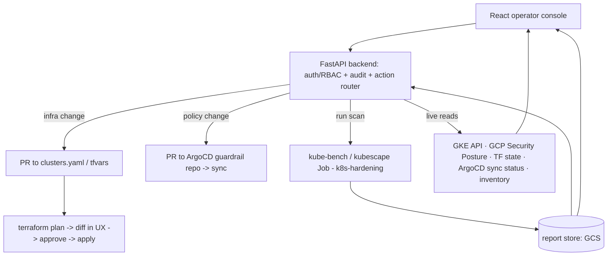

# Operator Console: UX for Build & Lifecycle Management

A self-service operator UX over the cluster factory — run a security-posture scan and view the report, add/modify a node pool (e.g. make it Confidential), drive build and Day-2 lifecycle. Requirements & Assumptions canonical in [01](01-provisioning-and-iac.md#requirements); this report adds **R9**.

## Executive Summary

The console is an **intent + visibility layer, not a second mutation path.** Every action that changes a cluster lands as a change to declared config that the existing pipeline applies (Terraform via PR, or the ArgoCD GitOps repo) — so IaC and ArgoCD self-heal stay authoritative and nothing the UX does causes out-of-band drift. The UX adds richer *reads* (scan reports, posture, inventory, run status) and a friendly *front door* to intent (forms that open PRs, render plan diffs, gate approval). Built as a **custom FastAPI + React** app, hosted as an operator-facing surface on the Management Plane, gated by the operator RBAC and audited via Git history + API logs.

**Action lanes:**

| Action type | Example | How it flows |
|---|---|---|
| Mutating infra | add node pool; flip `confidential: true` (D1/D7) | UX edits `clusters.yaml`/tfvars → **PR** → `terraform plan` → UX renders diff → approve → apply |
| Mutating policy | Kyverno exception, guardrail tweak | UX → **PR to the ArgoCD guardrail repo** → sync |
| Operational / read | run posture scan & view report; view inventory | UX triggers scan Job (k8s-hardening) → store report → render; live reads from GKE / GCP Security Posture / TF state / ArgoCD sync status |

## Requirements

- **R9 — Operator console.** A UX to drive build and lifecycle of factory clusters: trigger and view security-posture scans; add/modify/remove node pools including the per-pool Confidential flag; view cluster/node inventory, upgrade status, and sync/drift status — all through declared intent, never out-of-band mutation. Gated by operator RBAC; every action audited.

## Assumptions Made

- **A8** — Console is an operator-facing surface (Management Plane), not end-user-facing.
- **A9** — Mutations are async (PR → plan → approve → apply); reads are live + cached artifacts.
- **A10** — GitHub is the VCS/PR host (consistent with the WIF + Actions choices in [01](01-provisioning-and-iac.md)).

## Architecture

- **Backend (FastAPI):** authn/authz against operator RBAC, action router, audit log, orchestration of the TF execution backend and scan Jobs, read aggregation.
- **Frontend (React):** forms for intent (node pool add/confidential), plan-diff viewer with approve/apply, scan-report viewer, inventory/posture/sync dashboards.
- **Mutation engine:** PR-based GitOps; the **Terraform execution backend is an open decision** (see below).
- **Scan integration:** reuses the [`AI-Fabrik/k8s-hardening`](https://github.com/AI-Fabrik/k8s-hardening) pipeline (`harden.py`, kube-bench `gke-1.6.0`, kubescape) — the console triggers the Job, stores `delta.md`/`scores.json`, renders them, and overlays GKE Security Posture findings.

## Why intent-not-mutation is non-negotiable

A console that ran `gcloud`/`kubectl` directly would fight every D-series decision: ArgoCD self-heal would revert its in-cluster changes, Terraform state would drift from reality, and there'd be no plan/approve gate or audit trail. Routing all mutations through declared config preserves drift-heal, gives a reviewable plan diff before anything changes, and makes the Git history the audit log for free — satisfying the objectives doc's *Operator RBAC* and feeding *Observability* and *Inventory*.

## Decisions

- **D8 — PR-based mutation model.** Infra and policy changes flow through Git PRs that the pipeline plans/applies; the console renders the plan diff and gates approval. Direct (non-PR) calls are limited to read/scan triggers. The UX never mutates clusters out-of-band.
- **D9 — Custom FastAPI + React.** Build the console bespoke (fits the team's Python/FastAPI skills) rather than adopting an IDP framework (Backstage) or SaaS (Port).

## Open thread

- **Terraform execution backend (undecided).** Candidates compared: **GitHub Actions + self-hosted runners** (lean — reuses existing CI + WIF, clean Actions API for the console, runners keep creds in-env, Environments give the approval gate), **Atlantis** (purpose-built PR server, directory locking, OPA — but another service to harden and a thin API to embed), and **HCP Terraform / TFE** (richest API but external IBM-hosted SaaS / cost / sovereignty conflict — effectively eliminated). Left open pending review.
