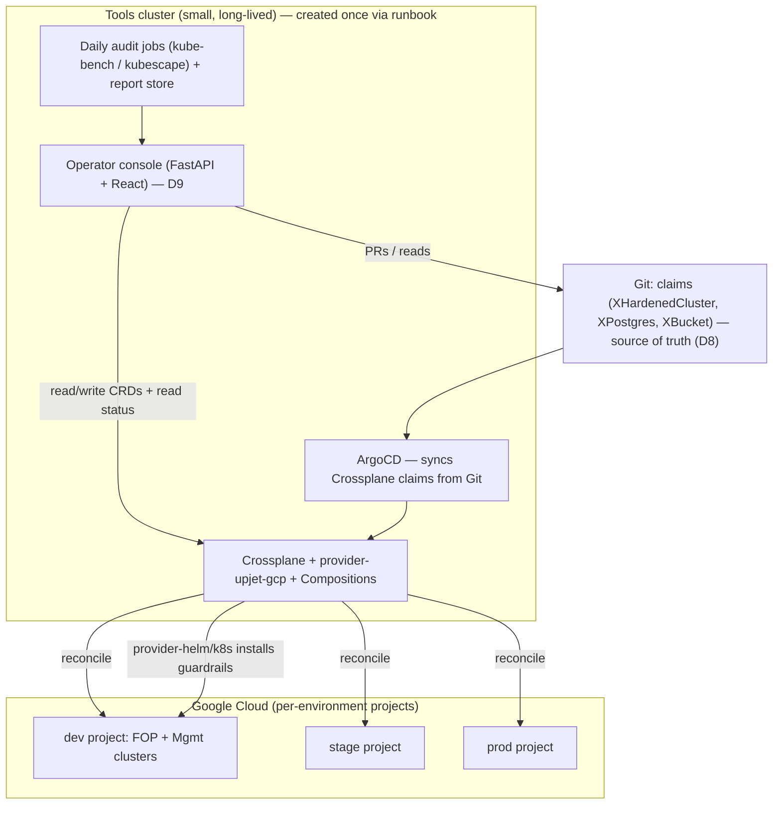

# Build vs Buy: the platform engine for the operator console

Decision report for the engine under the operator console — re-evaluated from scratch against the 7 goals, explicitly willing to pivot off the POC (Terraform + GitHub Actions).

## Table of contents
- [Executive Summary](#executive-summary)
- [Requirements (the 7 goals)](#requirements-the-7-goals)
- [Assumptions Made](#assumptions-made)
- [Why Crossplane (the engine decision)](#why-crossplane-the-engine-decision)
- [Recommended architecture](#recommended-architecture)
- [The two-dimensional model: env × purpose → projects](#the-two-dimensional-model-env--purpose--projects)
- [Day-2 operations the console must expose (Goal 6)](#day-2-operations-the-console-must-expose-goal-6)
- [Hardening beyond safer-cluster + daily audit (Goals 4 & 5)](#hardening-beyond-safer-cluster--daily-audit-goals-4--5)
- [What we keep from the POC, what we drop](#what-we-keep-from-the-poc-what-we-drop)
- [Risks & the lighter alternative](#risks--the-lighter-alternative)

## Executive Summary

| Dimension | **Crossplane + console** *(recommended)* | Config Connector (KCC) | Custom Terraform + GitHub Actions *(the POC)* | Cluster API | Rancher |
|---|---|---|---|---|---|
| Goal 7 — non-cluster resources (Postgres, bucket) | **Native** (MRs) | **Native** (CRDs) | More HCL + glue per type | ✗ clusters only | ✗ clusters only |
| Goal 3 — raise the abstraction (one "cluster" object) | **Compositions / XRs** | none (compose externally) | Terraform modules (no live object) | limited | fixed product model |
| Console integration | **easy — drives K8s CRDs** | easy — K8s CRDs | hard — orchestrate Actions runs + plan diffs | medium | use Rancher's own UI |
| Goal 5 — drift / audit | **continuous reconcile** | continuous reconcile | plan-time only | reconcile (clusters) | periodic |
| Goal 4 — extra hardening + guardrails | via provider-helm/k8s | via Config Sync | via ArgoCD | add-ons | built-in CIS + policy |
| Goal 2 — GCP-only | fine (multi-cloud unused) | **GCP-native** | fine | multi-cloud unused | multi-cloud unused |
| Git as source of truth (Goal 4-ans) | yes (ArgoCD-synced) | yes | yes | yes | partial |
| Operational surface | one component on tools cluster | **managed GKE add-on** | none extra, but heavy console glue + GCS state locks | controller set | large product |
| Reuse of our hardened spec + k8s-hardening | high | high | full | medium | low |

**Prefer Crossplane over the alternatives because:**
1. **It is the only option that satisfies Goal 7 *and* Goal 3 together** — clusters, Cloud SQL, and buckets are one resource model, and **Composition Functions** let us define a single high-level `XHardenedCluster` (and later `XPostgres`, `XBucket`) so an operator picks *env × purpose* and gets the whole hardened stack from one object. Rancher and Cluster API are cluster-only and fail Goal 7 outright.
2. **It collapses console complexity and removes the POC's worst pain.** The console drives **Kubernetes CRDs on the tools cluster** — no orchestrating GitHub Actions runs, rendering plan diffs, or fighting **GCS state-lock races** (the exact failure we hit). Crossplane's **continuous reconcile** is also the engine for Goal 5 (drift/anomaly), which the plan-time Terraform model can't do.
3. **Smallest operational surface that meets all 7 goals.** One platform component on the **pre-existing tools cluster** (which must exist anyway, since the engine can't run inside the FOP it builds). Keeps **Git as source of truth** (ArgoCD-synced Crossplane claims) and **reuses** our hardened cluster spec + the `k8s-hardening` guardrails.

> This supersedes the POC's **D11** (GitHub Actions as the Terraform execution backend) and reframes **D8/D10**: intent stays in Git and is PR-reviewed (D8 preserved), ArgoCD still syncs (D10) — but it now syncs **Crossplane claims**, and **Crossplane**, not Terraform-in-CI, is the execution engine. Honest pivot, not sunk cost.

## Requirements (the 7 goals)

1. **Operator UX** to build + manage GKE cluster lifecycle across two dimensions: **environment** (dev/stage/prod) and **business purpose** (FOP, Management Plane).
2. **One-time manual GCP setup** (org/project/IAM) via a runbook.
3. **Create a cluster from the console** by selecting *environment* + *purpose*; e.g. all dev clusters live in a specific GCP project.
4. **Apply controls beyond GKE safer-cluster** for additional security.
5. **Daily audit** from the console → reports + flag anomalies (**security first**, expandable).
6. **Day-2 operations** in the console — the full cluster-admin set (enumerated below).
7. **The console is the interface for future resource types** — Cloud SQL/Postgres, object-store buckets, etc.

## Assumptions Made

- **Operators/SRE only** — not a self-service tool for app teams (so no need for a heavy IDP catalog like Backstage).
- **GCP-only** for these clusters (on-prem/site clusters are Rafay's domain, D6).
- **Git remains the source of truth**; the engine is GitOps-reconciled.
- **A small "tools" cluster** exists to host the control plane (Crossplane + console) — it must be separate from the FOP, because the tool *builds* the FOP.
- **Anomaly scope starts at security** (drift + CIS/posture regression), expandable later.
- Crossplane edges Config Connector here **only because of Goal 3** (Compositions/abstraction); see the alternative below.

## Why Crossplane (the engine decision)

The console's job is "select env+purpose → get a hardened cluster; later, also get a Postgres or a bucket; keep them healthy and audited." That is a **control-plane** problem, not a CI problem. Two model families:

- **CI-driven (the POC):** the console pokes GitHub Actions to run `terraform plan/apply`. Every action is a pipeline run; the console must track runs, render plans, gate approvals, and Terraform serializes through a fragile GCS state lock. New resource types (Goal 7) mean new HCL + new pipeline glue. Imperative day-2 actions (cordon/drain) don't fit the plan/apply model at all.
- **Control-plane (Crossplane):** GCP resources are **Kubernetes objects** on the tools cluster. The console reads/writes CRDs through one API; Crossplane **continuously reconciles** them to GCP and reports status/drift. New resource types are new CRDs (already shipped by `provider-upjet-gcp`) or new Compositions — surfaced in the *same* console with no new engine.

For an operator console that must grow to arbitrary resource types and run a daily drift/security audit, the control-plane model is structurally the right fit — and Crossplane adds **Compositions** to raise the abstraction exactly as Goal 3 asks.

## Recommended architecture

- **Tools cluster**: a small GKE cluster (could even be Autopilot) hosting Crossplane, ArgoCD, the console, and the audit jobs. Created once by the runbook (Goal 2). Crossplane authenticates to GCP via **Workload Identity** (keyless — same principle as the POC's WIF).
- **Compositions** define platform resources: `XHardenedCluster` bundles the GKE cluster (our D2/D7 hardened spec) + node pools + the `k8s-hardening` guardrails (installed via `provider-helm`/`provider-kubernetes`) + scan hooks. Later: `XPostgres` (Cloud SQL), `XBucket` (GCS).
- **Console** drives Crossplane resources via the tools-cluster API; for imperative day-2 actions it calls the target cluster's API. Intent is committed to Git (PR-review preserved) and ArgoCD reconciles it.

## The two-dimensional model: env × purpose → projects

- **Project per environment** (`aifabrik-dev`, `aifabrik-stage`, `aifabrik-prod`) under an `environments` folder. All dev clusters live in the dev project (Goal 3). *(Option: split prod by purpose — `prod-fop`, `prod-mgmt` — for tighter blast-radius; start with project-per-env.)*
- **Purpose = cluster within the project** (`fop`, `mgmt`), distinguished by name/labels and Composition parameters (size, channel, confidential pools).
- **Console flow:** operator picks `env=dev, purpose=fop` → console creates an `XHardenedCluster` claim with those parameters → the Composition resolves the **target project** from `env` and the **hardening profile** from `purpose` → Crossplane builds it. One selection, one object, fully hardened.

## Day-2 operations the console must expose (Goal 6)

**Declarative** (edit the resource → Crossplane reconciles):
- Add / remove a **node pool**; add a pool of a **different machine type** (GPU, Confidential/AMD SEV, Arm).
- Resize a pool (**autoscaling min/max**, desired count); change machine type (triggers managed recreate).
- **Upgrade** control plane and node pools; change **release channel**; set **maintenance windows / exclusions**.
- Update **master authorized networks**; adjust the cluster **autoscaler**.
- Rotate/standardize the **KMS key**; manage **Workload Identity / IAM** bindings.
- **Create / delete** a cluster; provision/attach **Cloud SQL, buckets** (Goal 7).

**Imperative / operational** (console acts on the target cluster or GCP API):
- **Cordon / drain / delete** a node (let the pool recreate it); **rotate** nodes to a new image.
- Trigger **node auto-repair**; view **node/pool status, events, capacity**.
- Run an **on-demand CIS scan**; view **daily audit reports**; **acknowledge/triage** anomalies.
- **Backup / restore** (Backup for GKE); rotate **credentials/certs**; **re-encrypt** secrets after KMS change.

This list becomes the console's capability backlog; each item maps to either a Crossplane field or a target-cluster API call.

## Hardening beyond safer-cluster + daily audit (Goals 4 & 5)

- **Beyond safer-cluster (Goal 4):** the Composition layers our extra controls onto each cluster — the `k8s-hardening` **Tier-1 + Kyverno** policies (PSS, default-deny, drop-caps, runAsNonRoot, etc.), **Binary Authorization** policy, audit-log config, and any org-policy constraints — installed automatically as part of `XHardenedCluster`, not bolted on per cluster.
- **Daily audit (Goal 5):** scheduled `kube-bench (gke)` + `kubescape` jobs per cluster write reports to a store the console reads. **Anomaly = security-first:** (a) **drift** — Crossplane reports a managed resource diverging from its spec; (b) **CIS/posture regression** — today's scan scores worse than the baseline or a policy went missing. The console flags these on a dashboard. Scope expands later (cost, capacity, cert expiry).

## What we keep from the POC, what we drop

**Keep (not wasted):**
- The **hardened cluster spec** (every D2/D7 setting in `gke.tf`) → becomes the `XHardenedCluster` Composition.
- **`k8s-hardening` Tier-1 + scans** → installed by the Composition; powers the daily audit.
- The **console UX** (FastAPI + React/Bootstrap, the inventory/runs/report views) → largely reusable; "runs" become "reconcile status" (simpler, no Actions polling).
- **Workload Identity / keyless** principle; **Git as source of truth**; **ArgoCD**.

**Drop / supersede:**
- **GitHub Actions as the execution backend (D11)** → Crossplane is the engine. Actions stays for CI (lint/validate claims, run scans), not execution.
- The **Terraform state bucket + lock** model and its race conditions → state lives in the tools cluster; no `tflock`.
- The **safer-cluster Terraform *module*** as our primary path → its settings move into the Composition. *(If we want to reuse the module verbatim, `function-terraform`/`provider-terraform` can run it from a Composition — at the cost of reintroducing TF state.)*

## Risks & the lighter alternative

- **Crossplane is a platform to operate** (provider upgrades, Composition authoring, CRD versioning). Mitigation: it's one component on the tools cluster; Upbound's `platform-ref-gcp` gives a starting point.
- **`provider-upjet-gcp` tracks the Terraform google provider** (currently ~v6.47) and lags slightly behind brand-new GKE features; verify a needed field exists before relying on it.
- **Lighter alternative — Config Connector (KCC):** Google-native GCP-as-CRD, installable as a managed GKE add-on, GCP-only — arguably *smaller* operational surface than self-managed Crossplane. The trade: **no Composition primitive**, so the "abstraction up" (Goal 3) must be done with Helm/kustomize or by adding Crossplane on top. **If Goal 3's single-object abstraction proves not worth running Crossplane, KCC + Config Sync is the fallback.**

**Recommendation:** adopt **Crossplane on the tools cluster** with `provider-upjet-gcp` + Composition Functions, a thin **custom FastAPI+React operator console** over it, **ArgoCD** syncing Git-stored claims, and **kube-bench/kubescape** daily audits — reusing our hardened spec and `k8s-hardening` guardrails. Re-confirm against the lighter **KCC** path only if operating Crossplane proves heavier than the Goal-3 abstraction is worth.
