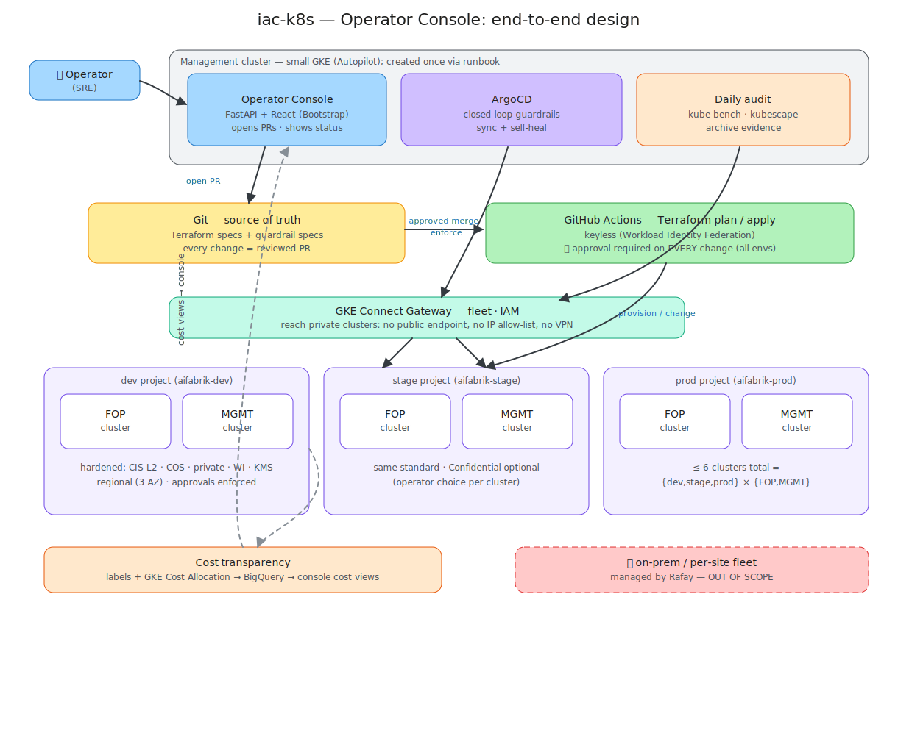
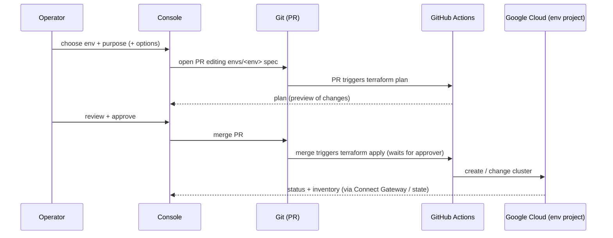
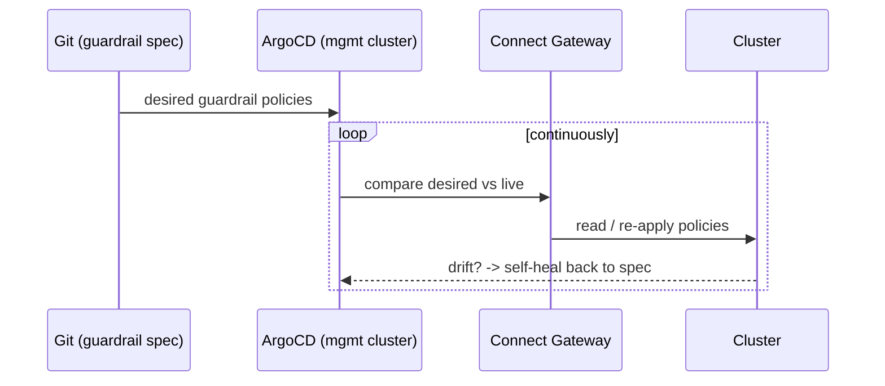
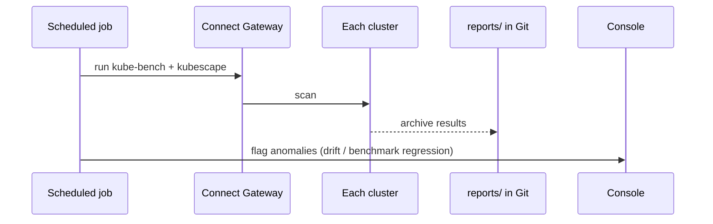

# iac-k8s — Design

End-to-end design for the operator console and the system it drives. This is the build contract: another session should be able to read this directory ([requirements.md](requirements.md), this file, [operator-console.md](operator-console.md)) and build the whole thing. Plain language; acronyms expanded on first use.

## Table of contents
- [Architecture at a glance](#architecture-at-a-glance)
- [Components and responsibilities](#components-and-responsibilities)
- [Repositories and layout](#repositories-and-layout)
- [The hardened cluster (what gets built)](#the-hardened-cluster-what-gets-built)
- [End-to-end flows](#end-to-end-flows)
- [Security model](#security-model)
- [One-time bootstrap (the runbook)](#one-time-bootstrap-the-runbook)
- [What to build, in order](#what-to-build-in-order)

## Architecture at a glance



*Editable source: [`diagrams/design-architecture.excalidraw`](diagrams/design-architecture.excalidraw) — open on [excalidraw.com](https://excalidraw.com), edit, re-export the SVG over the file above.*

The shape in one breath: an operator uses the **console**; the console writes the desired state as a **pull request (PR)** to **Git**; on approval, **GitHub Actions** runs **Terraform** to build/change clusters in per-environment Google Cloud projects; **ArgoCD** continuously enforces in-cluster security; everything is reached over **GKE Connect Gateway**; a daily audit archives evidence; cost is traced per cluster.

## Components and responsibilities

| Component | Runs where | Responsibility |
|---|---|---|
| **Operator console** (FastAPI + React) | Management cluster | The user interface. Turns operator actions into PRs; shows inventory, run status, audit reports, cost. Never changes cloud resources directly. |
| **Git repository** | GitHub | **Source of truth.** Holds Terraform specs (cluster shape) and guardrail specs (security policy). Every change is a reviewed PR. |
| **GitHub Actions** | GitHub-hosted runners | The **engine**. Runs `terraform plan` (preview) and `terraform apply` (change), authenticated keylessly. **Approval required on every change.** |
| **Terraform** | inside Actions | Describes and creates the Google Cloud substrate + GKE clusters. |
| **ArgoCD** | Management cluster | **Closed-loop** security: keeps each cluster's guardrail policies matching the committed spec; self-heals drift. |
| **GKE Connect Gateway** | Google-managed | Lets the console, ArgoCD, and audits reach the **private** clusters via Google's fleet service, controlled by **Identity and Access Management (IAM)** — no public endpoints. |
| **Daily audit jobs** | Management cluster (scheduled) | Run **kube-bench** (Center for Internet Security benchmark checker) and **kubescape** (security scanner); archive reports; flag anomalies. |
| **Management cluster** | Google Cloud (small GKE, Autopilot) | Hosts the console, ArgoCD, and audit jobs. Created once by the runbook; it is the only always-on piece. |

> **Bootstrap note:** the management cluster builds everything else, so it cannot build itself — it is stood up by hand once (see the runbook). Its standing privileges are limited: the console mostly *opens PRs*; the actual cloud changes run in GitHub Actions with short-lived credentials.

## Repositories and layout

Two repositories (names illustrative — final names per the build decision):

**`iac-gke` — infrastructure + policy + automation**
```
terraform/
  modules/
    project-foundation/   # per-project: VPC network, Cloud NAT, KMS key, labels
    gke-cluster/          # the parameterized hardened cluster (see next section)
  envs/
    dev/    main.tf · clusters.tfvars     # backend state prefix env/dev; project aifabrik-dev
    stage/  ...                           # env/stage; aifabrik-stage
    prod/   ...                           # env/prod;  aifabrik-prod
gitops/
  guardrails/             # k8s-hardening Tier-1 manifests + Kyverno policies (per-cluster)
  argocd/                 # ArgoCD App-of-Apps, one App per cluster (sync + self-heal)
.github/workflows/
  plan.yml · apply.yml · destroy.yml      # approval-gated, serialized (concurrency)
  audit.yml                               # scheduled daily scan -> reports/
reports/                  # archived audit artifacts (the evidence)
```

**`iac-console` — the operator console**
```
backend/    # FastAPI: PR authoring, run status, inventory, audit, cost endpoints
frontend/   # React + Bootstrap (screens per operator-console.md)
```

**Per-environment Terraform state** (separate state file per env, in a Google Cloud Storage bucket) isolates blast radius and avoids cross-environment lock contention.

## The hardened cluster (what gets built)

The `gke-cluster` module produces one regional cluster with these properties (the same standard for every cluster — *Secure by design*). Reuse the proven proof-of-concept module in [`archive/`](archive/) / the `iac-gke-poc` repository as the starting point.

- **Regional** (control plane + nodes across 3 availability zones) — survives one zone loss.
- **Private nodes and private control-plane endpoint** — the endpoint is *not* public; the console/ArgoCD/audit reach it via **Connect Gateway**. *(This is stronger than the proof-of-concept, which used a public endpoint limited to one Internet-Protocol address.)*
- **Container-Optimized OS (COS)** nodes (Google-hardened, auto-patched).
- **Workload Identity** (pods get cloud access via mapped identities, not node keys).
- **Shielded nodes** (secure boot + integrity monitoring).
- **Advanced datapath** (Dataplane V2) + default-deny network policy.
- **Secret encryption** with a Cloud **Key Management Service (KMS)** key.
- **Binary Authorization** (only signed images admitted) — audit-only first, enforce once the signing pipeline exists.
- **Node pools are parameterized**; a **Confidential (memory-encrypting) pool** is an operator option per cluster.
- **Labels** `environment` / `purpose` / `cluster` + **GKE Cost Allocation** enabled — for per-cluster cost (R12).

Inputs the console sets per cluster: name, environment, purpose, region, release channel, node pools (name, machine type, size, spot/on-demand, confidential yes/no).

## End-to-end flows

**1) Create or change a cluster (infrastructure).** Every change is previewed and approved.



**Plan in the pull request (what the approver sees).** When the console opens the PR, the `plan` workflow runs `terraform plan` and **posts the plan into the PR** — a comment with the add/change/destroy summary and a collapsible full diff — and uploads it as an artifact. The console mirrors that plan on its *Review & approve* screen by reading the artifact. So the approver always reviews the exact changes before approving; viewing the plan needs no approval, only applying does.

To guarantee **what is approved is what is applied**, the workflow uses a **saved plan**: `terraform plan -out=tfplan` produces the artifact, and apply runs that exact file (`terraform apply tfplan`) rather than re-planning. If reality drifted between preview and apply, applying the stale plan safely fails instead of doing something unreviewed. Sensitive values in plan output are masked.

**2) Closed-loop security enforcement (continuous).** No human in the steady-state loop.


*Changing the guardrails is itself an approved PR to the guardrail spec; ArgoCD then rolls it out.*

**3) Daily audit (evidence).** Because enforcement is the closed loop, the audit gathers proof.



## Security model

- **Every change is approved (R8).** GitHub **Environments** with required reviewers gate every `terraform apply` (all environments, including dev). Guardrail changes are gated at PR review before merge. No auto-apply anywhere.
- **Keyless automation.** GitHub Actions authenticates to Google Cloud with **Workload Identity Federation** — short-lived tokens (~1 hour), no downloadable keys; scoped to the specific repository.
- **Private clusters + Connect Gateway.** No public control-plane endpoints; all API access is IAM-controlled and logged through the gateway.
- **Least privilege.** Per-environment automation identities scoped to their own project; node pools use minimal-privilege node identities; humans get cluster access by role (**role-based access control, RBAC**) via the gateway.
- **Auditability.** Git history + PR approvals + Actions logs + archived audit reports = a complete trail from any running state back to who approved which commit.

## One-time bootstrap (the runbook)

Done by hand once (cannot be automated — it creates the accounts the automation uses). A generalized version of the proof-of-concept's `phase0-runbook` (in [`archive/`](archive/)):

1. Organization + folder; **billing** account.
2. **Projects:** `aifabrik-dev`, `-stage`, `-prod`, and a `-mgmt` project for the management cluster.
3. **Workload Identity Federation** for GitHub Actions (keyless) + per-environment automation service accounts with project-scoped roles.
4. **Terraform state** bucket (versioned).
5. **Management cluster** (small Autopilot GKE) + install **ArgoCD** and the **console**; register clusters into a **fleet** and enable **Connect Gateway**.
6. Budget alerts.

## What to build, in order

Reuse the proof-of-concept code (the `iac-gke-poc` and `iac-console-poc` repositories, and [`archive/`](archive/)) — it already proved the cluster module, the ArgoCD guardrails, the scans, and the console shell.

1. **Terraform foundation + cluster module + `dev` environment** (FOP + MGMT) + approval-gated `plan`/`apply`/`destroy` workflows. Build dev's two clusters end-to-end.
2. **Central ArgoCD + guardrail Apps + Connect Gateway** so dev's clusters are enforced closed-loop; add the daily audit workflow.
3. **Console backend** (real integrations: GitHub PRs + Actions Application Programming Interface (API), GKE via Connect Gateway, BigQuery for cost) and **frontend** (screens in [operator-console.md](operator-console.md)).
4. **Stage + prod** environments (same module, new entries) and the per-cluster cost views.

Definition of done for the first slice: an operator creates dev FOP from the console → approves → cluster is built, hardened, enforced, and audited — with the whole chain visible in Git, Actions, and the console.
