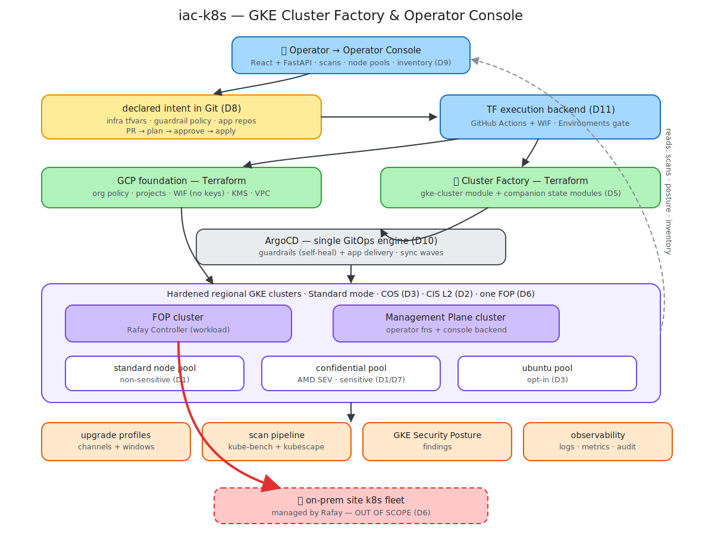

# iac-k8s — Exploration & POC Summary

What we debated, explored, and proved, so a reader can see *how* we got to the [requirements](requirements.md) and [design](design.md). The detailed working notes are frozen in [`archive/`](archive/).

## The problem we started with

We are building a platform from greenfield: there was no repeatable way to go from "nothing in Google Cloud" to a running, security-hardened **Google Kubernetes Engine (GKE)** cluster — Google's managed Kubernetes service. The first need was clusters for two planes — the **Fleet Operations Plane (FOP)** (the plane that operates our fleet) and the **Management Plane** (the end-user product surface). Over the exploration this widened into a clearer goal: **an operator console to build and run the full lifecycle of GKE clusters**, across environments (dev/stage/prod) and purposes (FOP/Management Plane).

## What we explored, and the decisions that came out of it

We worked through a series of design choices, each with a trade-off. The decisions (referenced elsewhere as D1–D12):

| Topic | What we debated | Where we landed |
|---|---|---|
| Sensitive vs normal workloads | Separate clusters vs one cluster with mixed nodes | **One cluster, mixed node pools** — a memory-encrypting (Confidential) pool beside normal pools; revisit separation only for a hard regulatory boundary |
| Security baseline | How strict a starting standard | **Center for Internet Security (CIS) Level 2** as the floor for every cluster |
| Cluster mode & node OS | GKE Standard vs Autopilot; which node operating system | **Standard mode** (we need node-level control) + **Container-Optimized OS (COS)**, Google's hardened, auto-patched node OS |
| Image trust | Whether to ever allow unsigned container images | **No unsigned images, no break-glass** (audit-only in the POC until the signing pipeline exists) |
| How many FOPs | One vs many | **One FOP** for the foreseeable future; the multi-site fleet is a *separate* system's job (Rafay), out of our scope |
| Change workflow | Direct changes vs reviewed changes | **Pull-request (PR) based** — every change is proposed, reviewed, approved, then applied; never by hand |
| Console technology | Buy an internal-developer-platform vs build | **Custom console** (Python **FastAPI** backend + **React** front end) — right-sized for an operators-only tool |
| In-cluster enforcement | One-off apply vs continuous | **ArgoCD** (a tool that keeps a cluster matching a Git-committed spec) enforcing security as a **closed loop** with self-healing |
| Provisioning engine | What actually makes cloud changes | **Terraform** (infrastructure-as-code) run by **GitHub Actions** (automation triggered by code changes), authenticating without long-lived keys |

The deepest debate was the **engine** — covered next.

## The build-vs-buy debate (the engine)

We seriously re-evaluated whether to build on **Terraform + console**, or adopt a continuously-reconciling control plane — **Crossplane** or Google **Config Connector** (which model cloud resources as Kubernetes objects), or a cluster product like **Rancher** or **Cluster API**. We scored them honestly, including where our chosen path loses.

Key findings:
- **Rancher and Cluster API are cluster-only** — they cannot serve future non-cluster resources (a database, a bucket), so they were eliminated.
- **Crossplane/Config Connector** are elegant for many resource types and give continuous drift-correction, but both need an **always-on, highly-privileged control plane** — a permanent, high-value attack target — and add specialized, fast-moving skills.
- **Terraform + console** keeps credentials **short-lived** (about one hour per run), gives an **explicit preview-and-approve** before every change, reuses Google's hardened modules, and uses skills that are common. Its trade-off is no *continuous* drift-correction — which we cover with a scheduled daily check.

**Decision (D12):** stay with **Terraform + GitHub Actions + the console** for the immediate scope (≤6 clusters). We will revisit a control-plane tool only if we later need continuous reconciliation across many resource types or open the console to self-service — *not* merely to add a database or bucket, which Terraform already does. The full analysis is archived in [`archive/build-vs-buy-platform.md`](archive/build-vs-buy-platform.md).

## What the POC proved (and what broke)

We ran a three-milestone proof-of-concept in a sandbox Google Cloud project, driven end-to-end by GitHub Actions with keyless authentication.

- **M1 — built a hardened cluster.** A regional (multi-zone) GKE cluster with three node pools — including a **Confidential (memory-encrypting)** pool — hardened with private nodes, workload identity, shielded nodes, advanced networking, and key-managed secret encryption. Built via a reviewed PR → preview → approve → apply. **Validated:** all controls present.
- **M2 — enforced hardening + produced a report.** **ArgoCD** deployed the guardrail policies and **self-healed** them (we deleted a policy; ArgoCD restored it). A privileged test pod was **rejected**. A before/after security report was generated and archived.
- **M3 — a mocked console.** A FastAPI + React console (styled with **Bootstrap**, a popular UI framework) drove the whole flow against a mock backend — create cluster → preview → approve → inventory → deploy hardening → view report — with no live cloud.

**What broke — and the lessons (now baked into the design):**
1. **Two applies collided on the shared state lock** → we serialize applies.
2. **Spot (interruptible) Confidential nodes kept disappearing** → use on-demand for nodes that must stay up.
3. **The one-time setup runbook was missing a few permissions/services** → corrected.
4. **The whole-cluster security score was a noisy before/after** because it included the un-hardened tooling we deployed → measure a fixed workload scope instead.
5. **Automation runners could not reach the locked-down cluster** → adopt **GKE Connect Gateway** (reach clusters through Google's fleet service, identity-controlled, no network allow-lists).

## The architecture we proved (POC)

This is the proof-of-concept shape. The forward design (next document) keeps the spine and folds in the lessons above (per-environment projects, Connect Gateway, approvals on every change, the closed-loop ArgoCD enforcement).

## Where this leaves us

- **Requirements** are written and agreed in [requirements.md](requirements.md), under four guiding principles: Simplicity, Audit-ready, Secure-by-design, Cost-transparency.
- **Engine** is decided (Terraform + console, D12).
- **The forward design** — how the console, Git, GitHub Actions, ArgoCD, the per-environment projects, and the daily audit fit together end-to-end — is in [design.md](design.md).
