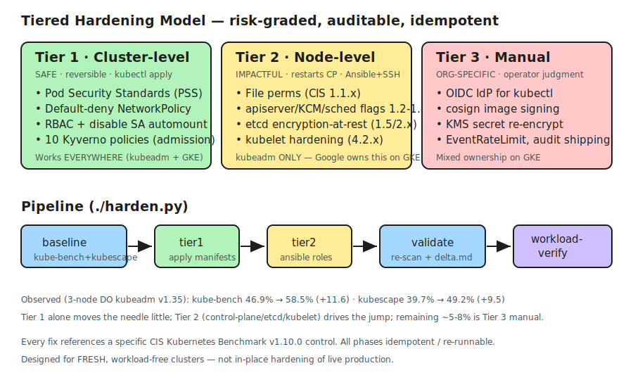
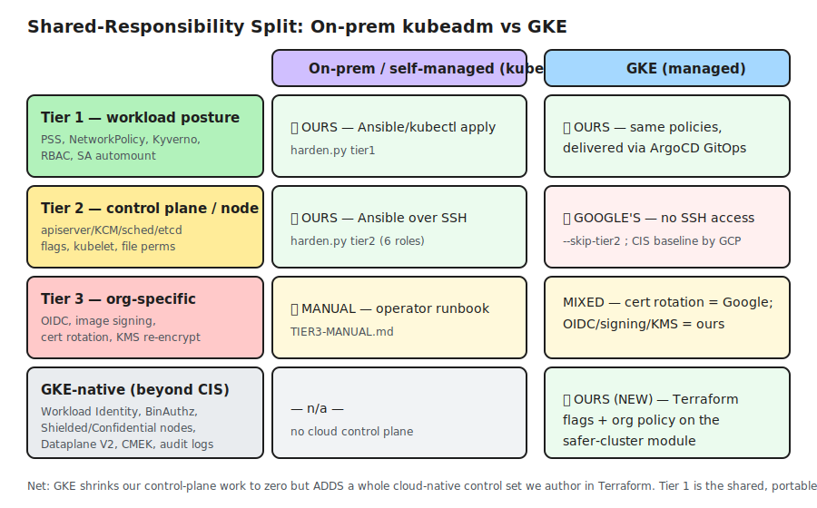
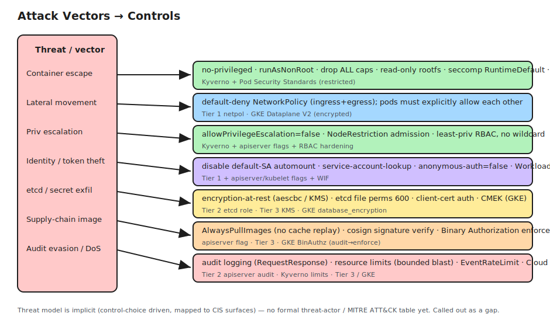
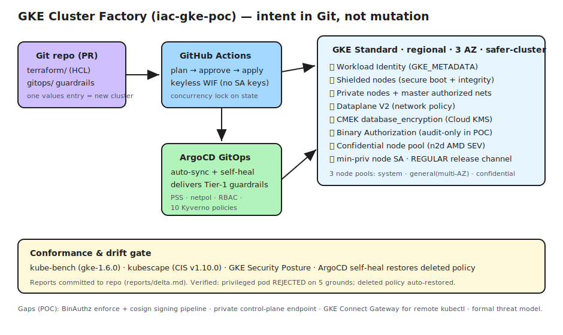
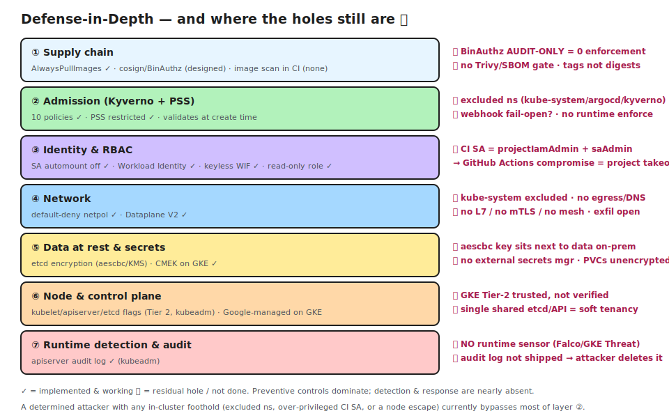

# Securing Two Kubernetes Worlds — An Operator's Guide

*We run Kubernetes in two places: on-prem in our private data centers, where we own everything down to the metal, and in GKE (Google Kubernetes Engine), where Google manages the control plane and we manage what runs on it. This guide walks the security of both, layer by layer, from the inside out. It is written for humans to read and for tools (including LLMs — large language models) to act on: every layer ends with a check block containing exact commands and pass criteria that a scanner or an agent can run against a live environment.*

---

## Goal and operating principles

Our goal: no break-ins via any path — control plane, data plane, workloads, or RBAC (role-based access control). We get there with common-sense security practice first, and advanced posture against known exploit vectors second.

The two environments deal us different hands:

|                | On-prem (private data center)                        | GKE                                                              |
| -------------- | ---------------------------------------------------- | ---------------------------------------------------------------- |
| Control plane  | Full access; we harden it ourselves                  | Google-managed; no SSH (Secure Shell) to control-plane nodes     |
| Node OS        | Our choice, our patching                             | COS (Container-Optimized OS) — minimal, immutable, auto-patched  |
| Mechanics      | `kubeadm` + Ansible + our orchestrator ([`harden.py`](https://github.com/kg-aifabrik/k8s-hardening/blob/main/harden.py)) | Terraform cluster config + GitOps for in-cluster policy          |
| Responsibility | Everything                                           | Workloads, policy, identity, and *verifying* what Google manages |

Principles we hold ourselves to:

- **Mimic the best posture of each world in the other.** Every security property one environment gives us becomes a requirement to evaluate in the other.
- **Don't take tooling decisions for granted — bake them off.** Where a control can be satisfied by a cloud-native service or an open-source framework, we run a structured comparison. The outcome can go either way: *use open-source X in both setups* (one mental model, one policy repo), or *use GKE-native Y in cloud and open-source Z in the private DC* (two stacks, but each best-of-breed). The deciding question is explicit: **is the operator cost of running two different implementations lower than the security or capability cost of forcing one implementation everywhere?** Each layer below names its bake-off and the criteria.
- **A benchmark score is evidence of conformance, not safety.** Our CIS (Center for Internet Security) kube-bench score moved from 46.9% to 58.5% after hardening a three-node test cluster — a useful regression signal, but none of the exploitable gaps we describe below would have moved that number.



---

## Layer 0 — Two empty clusters

Day one: a freshly built `kubeadm` cluster in the data center and a freshly built regional GKE cluster (e.g., in `us-central1`). No workloads, no tenants. An empty default cluster is not a safe cluster — it ships hostile to its owner.

**Mechanics for this layer, before the controls:**

- **On-prem:** SSH to the nodes and run the Ansible playbook — [`tier2-ansible/playbook.yml`](https://github.com/kg-aifabrik/k8s-hardening/blob/main/tier2-ansible/playbook.yml) in our `k8s-hardening` repo, invoked as `./harden.py tier2 --inventory <hosts.ini>`. Six roles (common file-perms, api-server, controller-manager, scheduler, etcd, kubelet) patch the static-pod manifests and kubelet config idempotently and leave `.bak` files for rollback. Expect control-plane restarts; run on an empty cluster or in a maintenance window.
- **GKE:** there is no SSH; every control is cluster configuration. We express them as Terraform on `google_container_cluster` (see [`terraform/gke.tf`](https://github.com/kg-aifabrik/iac-gke-poc/blob/main/terraform/gke.tf) in our `iac-gke-poc` repo) so the posture is reproducible and reviewable. For controls Google owns outright, our job is verification by scanner, not application.

| Exposure | Threat vector | Fix on-prem | Fix in GKE (if different) |
|---|---|---|---|
| API (application programming interface) server answers anonymous requests | Unauthenticated recon and access to cluster state | `--anonymous-auth=false` on the apiserver (api-server role) | N/A — disabled by GKE defaults; verify with the L0 checks rather than assume |
| kubelet read-only port (10255) serves pod specs unauthenticated | Node recon, leakage of pod env/config | Kubelet config: `read-only-port=0`, `anonymous-auth=false`, `authorization-mode=Webhook` (kubelet role) | N/A — Google manages kubelet config; verify the port is closed per node |
| etcd stores Secrets in plaintext | Secret theft from disk, backups, or a compromised control-plane node | EncryptionConfiguration on the apiserver; prefer a KMS (key management service) v2 provider backed by an external key store (e.g., HashiCorp Vault or an HSM — hardware security module); etcd data dir mode 0600 (etcd role) | `database_encryption = ENCRYPTED` with CMEK (customer-managed encryption keys) in Cloud KMS — envelope encryption with the key outside the cluster, by construction |
| No audit logging | A breach leaves no trail; attacker erases tracks | Apiserver audit flags + audit-policy file (api-server role), then ship the log off the node (see Layer 1) | Different: Cloud Audit Logs (Admin Activity + Data Access) — off-cluster and tamper-evident by default |
| Control-plane endpoint reachable from untrusted networks | Credential stuffing, apiserver zero-days, token replay from anywhere | Bind the apiserver to a private network; reach it via VPN (virtual private network) or bastion; firewall everything else | `enable_private_nodes = true`, **`enable_private_endpoint = true`**, master authorized networks for any exception, and Connect Gateway for operator/CI (continuous integration) access without a public IP |
| Control-plane manifests and PKI (public key infrastructure) world-readable | Local tampering, key theft by any node user | File permissions 600/700 across `/etc/kubernetes` and PKI dirs (common role) | N/A — Google-managed hosts; not reachable by us or by tenants |
| Default admission plugins only | Kubelet impersonating other nodes; stale local images replayed | Enable `NodeRestriction,AlwaysPullImages` apiserver plugins | NodeRestriction is on by default; AlwaysPullImages is enforced via admission policy instead of a flag (Layer 3) |
| Nodes boot unverified code | Bootkit/rootkit persistence; rogue node joins the cluster | UEFI (Unified Extensible Firmware Interface) Secure Boot + TPM (Trusted Platform Module) attestation — hardware-dependent, plan per fleet | Shielded GKE nodes: `enable_secure_boot` + integrity monitoring per node pool |
| Components drift behind on CVEs (common vulnerabilities and exposures) | Compromise via known, patched exploits | Scheduled `kubeadm upgrade` runbook with the same discipline a managed service applies automatically | Release channel (e.g., REGULAR) auto-patches control plane and nodes |

**A word on etcd encryption.** The KMS provider matters more than "encryption: on." The default `aescbc` provider keeps its encryption key in a config file on the same node as the data it protects — anyone who can read that disk holds the key and the ciphertext together, so the control collapses exactly when you need it (node compromise, stolen backup). Envelope encryption through a KMS v2 plugin keeps the key in an external system that can also log and rate-limit decrypt calls. On GKE, CMEK gives this shape natively; on-prem, build it with the KMS plugin from the start rather than treating `aescbc` as more than a stopgap.

**A word on trusting the managed control plane.** On GKE we inherit Google's hardening for the apiserver, etcd, and kubelets — but inheriting is not verifying, and the managed CIS benchmark checks fewer node-level items than the self-managed one. Our stance: scan on a schedule (kubescape with the GKE framework), record the scores, and alert on regression, so "Google handles it" stays a verified claim instead of an assumption.

```bash
# ===== LAYER 0 CHECKS (run against either environment) =====

# CHECK L0-1: anonymous auth must be rejected
kubectl --kubeconfig=/dev/null --server="$APISERVER" get nodes --insecure-skip-tls-verify 2>&1
# PASS: "Unauthorized" or "Forbidden". FAIL: any resource listing.

# CHECK L0-2: kubelet read-only port closed (run per node)
curl -s -o /dev/null -w '%{http_code}' http://NODE_IP:10255/pods --max-time 5
# PASS: timeout / connection refused. FAIL: HTTP 200.

# CHECK L0-3 (on-prem): etcd encryption provider is not 'identity'
grep -A2 'providers:' /etc/kubernetes/enc/encryption.yaml
# PASS: kms (preferred) or aescbc listed first. FAIL: identity first, or file absent.

# CHECK L0-3 (GKE): CMEK enabled
gcloud container clusters describe "$CLUSTER" --region "$REGION" \
  --format='value(databaseEncryption.state)'
# PASS: ENCRYPTED. FAIL: DECRYPTED.

# CHECK L0-4 (GKE): private endpoint posture
gcloud container clusters describe "$CLUSTER" --region "$REGION" \
  --format='value(privateClusterConfig.enablePrivateNodes,privateClusterConfig.enablePrivateEndpoint)'
# PASS: True;True. PARTIAL: True;False only with tight master authorized networks as a compensating control.

# CHECK L0-5: full conformance scan, diffed against last run
kubectl apply -f scan/kube-bench-job.yaml && kubectl logs -l app=kube-bench --tail=-1
kubescape scan framework cis-v1.10.0 --format json --output kubescape.json
# PASS: score >= recorded baseline. Alert on any regression.
```

---

## Layer 1 — What GKE gives us for free, and how we chase it on-prem

GKE doubles as a shopping list: every property Google hands us became a requirement to evaluate for the data center. The threat vectors at this layer are the slow ones — unpatched kernels, configuration drift, stolen node credentials, tampered boot chains, deleted logs.

**Mechanics:** on GKE these arrive as Terraform attributes on the cluster/node-pool resources (same `gke.tf` reference as Layer 0). On-prem each row is its own project with candidate tooling to bake off — listed as candidates, not decisions.

| GKE benefit | Threat vector it closes | On-prem path (candidates to evaluate) |
|---|---|---|
| COS — minimal, immutable, auto-patched node OS | Kernel CVEs, node config drift | Bake-off: immutable node OS (e.g., Talos Linux, Flatcar) vs. conventional OS + automated patching (unattended-upgrades + `kured` for coordinated reboots). Criteria: operational fit with our hardware, rollback story, agent support |
| Shielded nodes (secure boot, vTPM — virtual TPM, integrity monitoring) | Bootkit/rootkit persistence, rogue nodes | UEFI Secure Boot + TPM attestation on bare metal; hardware-dependent, phased rollout |
| Workload Identity — pods get scoped cloud identities, never the node's | A pod stealing node credentials via the metadata server | The *vector* (cloud metadata server) doesn't exist on-prem — N/A as a threat. The *capability* (per-workload identity) is still worth a bake-off: SPIFFE/SPIRE (Secure Production Identity Framework for Everyone) vs. service-mesh-issued identities |
| Cloud Audit Logs — off-cluster, tamper-evident by default | Attacker deletes their own trail | Ship apiserver audit logs to an off-cluster SIEM (security information and event management) store. Candidates: fluent-bit/promtail → Loki/Elastic/cloud SIEM. The store must be unreachable from in-cluster credentials |
| Managed control-plane patching via release channels | Control-plane CVEs | Calendarized `kubeadm upgrade` runbook; treat skipping a window as an incident, the way a managed service would never skip |
| Native runtime threat detection (GKE Security Posture / threat detection) | Post-exploitation activity | Open-source eBPF (extended Berkeley Packet Filter) sensors — Falco, Tetragon. Bake-off in Layer 3 |

The recurring pattern: GKE's gifts are mostly *defaults*. Nothing in that table is impossible on-prem; all of it requires us to choose it, build it, and keep it running. Defaults are themselves a security feature — every control that exists because nobody had to remember it is a control that can't be forgotten.

```bash
# ===== LAYER 1 CHECKS =====

# CHECK L1-1 (GKE): shielded nodes on every pool
gcloud container node-pools list --cluster "$CLUSTER" --region "$REGION" \
  --format='table(name,config.shieldedInstanceConfig.enableSecureBoot,config.shieldedInstanceConfig.enableIntegrityMonitoring)'
# PASS: True,True on all pools.

# CHECK L1-2 (GKE): workload identity wired
gcloud container clusters describe "$CLUSTER" --region "$REGION" \
  --format='value(workloadIdentityConfig.workloadPool)'
# PASS: <project>.svc.id.goog; per-pool workloadMetadataConfig.mode = GKE_METADATA.

# CHECK L1-3 (on-prem): node patch currency
ssh "$NODE" 'uname -r; ls /var/run/reboot-required 2>/dev/null'
# PASS: kernel within patch SLA (service-level agreement); no pending reboot older than the SLA window.

# CHECK L1-4 (both): audit log is leaving the cluster
# on-prem: a shipper tails the audit log
kubectl -n logging get ds -o name
# GKE: Data Access audit logs enabled for container.googleapis.com
gcloud projects get-iam-policy "$PROJECT" --format=json | jq '.auditConfigs'
# PASS: audit events queryable in a store an in-cluster attacker cannot delete. FAIL: log only on node disk.
```

At this point both clusters are hardened shells: doors locked, safe bolted down, camera running. Nobody lives there yet.



---

## Layer 2 — Opening the doors: namespaces, RBAC, network, storage, ingress

Tenants need namespaces, service accounts, network paths, storage, and a way for traffic to reach them. Every one of those is an attack path if handed out raw. The governing rule for this layer: **every tenant has zero trust with every other tenant, and tenants talk to each other only over declared Services.** Not "isolated by convention" — declared, default-deny, enforced.

**Mechanics:** tenants are stamped out by automation, never by hand, so no step can be skipped — `./harden.py create-tenant --tenant <name>` in the `k8s-hardening` repo creates the namespace, labels, policies, RBAC, and a scoped kubeconfig in one shot. The cluster-wide guardrail package lives in [`tier1-manifests/`](https://github.com/kg-aifabrik/k8s-hardening/tree/main/tier1-manifests) and is applied by `./harden.py tier1` on-prem and synced by GitOps (e.g., ArgoCD with auto-sync + self-heal) on GKE — same YAML in both worlds.

| Resource | Exposure if handed out raw | Threat vector | Secure-by-default configuration |
|---|---|---|---|
| **Namespace** | A flat namespace is a label, not a boundary | Tenant workloads escalate or sprawl beyond their slice | Created only via automation, with PSS (Pod Security Standards) labels `enforce=restricted` from birth; resource quotas; tenant ownership label for audit |
| **RBAC / ServiceAccount** | Default service accounts auto-mount API tokens; roles accumulate wildcards | Stolen token climbs the ladder; insider with over-broad role reads secrets | Namespace-scoped Role for the tenant deployer SA (service account) — no wildcards, no cluster verbs; `automountServiceAccountToken: false` on every default SA; tenant receives a kubeconfig minted for exactly that SA |
| **Service (east-west)** | Open pod network — any pod reaches any pod | Lateral movement between tenants | Default-deny NetworkPolicy, **ingress and egress**, in every tenant namespace; each allowed flow is an explicit policy naming the peer Service; DNS (Domain Name System) to kube-dns and nothing else by default; cross-tenant flows require *both* sides to declare them |
| **Ingress (north-south)** | Every tenant runs its own internet-facing entry | Sprawling, unaudited attack surface | One controlled front door per cluster: a single ingress-controller class terminating TLS (Transport Layer Security) with cert-manager-issued certs; tenants declare Ingress objects in their own namespace; the controller's namespace gets PSS `baseline`, narrow NetworkPolicy, and priority monitoring (it is *the* path in from outside) |
| **PVC (persistent volume claim) / storage** | hostPath-style provisioners put tenant data on raw node disk | Data theft from node compromise or disk handling; no tenant isolation | Encrypting, replicated storage class as default. On-prem bake-off: Rook-Ceph vs. Longhorn, with encryption-at-rest enabled. GKE: Persistent Disk StorageClass with CMEK. Node-local provisioners (e.g., `local-path-provisioner`) acceptable for test harnesses only |
| **Egress to the world** | Anything admitted can phone home | Data exfiltration over allowed-but-unwatched flows | Today: default-deny egress with explicit allows. Known limit: NetworkPolicy is L3/L4 (network/transport layer) only — see below |

**On enforcement of NetworkPolicy.** A policy object does nothing without a CNI (container network interface) that enforces it. On GKE that's Dataplane V2 (eBPF, with node-to-node encryption). On-prem it's a CNI bake-off — e.g., Cilium (closest lineage to Dataplane V2, both being eBPF) vs. Calico — judged on policy fidelity with the same YAML, observability, and ops cost.

**On the L3/L4 limit.** "Tenant A may reach tenant B's Service on port 8443" says nothing about *which requests* flow once connected, and a permitted egress can still exfiltrate to anywhere it reaches. Closing this is an open bake-off: CNI-level DNS-aware and L7 (application-layer) policies (e.g., Cilium) vs. a mutual-TLS service mesh (e.g., Istio, Linkerd). The deciding test is concrete: *a compromised pod in tenant A attempts exfiltration to an arbitrary external host — it must fail, and the attempt must be visible.* Whichever stack passes that test at acceptable operational cost wins; running the CNI option in both worlds versus mesh-in-one is exactly the one-stack-or-two cost question from the principles.

**On `kube-system`.** Core components (CoreDNS, kube-proxy) need broad reach, so default-deny typically exempts that namespace — which makes it a policy-free zone for anything that lands there. Treat that as a scheduled fix, not a permanent fact: add per-component allow rules, then default-deny `kube-system` like every other namespace.

```bash
# ===== LAYER 2 CHECKS =====

# CHECK L2-1: every tenant namespace enforces restricted PSS
kubectl get ns -l tenant -o jsonpath='{range .items[*]}{.metadata.name}{": "}{.metadata.labels.pod-security\.kubernetes\.io/enforce}{"\n"}{end}'
# PASS: every line ends in "restricted".

# CHECK L2-2: default-deny exists in every tenant namespace, both directions
for ns in $(kubectl get ns -l tenant -o name | cut -d/ -f2); do
  kubectl -n "$ns" get networkpolicy default-deny -o jsonpath='{.spec.policyTypes}'; echo " <- $ns"
done
# PASS: ["Ingress","Egress"] everywhere.

# CHECK L2-3: zero-trust is real — probe a cross-tenant path that was never declared
kubectl -n tenant-a run probe --rm -it --restart=Never --image=busybox -- \
  wget -qO- --timeout=5 http://web.tenant-b.svc.cluster.local
# PASS: timeout. FAIL: any response. (Then probe a DECLARED path and assert it works.)

# CHECK L2-4: no default SA auto-mounts a token
kubectl get sa default -A -o jsonpath='{range .items[*]}{.metadata.namespace}{" "}{.automountServiceAccountToken}{"\n"}{end}' | grep -v false
# PASS: empty output.

# CHECK L2-5: no wildcard RBAC has crept in
kubectl get clusterroles -o json | jq -r '.items[] | select(.rules[]? | (.verbs|index("*")) and (.resources|index("*"))) | .metadata.name' \
  | grep -vE '^(cluster-admin|system:)'
# PASS: empty output. Anything listed is a finding.

# CHECK L2-6: tenant storage is encrypted
kubectl get storageclass -o jsonpath='{range .items[*]}{.metadata.name}{" -> "}{.provisioner}{"\n"}{end}'
# PASS: default class is an encrypting provisioner. FAIL: a node-local/hostPath provisioner as default.
```

---

## Layer 3 — Letting workloads in, and watching them once they're in

Everything so far is architecture. This layer is the daily grind: which workloads get admitted, whether an image is what we think it is, and what happens when — not if — something running turns hostile.

**Threat vectors at this layer:** container escape to the node, privilege escalation inside a pod, a poisoned image arriving through the supply chain, and post-exploitation activity by an attacker already inside.

### 3a. Admission control — the bake-off

The guardrail *content* is settled and engine-agnostic; we maintain it as ten policies layered over PSS `restricted` (the set lives in [`tier1-manifests/kyverno-policies/`](https://github.com/kg-aifabrik/k8s-hardening/tree/main/tier1-manifests/kyverno-policies), currently expressed in Kyverno syntax):

- no privileged containers · no host namespaces · no hostPath · runAsNonRoot · drop ALL capabilities · no privilege escalation · read-only root filesystem · seccomp RuntimeDefault · mandatory resource limits · no default service account

The *engine* is an open bake-off. Our experiment so far ran Kyverno in both environments, and it did its core job — a test privileged pod was rejected on five independent grounds, and GitOps self-heal restored a manually deleted policy. The same experiment surfaced three findings that now define the bake-off criteria, because they apply to *any* webhook-based engine:

1. **Exemption surface.** Policies that exclude namespaces (`kube-system`, the GitOps engine, the policy engine itself) create a bypass: anything scheduled into an excluded namespace ignores every policy. How small can each engine's exemption set be, and what compensating controls wrap the exempt namespaces?
2. **Failure mode.** A validating webhook with `failurePolicy: Ignore` admits everything while the engine is down — and engine restarts cause real outage windows (we measured ~30 seconds). Each candidate must run fail-closed (`failurePolicy: Fail`) without wedging cluster-critical deploys.
3. **Create-time-only enforcement.** Webhooks don't evict already-running violators. What does each engine do about pre-existing violations — report, block on update, or nothing?

| Candidate | For | Against / open questions |
|---|---|---|
| **Kyverno** (open source, runs in both worlds) | Plain Kubernetes YAML, built-in mutation, small footprint; already proven in our experiment | Findings 1–3 above must be re-tested with hardened config (fail-closed, minimal exemptions) |
| **GKE Policy Controller** (managed, Gatekeeper-based) | Google-operated, integrates with GKE dashboards; no engine for us to babysit | GKE-only → on-prem still needs a second engine; constraint templates in Rego |
| **OPA Gatekeeper** (open source, runs in both worlds) | Mature audit mode for pre-existing violations; large constraint library | Rego (a policy language) learning curve; same webhook failure-mode questions |
| **ValidatingAdmissionPolicy** (in-tree, CEL — Common Expression Language) | Runs *inside* the apiserver — no webhook to be down; ideal fail-closed backstop for the non-negotiables | Not a full engine (no mutation, limited expressiveness); a complement, not a candidate for the whole job |

Decision shape per our principles: either **one open-source engine in both setups** (one policy repo, one operational skill), or **GKE Policy Controller in cloud + an open-source engine on-prem** (two stacks, each native to its home). The bake-off answers which cost is lower. Independent of that outcome, a thin **ValidatingAdmissionPolicy backstop** for the must-never-fail-open rules (e.g., no privileged pods) is attractive in both worlds precisely because it removes the webhook from the failure path — verify with check L3-2.

### 3b. Supply chain

If an attacker poisons an image we deploy, admission control doesn't help — the malicious workload will be unprivileged, non-root, seccomp'd, and still theirs. Supply-chain control is a pipeline, in order:

1. **Scan in CI** — image vulnerability scanning (e.g., Trivy, Grype) failing the build on critical CVEs; generate an SBOM (software bill of materials) per image.
2. **Sign at build** — cosign signatures and attestations from the CI pipeline. The signing pipeline becomes tier-0 infrastructure: the emergency path is *sign-and-ship or roll back to a previously signed image*, never "admit unsigned."
3. **Enforce at admission** — bake-off mirrors 3a: **Binary Authorization** (GKE-native, enforce mode — not audit-only, which logs and admits) vs. **signature verification in the admission engine** (e.g., Kyverno `verifyImages`, Sigstore policy-controller), which runs in both worlds. Same one-stack-or-two cost question.
4. **Pin by digest, not tag.** A mutable tag can be re-pointed at a different image after review. This is true even without an attacker — a public registry re-organizing or withdrawing tags (as happened to widely-used community images in 2025) breaks tag-pinned deploys overnight. Digests fail safe; tags fail silent.

### 3c. Runtime detection and response

A useful self-test exposed by our own experiments: nearly everything above is *prevention*. An attacker who gets past it — a zero-day, a supply-chain miss, a leaked credential — is invisible unless something is watching at runtime, and an on-node audit log is deletable by whoever owns the node. Detection has to be designed in, not assumed:

- **Runtime sensor:** eBPF-based detection on every node — bake-off between Falco and Tetragon (both open source, run in both worlds), alerting on shells spawned in containers, unexpected outbound connections, writes to sensitive paths, kernel module loads. On GKE, the native threat-detection offering can run *alongside* the open-source sensor; layering a managed detector over a portable one is one of the few places "both" is the right bake-off answer.
- **Off-cluster audit:** the apiserver audit stream and sensor alerts ship to the SIEM from Layer 1. The store must be unreachable with in-cluster credentials.
- **Response runbook:** pre-written and rehearsed — `kubectl cordon` the node, apply a quarantine NetworkPolicy that cuts the namespace to zero flows, snapshot before killing anything, rotate the credentials that workload could see.

```bash
# ===== LAYER 3 CHECKS =====

# CHECK L3-1: the wall holds — a privileged pod must be rejected
kubectl -n tenant-a run attack --image=busybox --restart=Never \
  --overrides='{"spec":{"containers":[{"name":"a","image":"busybox","securityContext":{"privileged":true}}]}}' 2>&1
# PASS: rejected, message names the policy. FAIL: pod created (sev-critical finding).

# CHECK L3-2: the wall holds while the policy engine is DOWN (test cluster only)
kubectl -n <policy-engine-ns> scale deploy --all --replicas=0 && sleep 20
kubectl -n tenant-a run attack2 --image=busybox --restart=Never \
  --overrides='{"spec":{"containers":[{"name":"a","image":"busybox","securityContext":{"privileged":true}}]}}' 2>&1
# PASS: still rejected (failurePolicy=Fail and/or ValidatingAdmissionPolicy backstop).
# FAIL: pod admitted -> the boundary fails open. Restore replicas after.

# CHECK L3-3: enumerate the policy bypass surface
kubectl get clusterpolicies -o json | jq -r '[.items[].spec.rules[].exclude // empty]'   # engine-specific; adjust per engine
kubectl get ns -o jsonpath='{range .items[*]}{.metadata.name}{" "}{.metadata.labels.pod-security\.kubernetes\.io/enforce}{"\n"}{end}' | awk '$2==""'
# PASS: exemption list is short, documented, and every exempt ns has compensating controls.
# Namespaces with no PSS enforce label are findings.

# CHECK L3-4: supply-chain enforcement is real
gcloud container binauthz policy export | grep -E 'evaluationMode|enforcementMode'
# PASS: ENFORCED_BLOCK_AND_AUDIT_LOG. FAIL: DRYRUN_AUDIT_LOG_ONLY (logs but admits).
kubectl get deploy -A -o jsonpath='{range .items[*]}{range .spec.template.spec.containers[*]}{.image}{"\n"}{end}{end}' | grep -v '@sha256:'
# PASS: empty (all images digest-pinned). Every line printed is a finding.

# CHECK L3-5: someone is watching at runtime
kubectl get ds -A | grep -Ei 'falco|tetragon'
# PASS: sensor DaemonSet on all nodes AND a canary event (shell spawned in a test pod)
#       visible in the SIEM within 60s. FAIL: no sensor, or canary not seen.
```



---

## One more door: the machinery that builds the clusters

A guide about securing clusters has to include the thing that creates them, because it holds more power than anything inside them.

Our GKE clusters come from a Terraform factory driven by CI (GitHub Actions in our experiment): keyless WIF (Workload Identity Federation), so no service-account keys sit in CI secrets, and every change is a reviewed pull request. This is a learning worth keeping under the "thought secure, found an exploit path" rule: keyless auth *looks* like the end of the credential problem, but it concentrates power instead of eliminating it. The CI identity in our experiment held IAM (identity and access management) roles including `serviceAccountAdmin`, `projectIamAdmin`, and `binaryauthorization.policyEditor` — meaning a compromised CI pipeline owns the GCP (Google Cloud Platform) project *and can rewrite the image-admission policy meant to stop it*. No key was ever at risk; the blast radius was the problem.

Controls, both worlds:

- **Split and scope CI identities** per environment; no single identity can both deploy and rewrite security policy.
- **Human approval gates** for any change to IAM or admission/signing policy.
- **Pin third-party CI actions** to a commit SHA (hash), not a tag — same digests-over-tags rule as images.
- **On-prem equivalent:** whatever runs Ansible (the bastion host and its SSH keys) is the same crown jewel and gets the same treatment — scoped keys, session recording, approval for inventory or playbook changes to security-relevant roles.



---

## The operator's worry list

Where the program stands, ranked by what would hurt most. Each item names the open decision or action — these are the bake-offs and builds to schedule, not regrets:

1. **Supply chain enforcement** — run the 3b pipeline end-to-end: CI scanning + cosign + enforce-at-admission. Bake-off: Binary Authorization (GKE) vs. engine-level verification (both worlds). Until enforcement is on, treat every image as potentially hostile.
2. **Runtime detection** — Falco vs. Tetragon bake-off, GKE-native detection layered in cloud, SIEM shipping, rehearsed response runbook.
3. **Admission engine bake-off** — Kyverno (hardened config) vs. GKE Policy Controller vs. OPA Gatekeeper, judged on the three findings; ValidatingAdmissionPolicy backstop evaluated regardless of winner.
4. **CI identity blast radius** — role split, approval gates, SHA-pinned actions.
5. **On-prem secrets at rest** — KMS v2 plugin (e.g., Vault-backed) replacing `aescbc`; evaluate an external secrets manager (e.g., External Secrets Operator) for distribution.
6. **L7/egress control** — CNI L7+DNS policies vs. service mesh, decided by the exfiltration test in Layer 2.
7. **Tenant storage** — Rook-Ceph vs. Longhorn (encrypted) as the on-prem default StorageClass; PD+CMEK on GKE.
8. **Verify the managed control plane** — scheduled GKE-framework scans with regression alerts; `enable_private_endpoint = true` + Connect Gateway as the standing endpoint posture.



---

## Appendix — the toolbox

For tools and agents working against these environments:

| Tool | What it does | Where |
|---|---|---|
| [`harden.py`](https://github.com/kg-aifabrik/k8s-hardening/blob/main/harden.py) | Orchestrator — phases `assess`, `baseline`, `tier1`, `tier2`, `validate`, `all [--skip-tier2]`, `create-tenant`, `workload-deploy`, `workload-verify`, `check-images`. Use `--skip-tier2` on GKE (no control-plane SSH) | `k8s-hardening` repo root |
| Tier-1 policy package | PSS labels, default-deny NetworkPolicies, RBAC hardening, SA-automount-off, 10 admission policies. Applied by `harden.py` on-prem; synced by GitOps on GKE — same files | `k8s-hardening/tier1-manifests/` |
| Tier-2 Ansible | Six node-hardening roles with idempotent patch scripts; leaves `.bak` rollback files. On-prem only | `k8s-hardening/tier2-ansible/playbook.yml` |
| Scanners | kube-bench as per-node DaemonSet Job; kubescape CLI (framework `cis-v1.10.0` on-prem, GKE framework in cloud). Reports land in `reports/<phase>_<timestamp>/` as `baseline.md`, `post-hardening.md`, `delta.md`, `scores.json` | `k8s-hardening/scan/`, `scripts/install-kubescape.sh` |
| Workload harness | Representative admin + tenant workloads plus an in-cluster verify Job (HTTP reachability, Redis PING, Postgres write/read, CronJob firing). Run before and after every hardening change to prove nothing broke | `k8s-hardening/workloads/` |
| GKE factory | Terraform (`gke.tf`, `network.tf`, `kms.tf`, `binauthz.tf`), CI workflows with keyless WIF and approval gates, GitOps application for the guardrail package | `iac-gke-poc/` |

Operational learnings that earned their place here (each one *looked* safe until it wasn't):

- **An idempotent `kubectl apply` can still roll pods** — "no config change" is not "no disruption"; pre-flight before re-applying on a live cluster.
- **Webhook "Ready" lags Deployment "Available"** — a policy engine that reports healthy can still be unreachable for admission; probe end-to-end with `kubectl --dry-run=server` before trusting the boundary.
- **Dropping ALL capabilities breaks innocent tooling in non-obvious ways** (package managers, post-install scripts calling `unshare`); bake task images instead of installing at runtime.
- **Tags lie** — a registry re-organizing its public images broke tag-pinned deploys with no attacker involved. Digest-pin everything: images, CI actions, third-party manifests.
