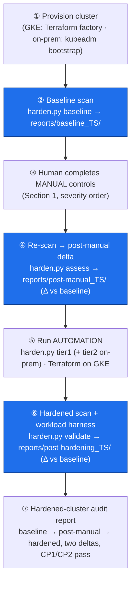

# Kubernetes Hardening — Consolidated Control Catalog & Measurement Workflow

*A single, severity-ranked catalog of the security controls we apply to our two Kubernetes (K8s) clusters — on-prem `kubeadm` and Google Kubernetes Engine (GKE) — split into the controls a human applies by hand and the controls our tooling applies for us, each tagged with the exposure it closes and the published vulnerability it maps to. This is the operator-facing companion to the layered narrative in [REPORT.md](REPORT.md); where REPORT.md explains the **why** layer by layer, this catalog is the **what** and **in what order**, plus the end-to-end measure → fix → re-measure workflow that proves it.*

## Table of contents

- [Executive summary](#executive-summary)
- [Requirements](#requirements)
- [Assumptions made](#assumptions-made)
- [How to read the tables](#how-to-read-the-tables)
- [Section 1 — Manual controls](#section-1--manual-controls)
- [Section 2 — Automation controls](#section-2--automation-controls)
- [Section 3 — Exposure measurement & audit reporting](#section-3--exposure-measurement--audit-reporting)
- [Section 4 — The end-to-end hardening workflow](#section-4--the-end-to-end-hardening-workflow)
- [Appendix — CVE reference](#appendix--cve-reference)

---

## Executive summary

The work to harden these two clusters has been spread across three repositories — the research/threat-model ([REPORT.md](REPORT.md)), the GKE cluster-factory design ([iac-k8s/](../iac-k8s/)), and the automation that applies and measures the controls (the `k8s-hardening` repo, [github.com/kg-aifabrik/k8s-hardening](https://github.com/kg-aifabrik/k8s-hardening)). This catalog consolidates them into one severity-ranked control set under a single taxonomy:

- **Two application modes.** **Manual controls** (Section 1) require a human decision or action not yet codified — an identity-provider choice, a signing pipeline, a hardware boot-chain, a destructive re-encryption gated for safety. **Automation controls** (Section 2) are applied by tooling and are repeatable with no per-run human judgement — and per our decision, *Infrastructure-as-Code counts as automation*: GKE Terraform-native controls, the `harden.py` tier-1 cluster manifests and tier-2 Ansible roles, and the on-prem node bootstrap all live here.
- **Three applicability buckets** inside each mode, via the **Applies to** column: **Both** (we apply on on-prem and GKE alike — the workload/policy layer), **On-prem** (we apply only in the data center; on GKE these are Google-managed and we merely *verify*), and **GKE** (GKE-native controls with no on-prem analogue, or whose on-prem analogue is a different control listed separately).
- **Severity order.** Rows run most-severe to least, blending the Common Vulnerability Scoring System (CVSS) base score of the mapped vulnerability with the exposure's impact and exploitability in our threat model. The single worst exposures are an **unauthenticated control-plane** ([CVE-2018-1002105](https://nvd.nist.gov/vuln/detail/CVE-2018-1002105), CVSS 9.8) on the automation side and an **internet-reachable ingress controller** ([CVE-2025-1974](https://nvd.nist.gov/vuln/detail/CVE-2025-1974), CVSS 9.8) on the manual side.

**The operating loop** (Section 4): provision a cluster → run the measurement tool for a **baseline** report → a human completes the **manual** controls and re-runs for a **post-manual delta** → the **automation** deploys the rest → a final re-run produces the **hardened** report. Three measurement points, two deltas, one audit trail.

**One caveat carried over from REPORT.md:** the benchmark score is a *conformance and regression signal, not a safety proof*. Our three-node test cluster moved kube-bench 46.9% → 58.5% and kubescape 39.7% → 49.2% after hardening, yet several of the highest-severity exposures here (e.g. existing-secret re-encryption, ingress annotation injection) move that number little or not at all. Read the deltas alongside the control checklist, never instead of it.

---

## Requirements

Confirmed with the requester before this write-up:

- Cover **two cluster types only**: managed **GKE** and self-managed **on-prem `kubeadm`**. (EKS, present in the current tooling, is out of scope for this catalog.)
- Produce **one consolidated catalog** organised as: common controls (apply to both), GKE-specific controls (not applicable on-prem), on-prem-specific controls (not applicable on GKE).
- **Two sections**, each with its own table: **Section 1 — Manual controls**, **Section 2 — Automation controls** (automation = applied by tooling such as the `k8s-hardening` project).
- Each table has columns: **Control ID** (e.g. `CTRL-A1`), **Exposure** (what is at risk and how it is exploited), **CVE / published-ID + risk score**, **How to fix**.
- Rows ordered **most-severe to least-severe**.
- A **Exposure Measurement & Audit Reporting** section describing the kube-bench + kubescape tooling and how the audit report is built.
- Document the **provision → baseline → manual → delta → automation → hardened** workflow.

---

## Assumptions made

Confirmed via clarifying questions, except where flagged:

- **Infrastructure-as-Code (IaC) is classified as automation.** GKE Terraform-native controls and the on-prem node bootstrap appear in Section 2, not Section 1. Manual controls are reserved for genuinely human-in-the-loop steps.
- **CVE depth:** cite a real CVE with its CVSS v3.1 base score where a control maps to a known vulnerability class; otherwise use the Center for Internet Security (CIS) Benchmark ID and/or the kubescape control ID with a qualitative severity. Scores in this document were each fetched and independently re-verified against the National Vulnerability Database (NVD); see the [appendix](#appendix--cve-reference).
- **The placement split** is intentional: this proposal (the *why* and the catalog) lives in the research repo; an actionable, run-oriented copy is to be derived into `k8s-hardening/docs/` as part of the implementation work.
- *(Not separately confirmed)* A given CVE is listed against the control that **most directly closes it**; many exposures are mitigated by several controls, and the appendix is the authoritative mapping. CVSS scores reflect NVD's primary metric at time of writing and can be re-scored by the vendor.

---

## How to read the tables

- **Applies to** — `Both` = applied on on-prem **and** GKE; `On-prem` = we apply only on-prem (Google manages and we verify on GKE); `GKE` = GKE-native, no direct on-prem equivalent (the on-prem analogue, where one exists, is a separate row).
- **CVE / risk** — the headline mapped vulnerability and its CVSS v3.1 base (NVD primary). `CIS x.y` / `C-NNNN` are CIS Benchmark / kubescape control IDs used where no single CVE applies. "—" means the exposure is a configuration/data-at-rest class with no representative CVE.
- **Fix** — names the concrete mechanism and, in parentheses, the artifact in the `k8s-hardening` repo or the GKE Terraform module that implements it.

---

## Section 1 — Manual controls

Controls requiring a human decision or action not yet codified. A human completes these between the baseline scan and running the automation (Section 4, step 3).

| Control ID | Applies to | Exposure | CVE / published ID + risk | How to fix |
|---|---|---|---|---|
| **CTRL-M1** | Both | **Ingress front door is the cluster's most-exposed RCE surface.** An attacker reaching the ingress-nginx admission webhook from the pod network, or anyone able to create/edit `Ingress` objects, can inject NGINX config that executes code in the controller and reads every Secret the controller can see — cluster takeover. | [CVE-2025-1974](https://nvd.nist.gov/vuln/detail/CVE-2025-1974) **9.8 Critical**; [CVE-2023-5043](https://nvd.nist.gov/vuln/detail/CVE-2023-5043) 8.8; [CVE-2021-25742](https://nvd.nist.gov/vuln/detail/CVE-2021-25742) 7.1 | One controlled ingress class only. Set `allow-snippet-annotations=false` and `--enable-annotation-validation`; **NetworkPolicy-isolate the admission webhook so only the API server reaches it**; restrict who can create/edit `Ingress` via RBAC + admission policy; pin to ingress-nginx ≥ 1.12.1 / 1.11.5. Patch on disclosure. |
| **CTRL-M2** | Both | **Unsigned / tampered / maliciously-crafted images run as trusted workloads.** A poisoned image is admitted even when it is non-root and seccomp'd; a crafted image config reads host files or escapes the runtime. | [CVE-2024-21626](https://nvd.nist.gov/vuln/detail/CVE-2024-21626) 8.6; [CVE-2022-23648](https://nvd.nist.gov/vuln/detail/CVE-2022-23648) 7.5 | Build the pipeline: scan in CI (Trivy/Grype) + SBOM → cosign sign at build → **enforce at admission** (GKE Binary Authorization `ENFORCED`; on-prem Kyverno `verifyImages`) → **pin by digest, not tag**. Pipeline build + key management is the manual part; admission enforcement becomes automation once it exists ([CTRL-A8](#section-2--automation-controls)). |
| **CTRL-M3** | On-prem | **Unpatched node kernel / container runtime → container escape to host root.** A workload (or a malicious image) exploits a kernel or runc/containerd flaw to break out of its container onto the node. | [CVE-2019-5736](https://nvd.nist.gov/vuln/detail/CVE-2019-5736) 8.6; [CVE-2022-0185](https://nvd.nist.gov/vuln/detail/CVE-2022-0185) 8.4; [CVE-2022-0847](https://nvd.nist.gov/vuln/detail/CVE-2022-0847) 7.8 | Choose an immutable, auto-patched node OS (Talos/Flatcar) **or** conventional OS + `unattended-upgrades` + `kured` coordinated reboots; patch runc ≥ 1.1.12 / containerd; disable unprivileged user namespaces (`kernel.unprivileged_userns_clone=0`). *(GKE: covered by COS + release channel — [CTRL-A16](#section-2--automation-controls).)* |
| **CTRL-M4** | On-prem | **Control-plane drifts behind on CVEs.** Many control-plane flaws (below) require patching, not just config; a stale `kubeadm` cluster is exploitable via known, fixed bugs. | [CVE-2020-8559](https://nvd.nist.gov/vuln/detail/CVE-2020-8559) 6.8; [CVE-2022-3172](https://nvd.nist.gov/vuln/detail/CVE-2022-3172) 8.2 (patch-only) | Calendarized `kubeadm upgrade` runbook for control plane + nodes; treat a skipped window as an incident. *(GKE: release channel auto-patches — [CTRL-A16](#section-2--automation-controls).)* |
| **CTRL-M5** | Both | **CI/CD identity holds the keys to the kingdom.** Keyless Workload Identity Federation removes static keys but concentrates power: a CI identity holding `serviceAccountAdmin` / `projectIamAdmin` / `binaryauthorization.policyEditor` can, if compromised, rewrite the very admission policy meant to stop it. | CIS Supply-chain; no CVE (design/blast-radius) | Split and scope CI identities per environment (deploy ≠ policy-edit); human approval gates on any IAM or admission/signing-policy change; SHA-pin third-party CI actions; org policy: no downloadable SA keys. On-prem: the Ansible bastion + SSH keys get the same treatment. |
| **CTRL-M6** | On-prem | **`aescbc` keeps the key on the same disk as the ciphertext.** Encryption-at-rest with the in-tree `aescbc` provider stores its key in a node-local config file — node compromise or a stolen backup yields key **and** data together, so the control collapses exactly when needed. | CIS 2.1; no CVE (key-management design) | Replace `aescbc` with a Key Management Service (KMS) v2 plugin backed by an external store (HashiCorp Vault / hardware security module); evaluate External Secrets Operator for distribution. Refines [CTRL-A4](#section-2--automation-controls) on-prem. |
| **CTRL-M7** | Both | **Secrets written before encryption was enabled stay plaintext in etcd.** Turning on encryption-at-rest ([CTRL-A4](#section-2--automation-controls)) only encrypts *new* writes; pre-existing Secrets remain readable from etcd until rewritten. | CIS 2.1; no CVE | After KMS/CMEK is live, force a rewrite of every Secret: `kubectl get secrets -A -o json \| kubectl replace -f -`. Gated as manual to avoid corrupting Secrets mid-rotation; run in a window with an etcd snapshot taken first. |
| **CTRL-M8** | On-prem | **An in-cluster attacker deletes the audit trail.** A node-local audit log is deletable by whoever owns the node; without off-cluster shipping, a breach leaves no forensics and logs may even leak credentials. | [CVE-2019-11250](https://nvd.nist.gov/vuln/detail/CVE-2019-11250) 6.5 (creds in logs) | Ship the API server audit stream + runtime alerts to an off-cluster Security Information and Event Management (SIEM) store (fluent-bit/promtail → Loki/Elastic/Splunk) that **in-cluster credentials cannot reach or delete**. *(GKE: Cloud Audit Logs — [CTRL-A14](#section-2--automation-controls) — covers this.)* |
| **CTRL-M9** | Both | **No per-human identity for `kubectl`.** Shared/static kubeconfig credentials mean no individual attribution, no multi-factor authentication (MFA), and no fast revocation when someone leaves or is compromised. | CIS 1.2 (authn); no CVE | Integrate the org OpenID Connect (OIDC) identity provider (Okta/Keycloak/Google Workspace): API server OIDC flags on-prem; Connect Gateway + Workload Identity on GKE. |
| **CTRL-M10** | Both | **`kube-system` is a policy-free blast zone.** Left at `baseline` Pod Security and exempt from default-deny NetworkPolicy so core components run, it becomes the soft spot anything that lands there can exploit for privilege and lateral movement. | CIS 5.2 / 5.3.2; no CVE | Audit core components; add per-component allow NetworkPolicies, then default-deny `kube-system`; raise Pod Security toward `restricted` with documented, minimal exceptions. |
| **CTRL-M11** | Both | **Service `externalIPs` / cross-namespace endpoint redirection → MITM.** A user able to set `spec.externalIPs` or edit `Endpoints`/`EndpointSlices` can intercept or redirect cluster traffic, bypassing NetworkPolicy. | [CVE-2020-8554](https://nvd.nist.gov/vuln/detail/CVE-2020-8554) 5.0; [CVE-2021-25737](https://nvd.nist.gov/vuln/detail/CVE-2021-25737) 4.8; [CVE-2021-25740](https://nvd.nist.gov/vuln/detail/CVE-2021-25740) 3.1 | Deploy the `externalip-webhook` or a Kyverno/Gatekeeper policy denying `spec.externalIPs`; remove `patch services/status` and broad `endpoints` edit from non-controller roles. *(Candidate to promote into automation as a Kyverno policy.)* |
| **CTRL-M12** | On-prem | **Nodes boot unverified code.** Without a measured boot chain, a bootkit/rootkit persists across reboots and a rogue node can join the cluster. | CIS node-hardening; no CVE | UEFI Secure Boot + Trusted Platform Module (TPM) attestation on bare metal; hardware-dependent, phased per fleet. *(GKE: Shielded Nodes — [CTRL-A12](#section-2--automation-controls).)* |
| **CTRL-M13** | Both | **Post-exploitation activity is invisible.** Prevention controls don't detect a successful breach (zero-day, leaked credential, supply-chain miss); reverse shells, crypto-mining and lateral movement run unseen. | MITRE ATT&CK; no single CVE | Deploy eBPF runtime sensors (Falco/Tetragon) on every node; alerts → SIEM; rehearsed response runbook (`cordon` → quarantine NetworkPolicy → snapshot → rotate credentials). *(GKE: layer over GKE Security Posture.)* |
| **CTRL-M14** | Both | **NetworkPolicy is Layer 3/4 only — egress exfiltration is unwatched.** A default-deny egress policy ([CTRL-A9](#section-2--automation-controls)) cannot see *which* requests flow once a connection is allowed; a compromised pod exfiltrates over a permitted path. | CIS 5.3; no CVE | Add Layer-7/DNS-aware egress control: Cilium L7 policies or a mutual-TLS service mesh. Decide with a concrete exfiltration test (compromised pod → arbitrary external host must fail and be visible). |
| **CTRL-M15** | On-prem | **API server request-flood denial of service (DoS).** Without rate limiting, a flood of requests (or recursive YAML/JSON) exhausts API server CPU/memory. | [CVE-2019-11253](https://nvd.nist.gov/vuln/detail/CVE-2019-11253) 7.5 (parser DoS) | Configure the `EventRateLimit` admission plugin via an `AdmissionConfiguration` file + hostPath mount + `--admission-control-config-file`. Deferred from tier-2 automation because a malformed config crash-loops the API server; apply by hand with verification. |
| **CTRL-M16** | On-prem | **Tenant data sits on raw, unencrypted node disk.** A hostPath/node-local provisioner exposes persistent data to node compromise or disk handling, with no tenant isolation. | CIS storage; no CVE | Make an encrypting, replicated StorageClass the default: Rook-Ceph or Longhorn with encryption-at-rest. *(GKE: Persistent Disk + CMEK is the default — provisioned via Terraform.)* |
| **CTRL-M17** | GKE | **Secrets in node memory are readable by a host/hypervisor-level compromise.** Standard nodes do not encrypt memory; data in use is exposed if the underlying host is compromised. | GKE-native; no CVE | Enable Confidential GKE Nodes (AMD SEV / Intel TDX) on node pools that handle sensitive data. Per-pool toggle and data-classification decision (the one deliberately non-blanket GKE control). |

---

## Section 2 — Automation controls

Controls applied by tooling — the `harden.py` orchestrator (tier-1 cluster manifests, tier-2 Ansible), GKE Terraform, and the on-prem node bootstrap. Repeatable, idempotent, no per-run human judgement. The automation deploys these after the manual controls are complete (Section 4, step 4).

| Control ID | Applies to | Exposure | CVE / published ID + risk | How to fix |
|---|---|---|---|---|
| **CTRL-A1** | On-prem | **Unauthenticated / weakly-authorized control plane.** An API server answering anonymous requests leaks cluster state and, via the aggregated-API/upgrade proxy, lets a crafted request reuse the server's backend connection to escalate to cluster-admin. | [CVE-2018-1002105](https://nvd.nist.gov/vuln/detail/CVE-2018-1002105) **9.8 Critical** (CVSS v3.0); [CVE-2019-11253](https://nvd.nist.gov/vuln/detail/CVE-2019-11253) 7.5; [CVE-2019-11250](https://nvd.nist.gov/vuln/detail/CVE-2019-11250) 6.5; CIS 1.2.x | tier-2 Ansible `api-server` role (`patch_apiserver.py`): `--anonymous-auth=false`, audit logging + policy, `--enable-admission-plugins=NodeRestriction,AlwaysPullImages`, `--profiling=false`, strong TLS cipher suites, `--request-timeout`, `--service-account-lookup=true`; forbid `--insecure-*` flags. *(GKE: Google-managed; verify via kube-bench `gke-1.6.0`.)* |
| **CTRL-A2** | On-prem | **Kubelet exposes node & pod data and a localhost bypass.** An unauthenticated kubelet read-only port (10255) serves pod specs; `route_localnet` lets adjacent hosts/pods reach services bound to 127.0.0.1 in the node netns. | [CVE-2020-8558](https://nvd.nist.gov/vuln/detail/CVE-2020-8558) **8.8 High**; [CVE-2018-1002105](https://nvd.nist.gov/vuln/detail/CVE-2018-1002105) 9.8; CIS 4.2.x | tier-2 Ansible `kubelet` role: `anonymous-auth=false`, `read-only-port=0`, `authorization-mode=Webhook`, `protectKernelDefaults=true`, `rotateCertificates`, strong TLS, streaming idle timeout; node martian-packet drop. *(GKE: Google-managed; verify.)* |
| **CTRL-A3** | Both | **Container-escape primitives admitted by default.** Privileged containers, host namespaces, hostPath/subPath mounts, added capabilities, writable root FS and missing seccomp give a workload (or attacker) a direct path to node root. | [CVE-2019-5736](https://nvd.nist.gov/vuln/detail/CVE-2019-5736) 8.6; [CVE-2024-21626](https://nvd.nist.gov/vuln/detail/CVE-2024-21626) 8.6; [CVE-2021-25741](https://nvd.nist.gov/vuln/detail/CVE-2021-25741) 8.1; CIS 5.2.1–5.2.10 | tier-1 `00-namespaces-pss.yaml` (PSS `enforce=restricted`) + Kyverno policies 01–08: disallow privileged / host-namespaces / hostPath / privilege-escalation; require drop-ALL caps, `runAsNonRoot`, read-only rootfs, seccomp `RuntimeDefault`. |
| **CTRL-A4** | Both | **Secrets stored in plaintext at rest.** Without application-layer encryption, Secrets are readable from the etcd datastore, snapshots and backups, or a compromised control-plane node. | CIS 2.1; kubescape C-0066; no CVE | On-prem: `EncryptionConfiguration` via tier-2 `etcd` role (KMS v2 target — see [CTRL-M6](#section-1--manual-controls); `aescbc` interim). GKE: `database_encryption = ENCRYPTED` with Cloud KMS CMEK via Terraform `kms.tf`. Existing Secrets need re-encryption ([CTRL-M7](#section-1--manual-controls)). |
| **CTRL-A5** | GKE | **Control-plane endpoint reachable from untrusted networks.** A public API endpoint multiplies every control-plane vulnerability — credential stuffing, zero-day exploitation, token replay from anywhere. | CIS GKE 5.6.x; amplifier for [CVE-2018-1002105](https://nvd.nist.gov/vuln/detail/CVE-2018-1002105) | Terraform `gke.tf`: `enable_private_nodes=true`, `enable_private_endpoint=true`, master authorized networks, Connect Gateway for operator/CI access. *(On-prem analogue — bind private + firewall — is a network-design decision; see CTRL-M network notes.)* |
| **CTRL-A6** | Both | **Stolen tokens climb the ladder; over-broad RBAC reads everything.** Default ServiceAccounts auto-mount API tokens and roles accumulate wildcards; a namespace token reaches cluster-scoped custom resources or other namespaces' data. | [CVE-2019-11247](https://nvd.nist.gov/vuln/detail/CVE-2019-11247) **8.1 High**; [CVE-2022-3162](https://nvd.nist.gov/vuln/detail/CVE-2022-3162) 6.5; CIS 5.1.x | tier-1 `02-disable-default-sa-automount.yaml` (`automountServiceAccountToken=false`), `03-rbac-hardening.yaml` (namespace-scoped Roles, no wildcards), Kyverno `10-disallow-default-sa`. *(Org-specific least-privilege RBAC design is a manual review overlay.)* |
| **CTRL-A7** | GKE | **Pod steals the node's cloud credentials.** A pod reaching the metadata server inherits the node ServiceAccount's cloud roles → cloud-account compromise; SSRF can leak control-plane host data. | [CVE-2020-8555](https://nvd.nist.gov/vuln/detail/CVE-2020-8555) 6.3 (SSRF); GKE-native | Terraform: `workload_pool` + per-workload GCP SA binding (Workload Identity), `GKE_METADATA` node mode, org policy `iam.disableServiceAccountKeyCreation`. *(On-prem: the cloud-metadata vector doesn't exist; per-workload identity via SPIFFE/SPIRE is an optional manual capability.)* |
| **CTRL-A8** | GKE | **Untrusted images deployed.** Without admission-time signature/attestation enforcement, any image — including a tampered or unscanned one — runs. | Supply chain; mitigates [CVE-2022-23648](https://nvd.nist.gov/vuln/detail/CVE-2022-23648) 7.5, [CVE-2024-21626](https://nvd.nist.gov/vuln/detail/CVE-2024-21626) 8.6 | Terraform `binauthz.tf`: `evaluation_mode=ENFORCED_BLOCK_AND_AUDIT_LOG`, no break-glass. Depends on the signing pipeline ([CTRL-M2](#section-1--manual-controls)). *(On-prem analogue: Kyverno `verifyImages`.)* |
| **CTRL-A9** | Both | **Flat pod network — any pod reaches any pod.** Open east-west and egress let a compromised pod move laterally between tenants and exfiltrate freely. | [CVE-2020-8554](https://nvd.nist.gov/vuln/detail/CVE-2020-8554) 5.0; CIS 5.3.2 | tier-1 `01-default-deny-netpol.yaml`: default-deny ingress **and** egress per namespace; explicit allows; DNS to kube-dns only. Requires a NetworkPolicy-enforcing CNI — GKE Dataplane V2 ([CTRL-A10](#section-2--automation-controls)); on-prem CNI choice (Cilium/Calico) is a setup decision. L7 egress is [CTRL-M14](#section-1--manual-controls). |
| **CTRL-A10** | GKE | **NetworkPolicy objects exist but go unenforced.** Without an enforcing dataplane, applied policies are inert and lateral movement continues silently. | CIS 5.3.2 (enforcement); no CVE | Terraform `enable_dataplane_v2=true` (eBPF enforcement, node-to-node encryption). Makes [CTRL-A9](#section-2--automation-controls) real on GKE. |
| **CTRL-A11** | On-prem | **Controller-manager / scheduler info disclosure & SSRF.** Profiling endpoints leak internals; a shared SA token and bound-to-all-interfaces components widen the attack surface; the provisioning path enables SSRF. | [CVE-2020-8555](https://nvd.nist.gov/vuln/detail/CVE-2020-8555) 6.3; CIS 1.3 / 1.4 | tier-2 `controller-manager` + `scheduler` roles: `--profiling=false`, `--use-service-account-credentials=true`, `--bind-address=127.0.0.1`. *(GKE: Google-managed; verify.)* |
| **CTRL-A12** | GKE | **Nodes boot unverified code.** Bootkit/rootkit persistence and rogue node joins without a measured, attested boot chain. | GKE-native; no CVE | Terraform `shielded_instance_config`: `enable_secure_boot=true`, `enable_integrity_monitoring=true` on every node pool. *(On-prem analogue: Secure Boot + TPM — [CTRL-M12](#section-1--manual-controls).)* |
| **CTRL-A13** | Both | **Resource exhaustion / node DoS.** Limitless pods starve neighbours; unbounded writes to node-managed paths exhaust disk and take the node down. | [CVE-2020-8557](https://nvd.nist.gov/vuln/detail/CVE-2020-8557) 5.5; CIS 5.x | tier-1 Kyverno `09-require-resource-limits` (mandatory CPU/memory requests + limits) plus per-namespace `ResourceQuota`. |
| **CTRL-A14** | GKE | **No tamper-evident audit trail.** Without off-cluster logging, a breach leaves no record and an attacker erases their tracks. | CIS 3.2; no CVE | Terraform / org policy: Cloud Audit Logs (Admin Activity always on; **enable Data Access**), off-cluster and tamper-evident by construction. *(On-prem analogue: local audit ([CTRL-A1](#section-2--automation-controls)) + SIEM shipping ([CTRL-M8](#section-1--manual-controls)).)* |
| **CTRL-A15** | On-prem | **Control-plane manifests, PKI and etcd files world-readable.** Any node user can read keys or tamper with static-pod manifests. | CIS 1.1.x; no CVE | tier-2 `common` role: file permissions 600/700 across `/etc/kubernetes`, the public key infrastructure (PKI) directories, the etcd data dir and the kubelet config. *(GKE: Google-managed hosts; not reachable.)* |
| **CTRL-A16** | GKE | **Components drift behind on CVEs.** A cluster running old control-plane/node versions is exploitable via known, already-patched bugs. | Mitigates the patch-only CVEs (e.g. [CVE-2022-3172](https://nvd.nist.gov/vuln/detail/CVE-2022-3172) 8.2, [CVE-2020-8559](https://nvd.nist.gov/vuln/detail/CVE-2020-8559) 6.8) | Terraform `release_channel` (e.g. `REGULAR`) auto-patches control plane and nodes on Container-Optimized OS. *(On-prem analogue: the `kubeadm` upgrade runbook + node OS patching — [CTRL-M3](#section-1--manual-controls)/[CTRL-M4](#section-1--manual-controls).)* |

---

## Section 3 — Exposure measurement & audit reporting

The tooling that turns "are we hardened?" into a number with evidence. It lives in the `k8s-hardening` repo and is driven by the `harden.py` orchestrator.

### The two scanners

| | **kube-bench** (Aqua Security) | **kubescape** (ARMO) |
|---|---|---|
| Runs as | A `DaemonSet` Job on **every node** ([`scan/kube-bench-job.yaml`](https://github.com/kg-aifabrik/k8s-hardening/blob/main/scan/kube-bench-job.yaml), image `v0.10.4`), tolerating control-plane taints with `hostPID` + host mounts | The kubescape CLI run **locally against the API**, no in-cluster deploy |
| Sees | Node-level files & flags: static-pod manifests, kubelet config, etcd, PKI, file permissions (CIS sections 1–4) | API-server state: RBAC, PSS, NetworkPolicy, ServiceAccounts, admission (CIS section 5 + framework controls) |
| Benchmark | `cis-<ver>` auto-detected; override `--benchmark gke-1.6.0` on GKE, `eks-1.5.0` on EKS | Framework `cis-v1.10.0` (on-prem), GKE framework in cloud |
| Output | Per-control pass/fail/warn JSON, aggregated per pod and **deduplicated** (control-plane sections counted once; node/policy sections deduped across nodes) | Per-control status + native `complianceScore`, failed-resource list |
| Why both | kube-bench reaches what only a node can see; kubescape reaches what only the API can see. Together they cover the control plane *and* the workload layer. | |

### Scoring

`score = pass / (pass + fail + warn) × 100`, with warnings counted in the denominator (conservative). kubescape's native `complianceScore` is preferred when present, else the same pass-ratio formula. The score is a **regression and conformance signal, not a safety proof** — pair it with the control checklist above.

### The audit report

Each scan phase writes a timestamped directory `reports/<phase>_<timestamp>/` containing:

- `kube-bench.json`, `kubescape.json` — raw scanner output (the evidence).
- `scores.json` — the structured summary (tool, pass, fail, warn, score).
- `baseline.md` / `post-manual.md` / `post-hardening.md` — a human-readable report: a summary table plus the failed-control list with remediation text.
- `delta.md` — before/after/Δ for each tool against the prior phase.

The JSON is machine-checkable for CI gating and regression alerts; the Markdown is the human audit artifact; the directory as a whole, kept under version control (or archived per the retention policy), is the tamper-evident record of what the cluster's posture was at each point in time. On GKE, the free **GKE Security Posture** dashboard supplements these with managed vulnerability and misconfiguration findings, and a scheduled scan with regression alerts keeps "Google handles the control plane" a verified claim rather than an assumption.

### Validating that hardening didn't break anything

Measurement answers "is it secure?"; the **workload harness** ([`workloads/`](https://github.com/kg-aifabrik/k8s-hardening/tree/main/workloads)) answers "does it still work?". Representative admin + tenant workloads (nginx, go-httpbin, Postgres, Redis, a CronJob, cert-manager `Certificate`) plus an in-cluster verify Job (HTTP reachability, Redis `PING`, Postgres write/read, CronJob firing) run at two checkpoints — **CP1** before hardening and **CP2** after — and gate the run. A hardened cluster that breaks its workloads is a failed run, not a success.

---

## Section 4 — The end-to-end hardening workflow

The objective loop: provision → measure → manual fixes → re-measure → automated fixes → re-measure. Three measurement points produce two deltas and a hardened-cluster report.

| Step | Command (illustrative) | Produces | Gate |
|---|---|---|---|
| ① Provision | GKE: `terraform apply`; on-prem: `scripts/standalone-bootstrap.sh` | A running, unhardened cluster | Cluster reachable |
| ② Baseline | `./harden.py baseline` | `reports/baseline_<ts>/` | Recorded as the reference posture |
| ③ Manual | Human follows Section 1, top-down | Applied manual controls | Operator checklist signed off |
| ④ Post-manual | `./harden.py assess` *(re-scan; see implementation note)* | `reports/post-manual_<ts>/` + Δ vs baseline | Manual controls show up as score movement / closed findings |
| ⑤ Automation | `./harden.py tier1` (+ `tier2 --inventory` on-prem); GKE-native via Terraform | Applied automation controls | tier-1/tier-2 apply cleanly; API server healthy |
| ⑥ Hardened | `./harden.py validate` | `reports/post-hardening_<ts>/` + Δ vs baseline + CP1/CP2 | Score ≥ post-manual; **workload harness CP2 passes** |
| ⑦ Report | (assembled from the three phase dirs) | Hardened-cluster audit report | Two deltas + evidence archived |

**Implementation note (to be built — see the implementation plan):** the current `harden.py` measures at two points (baseline → post-hardening). This workflow needs a **third, explicit post-manual measurement** so the manual delta is visible on its own, and a **manual-controls checklist** the operator works through at step ③ derived from Section 1. Wiring `harden.py` to emit `post-manual_<ts>/` and a `baseline → post-manual → hardened` three-way audit report, plus deriving the operator checklist into `k8s-hardening/docs/`, is the substance of the companion implementation plan.

---

## Appendix — CVE reference

Every score below was fetched from and independently re-verified against the NVD record. Where NVD publishes only a CVSS v3.0 (not v3.1) score, that is noted.

| CVE | CVSS (v3.1 unless noted) | Affected component | One-line exposure | Mapped control |
|---|---|---|---|---|
| [CVE-2018-1002105](https://nvd.nist.gov/vuln/detail/CVE-2018-1002105) | 9.8 Critical *(v3.0; no v3.1 on NVD)* | kube-apiserver (aggregated-API / upgrade proxy) | Backend-connection reuse → privilege escalation to cluster-admin | CTRL-A1 |
| [CVE-2025-1974](https://nvd.nist.gov/vuln/detail/CVE-2025-1974) | 9.8 Critical | ingress-nginx ("IngressNightmare") | Unauthenticated pod-network → RCE in controller → cluster Secrets | CTRL-M1 |
| [CVE-2020-8558](https://nvd.nist.gov/vuln/detail/CVE-2020-8558) | 8.8 High | kube-proxy / kubelet (`route_localnet`) | LAN/pod reaches node localhost-only services | CTRL-A2 |
| [CVE-2023-5043](https://nvd.nist.gov/vuln/detail/CVE-2023-5043) | 8.8 High | ingress-nginx (config-snippet annotation) | Annotation injection → RCE + SA-cred theft | CTRL-M1 |
| [CVE-2019-5736](https://nvd.nist.gov/vuln/detail/CVE-2019-5736) | 8.6 High | runc | `/proc/self/exe` overwrite of host runc → host root | CTRL-A3, CTRL-M3 |
| [CVE-2024-21626](https://nvd.nist.gov/vuln/detail/CVE-2024-21626) | 8.6 High | runc ("Leaky Vessels") | fd leak → host filesystem access → container escape | CTRL-A3, CTRL-M2, CTRL-M3 |
| [CVE-2022-0185](https://nvd.nist.gov/vuln/detail/CVE-2022-0185) | 8.4 High | Linux kernel (`legacy_parse_param`) | Heap overflow → privilege escalation / container escape | CTRL-M3 |
| [CVE-2022-3172](https://nvd.nist.gov/vuln/detail/CVE-2022-3172) | 8.2 High | kube-apiserver (aggregation layer) | Aggregated API server redirects client → SSRF + cred leak | CTRL-M4 |
| [CVE-2019-11247](https://nvd.nist.gov/vuln/detail/CVE-2019-11247) | 8.1 High | kube-apiserver (CRD scope) | Namespaced RBAC reaches cluster-scoped custom resource | CTRL-A6 |
| [CVE-2021-25741](https://nvd.nist.gov/vuln/detail/CVE-2021-25741) | 8.1 High | kubelet (subPath) | Symlink-exchange race → host file access | CTRL-A3 |
| [CVE-2022-0847](https://nvd.nist.gov/vuln/detail/CVE-2022-0847) | 7.8 High | Linux kernel ("Dirty Pipe") | Page-cache overwrite of read-only files → root | CTRL-M3 |
| [CVE-2019-11253](https://nvd.nist.gov/vuln/detail/CVE-2019-11253) | 7.5 High | kube-apiserver (YAML/JSON parser) | "Billion laughs" recursive expansion → DoS | CTRL-A1, CTRL-M15 |
| [CVE-2022-23648](https://nvd.nist.gov/vuln/detail/CVE-2022-23648) | 7.5 High | containerd (CRI) | Crafted image config → arbitrary host file read | CTRL-M2, CTRL-A8 |
| [CVE-2021-25742](https://nvd.nist.gov/vuln/detail/CVE-2021-25742) | 7.1 High | ingress-nginx (snippet annotation) | Read arbitrary cluster Secrets via injected NGINX config | CTRL-M1 |
| [CVE-2020-8559](https://nvd.nist.gov/vuln/detail/CVE-2020-8559) | 6.8 Medium | kube-apiserver (proxy redirect) | Compromised node → redirect hijack → cluster compromise | CTRL-M4 |
| [CVE-2019-11250](https://nvd.nist.gov/vuln/detail/CVE-2019-11250) | 6.5 Medium | client-go | Bearer/basic creds logged at `--v≥7` | CTRL-M8, CTRL-A1 |
| [CVE-2022-3162](https://nvd.nist.gov/vuln/detail/CVE-2022-3162) | 6.5 Medium | kube-apiserver (CRD list/watch) | Cross-CRD read in same API group without authorization | CTRL-A6 |
| [CVE-2020-8555](https://nvd.nist.gov/vuln/detail/CVE-2020-8555) | 6.3 Medium | kube-controller-manager | SSRF leaks ~500 bytes from host-network endpoints | CTRL-A7, CTRL-A11 |
| [CVE-2020-8557](https://nvd.nist.gov/vuln/detail/CVE-2020-8557) | 5.5 Medium | kubelet (eviction) | `/etc/hosts` writes uncounted → node disk DoS | CTRL-A13 |
| [CVE-2020-8554](https://nvd.nist.gov/vuln/detail/CVE-2020-8554) | 5.0 Medium *(CNA 6.3)* | kube-apiserver (Service) | `externalIPs` MITM of cluster traffic | CTRL-M11, CTRL-A9 |
| [CVE-2021-25737](https://nvd.nist.gov/vuln/detail/CVE-2021-25737) | 4.8 Medium | kube-apiserver (EndpointSlice) | Unvalidated EndpointSlice IP → redirect to restricted nets | CTRL-M11 |
| [CVE-2021-25740](https://nvd.nist.gov/vuln/detail/CVE-2021-25740) | 3.1 Low | Endpoints/EndpointSlice | Confused-deputy cross-namespace traffic, bypasses NetworkPolicy | CTRL-M11, CTRL-A6 |

*CVSS scores are NVD primary metrics as of 2026-06-04 and may be re-scored. The mapped-control column lists the control(s) that most directly close the exposure; consult Sections 1–2 for the full fix.*
